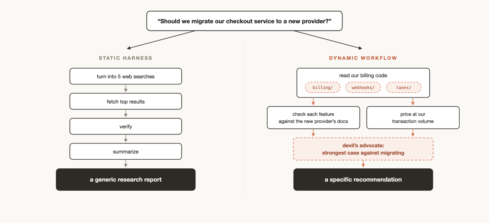
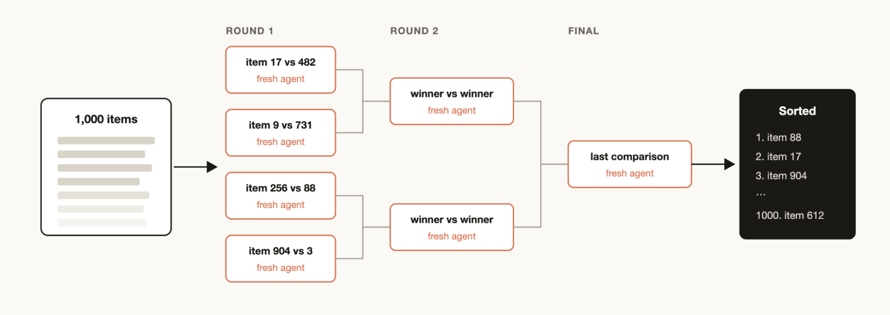

# 为每个任务量身定制：Claude Code 中的动态工作流

- **来源：** https://claude.com/blog/a-harness-for-every-task-dynamic-workflows-in-claude-code
- **分类：** Claude Code
- **日期：** 2026 年 6 月 2 日
- **阅读时长：** 5 分钟

---

Claude Code 的默认执行框架（harness）为编码而建，但也能胜任许多其他类型的任务。然而，某些类型的任务——研究、安全分析、智能体团队、代码审查——需要在 Claude Code 之上构建自定义执行框架才能达到最佳性能。

**动态工作流（Dynamic Workflows）** 允许在 Claude Code 之上动态创建执行框架，让 Claude 以更原生的方式解决这些问题。工作流可以共享和复用。最佳实践仍在发展中；动态工作流通常消耗更多 token，适合复杂的高价值任务。

---

## 示例提示词

以下是动态工作流的一些典型用法：

1. "这个测试大约每 50 次运行失败一次。设置一个工作流来复现它。形成关于竞态条件的竞争性理论，在其中一个理论被证据证实之前不要停下来。"
2. "使用工作流，回顾我最近的 50 个会话，挖掘我反复做出的纠正，将重复出现的纠正转化为 `CLAUDE.md` 规则。"
3. "使用工作流，翻阅过去六个月 Slack 中 #incidents 频道的内容，找出没有人建过工单的反复出现的根因。"
4. "拿着我的商业计划，运行一个工作流，让不同的智能体分别从投资者、客户和竞争对手的角度来拆解它。"
5. "这是一份包含 80 份简历的文件夹，使用工作流为后端岗位排序，并对前十名进行复核。用 AskUserQuestion 工具面试我以获取评分标准。"
6. "我需要给这个 CLI 工具起个名字。使用工作流头脑风暴一批选项，然后运行锦标赛选出前三名。"
7. "使用工作流，将我们的 User 模型在所有地方重命名为 Account。"
8. "使用工作流审查我的博客文章草稿，针对代码库验证每一个技术性声明，我不想发布任何错误的内容。"

---

## 动态工作流如何运作

动态工作流执行一个 JavaScript 文件，其中包含用于生成和协调子智能体的特殊函数，同时也支持 JSON、Math、Array 等标准 JavaScript 函数用于数据处理。

动态工作流可以决定智能体使用哪个模型，以及子智能体是否在自己的工作树（worktree）中运行，让 Claude 能够选择所需的智能水平和隔离程度。

如果工作流被中断（例如用户操作或退出终端），恢复会话后工作流会从中断处继续执行。

---

## 为什么需要动态工作流

当默认的 Claude Code 执行框架处理任务时，它在同一个上下文窗口中进行规划和执行。这对许多编码任务很有效，但在长时间运行、大规模并行、高度结构化和/或对抗性的任务中可能会失效。

Claude 在单个上下文窗口中处理复杂任务的时间越长，就越容易受到以下特定失败模式的影响：

- **智能体偷懒（Agentic laziness）** — Claude 在完成复杂的多部分任务之前就停下来，宣布工作已完成。例如，在安全审查中只处理了 50 个项目中的 35 个。
- **自我偏好偏差（Self-preferential bias）** — Claude 倾向于偏好自己的结果或发现，尤其是被要求根据评分标准进行验证或评判时。
- **目标漂移（Goal drift）** — 在多轮交互中逐渐丧失对原始目标的保真度，尤其是在上下文压缩之后。每次摘要步骤都是有损的，边缘情况的需求或约束等细节可能会丢失。

创建工作流有助于通过编排具有各自上下文窗口和聚焦、隔离目标的独立 Claude 子智能体来对抗这些问题。

---

## 动态 vs 静态工作流

使用 Claude Agent SDK 或 `claude -p` 构建的静态工作流需要适用于所有边缘情况，通常更加通用。借助 Claude Opus 4.8 和动态工作流，Claude 现在足够智能，可以编写针对用例量身定制的自定义执行框架。

---

## 使用动态工作流的实用模式

你可以通过要求 Claude 创建一个工作流来开始使用动态工作流，或者使用触发词 "`ultracode`" 来确保 Claude Code 创建工作流。

以下是 Claude 可能使用和组合的常见模式：

### 分类后执行（Classify-and-act）

使用分类器智能体判断任务类型，然后根据任务类型路由到不同的智能体或行为。或者在最后使用分类器来决定输出。

### 扇出后综合（Fan-out-and-synthesize）

将任务拆分为许多更小的步骤，对每个步骤运行一个智能体，然后综合结果。当有许多较小步骤或每个步骤受益于自己的干净上下文窗口时很有用。综合步骤等待所有扇出智能体完成，然后将它们的结构化输出合并为一个结果。

### 对抗性验证（Adversarial verification）

对每个生成的智能体，运行一个单独的生成智能体来根据评分标准或标准对抗性地验证其输出。

### 生成后过滤（Generate-and-filter）

对某个主题生成想法，通过评分标准或验证进行过滤，去重，然后只返回最高质量、经过测试的想法。

### 锦标赛（Tournament）

让智能体使用不同方法竞争同一任务。生成 N 个智能体各自尝试任务。使用评判智能体通过成对比较来评判结果，直到产生获胜者。

### 循环直到完成（Loop until done）

对于工作量未知的任务，循环生成智能体直到满足停止条件（没有新发现，或日志中没有更多错误），而不是固定次数的遍历。

---

## 使用场景

### 迁移和重构

Bun 使用工作流从 Zig 重写为 Rust。关键是将任务分解为一系列步骤（调用点、失败的测试、模块等）。在工作树中为每个修复启动一个子智能体，让另一个智能体对抗性审查，然后合并。考虑告诉智能体不使用资源密集型命令以最大化并行化。

### 深度研究

Claude Code 中的深度研究技能（`/deep-research`）使用动态工作流。它扇出网页搜索、抓取来源、对抗性地验证声明，并综合出一份带引用的报告。这可以扩展到从 Slack 上下文编译状态报告，或通过探索代码库来研究某个功能的工作原理。

### 深度验证

检查报告中的每一个事实性声明：一个智能体识别所有事实性声明，一个子智能体详细检查每一条，一个验证智能体检查源子智能体的质量。

### 排序

对于按定性度量排序列表（如按严重程度排序支持工单），在一个提示中运行 1000 多行会降低质量。可以改用锦标赛、成对比较智能体的流水线（比较判断比绝对评分更可靠），或并行桶排序然后合并。

### 记忆与规则遵守

如果 Claude 即使在 `CLAUDE.md` 中也遗漏了某些规则，可以创建一个工作流，用验证器智能体检查规则列表——每个规则一个。一个怀疑论者人格的子智能体审查误报。反过来也有效：挖掘会话和代码审查评论中的重复纠正，用并行智能体聚类，对抗性地验证每个候选项，将幸存者提炼为 `CLAUDE.md`。

### 根因调查

调试在有几个独立假设被独立测试时效果最好。工作流可以启动智能体从不相交的证据中生成假设（日志、文件、数据各用单独的智能体）。每个假设面对一组验证者和反驳者。这不仅适用于代码：销售分析、数据工程、事后复盘也同样适用。

### 大规模分诊

每个团队都有一个人力无法完全处理的待办事项。分诊工作流对每个项目进行分类，与已跟踪的内容去重，并采取行动（尝试修复或升级）。一个有用的模式是**隔离区（quarantine）**：禁止读取不受信任内容的智能体执行高权限操作，改由专门负责执行的智能体完成。将分诊工作流与 `/loop` 配对以实现持续运行。

### 探索与品味

工作流在探索不同方法时很有用，尤其是基于品味的任务（设计、命名），需要评分标准。要求 Claude 探索解决方案，给审查智能体一个评分标准，当审查智能体觉得标准满足时任务完成。解决方案可以通过锦标赛排序或选择。

### 评估（Evals）

在工作树中启动单独的智能体运行轻量级评估，然后用比较智能体根据评分标准比较和评分输出（例如评估和优化一个技能）。

### 模型和智能路由

创建一个针对你的任务调优的分类器智能体来决定使用哪个模型。执行前的研究识别最佳模型。例如，"解释 auth 模块如何工作"取决于有多少文件；分类器智能体根据预期复杂度路由到 Sonnet 或 Opus。

---

## 何时不使用动态工作流

工作流是新事物。虽然许多用例能产生超常结果，但并非每个任务都需要它们，而且可能消耗显著更多的 token。对于常规编码任务，问问自己：它真的需要更多算力吗？大多数传统编码任务不需要 5 个审查员的评审团。

---

## 构建动态工作流的技巧

### 提示词

使用特定技巧的详细提示词能产生最佳结果。工作流不仅适用于大型任务——你可以提示模型使用"快速工作流"（例如，对一个假设进行快速对抗性审查）。

### 与 `/goal` 和 `/loop` 结合

使用可重复的工作流（分诊、研究、验证）时，与 `/loop` 配对以固定间隔运行，与 `/goal` 配对以设定硬性完成要求。

### Token 使用预算

使用类似"使用 10k token"的提示词设置明确的 token 使用预算来限制消耗。

### 保存和共享动态工作流

在工作流菜单中按 "s" 保存工作流。将它们检入 `~/.claude/workflows` 或通过技能分发。

要通过技能共享，将 JavaScript 工作流文件放在技能文件夹中，并在 SKILL.md 中引用它们。为了灵活性，提示 Claude 将技能工作流视为模板而非照本宣科的脚本。

---

## 探索的新起点

工作流是扩展 Claude Code 的一种有益新方式。作者鼓励将它们视为探索 Claude 新用法的起点。仍有大量内容有待发现。

---

*本文由 Anthropic 技术团队成员 Thariq Shihipar 和 Sid Bidasaria 撰写，他们正在开发 Claude Code。*
