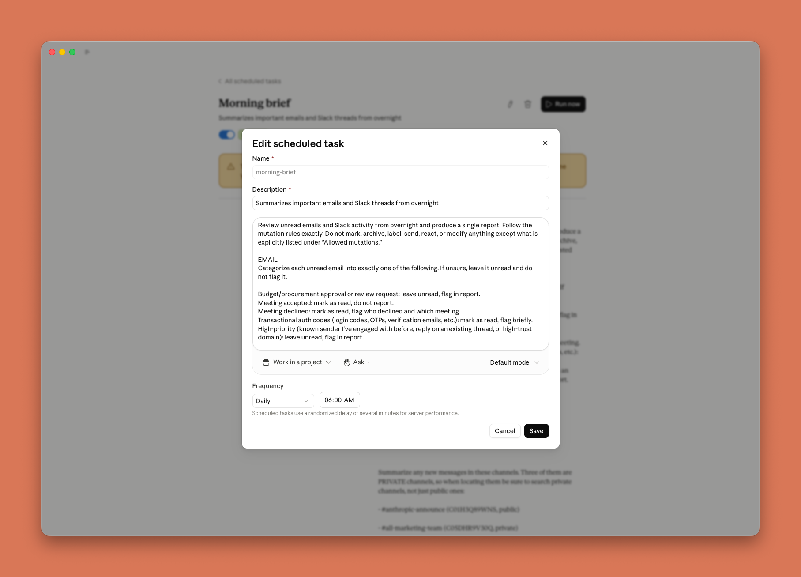
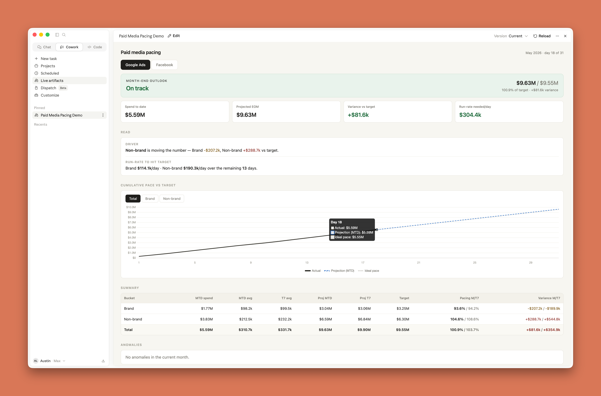
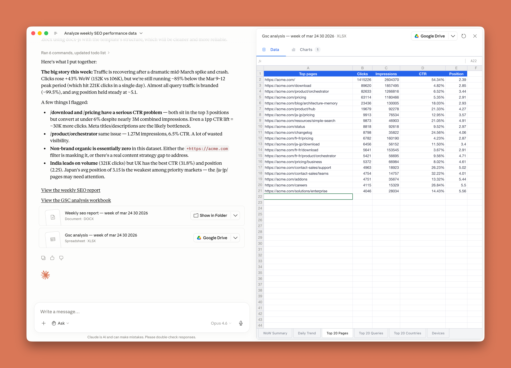

# Claude Cowork 入门最佳实践

- **来源：** https://claude.com/blog/best-practices-for-getting-started-with-claude-cowork
- **分类：** 企业 AI
- **产品：** Claude Cowork
- **日期：** 2026 年 6 月 3 日
- **阅读时长：** 5 分钟

---

> **Austin Lau，Anthropic 增长营销负责人**，讲解何时使用 Claude Cowork、如何决定委派哪些工作流，以及具体的入门步骤。6 月 4 日，Austin 将分享他如何在营销工作中使用 Claude Cowork。[注册网络研讨会 →](https://www.anthropic.com/webinars/how-anthropics-marketing-team-uses-claude-cowork)

---

2024 年，我们在聊天窗口中使用 Claude。2025 年，Claude Code 帮助工程师快速交付。如今，我们所有人都可以跟上 Claude Cowork 的步伐。

去年我开始用 Claude Code 处理多步骤的长时间任务——从不知道终端是什么，到构建出能在 30 秒内完成 30 分钟任务的工作流。当时我在非技术工作中使用 Claude Code，因为那时候 Claude Cowork 还不存在。

如今，我 90% 的工作在 Claude Cowork 中完成。在本文中，我将展示如何判断哪些任务适合 Claude Cowork，通过真实案例讲解，并帮助你在大约十分钟内完成第一个交付物。

---

## Chat vs Claude Cowork vs Claude Code

如果你的工作是非技术性的知识工作——邮件、演示文稿、电子表格、文档、会议——Claude Cowork 就是为你设计的。不需要会编程，不需要知道什么是"智能体"。

如果你过去两年一直在 AI 聊天标签页中工作，复制粘贴问题和答案，那你已经会用 Claude Cowork 了——它就是那个，去掉了复制粘贴。

同一个 Claude 模型驱动 Chat、Claude Cowork、Claude Code、Claude Design 等所有产品。它们是不同的工作空间，但运行相同的模型。

**使用场景框架：**

- **Chat** 是知识工作者接触 Claude 的常见方式。**Chat 用于获取答案、头脑风暴和自言自语式的思考。**
- **Claude Cowork** 在桌面应用中反转这一模式。不是把工作带给 Claude，而是把 Claude 带到你的工作中。**你描述一个结果，走开，回来时工作已经完成。**
- **Claude Code** 面向开发构建和发布软件。

Claude Cowork 和 Claude Code 底层运行在同一个引擎上。

---

## 何时应该使用 Claude Cowork？

判断何时使用 Claude Cowork vs Chat 的简单规则：

- **使用 Chat**：如果需求适合几个来回交流——提问、解释、头脑风暴或验证想法。
- **使用 Claude Cowork**：如果你需要的是一个交付物——一个有人会打开的文件、一个有人会演示的演示文稿、或一份需要整理的电子表格——多步骤、涉及多文件或多应用的工作，用 Claude Cowork 来**委派**工作。

**使用场景对比表：**

| 示例问题或任务 | 使用 |
|---|---|
| 我应该在业务评审会上讲什么？ | Chat |
| 读取这个 Google Drive 文件夹中过去三个月的会议记录，用我们的模板制作一份 QBR 演示文稿。 | Claude Cowork |
| VLOOKUP 怎么用？ | Chat |
| 把我电子表格中所有的 VLOOKUP 改成 INDEX MATCH。 | Claude Cowork |
| 为这个页面建议一个更好的标题标签和元描述。 | Chat |
| 用这张表中的新标题标签和元描述，通过 CMS 连接器更新这 30 个页面。 | Claude Cowork |

最常见的错误是一直使用 Chat 从未体验 Claude Cowork 的差异；反之则是用 Claude Cowork 处理一个 Chat 五秒就能回答的问题。

---

## Claude Cowork 适用任务的五个要素

不确定哪些项目适合委派给 Claude Cowork 时，用这个清单检验。不需要全部满足五条，但好的候选任务通常命中几条：

1. **多个输入。** 多个文件、整个文件夹，或文件加连接器。如果只有一个输入，Chat 通常就够了。
2. **产出一个文件。** 你需要一个可附加、展示、分享或再利用的交付物：文档、演示文稿、电子表格或 CSV。
3. **会重复执行。** 一次性任务可以，但重复任务是最佳场景。可以安排在你到办公桌前就自动运行。
4. **你知道什么是好的。** 你熟悉输出的形式，能在 15 秒内判断输出是对的、错的还是完成了 70%。
5. **中间部分是无聊的。** 思考在开头（决定你要什么）和结尾（判断是否正确）之间。中间的提取、编译、核对和重新格式化部分就是你交出去的。

---

## 我在 Anthropic 如何使用 Claude Cowork

我在 Anthropic 负责增长营销，所以示例带有营销色彩。不要照搬我的工作流——而是观察每个案例如何命中上面的清单。

### 每日简报

营销人员每天收到大量 Slack 消息和邮件。我设置了一个每天早上 6 点运行的"每日简报"任务。Claude Cowork 连接到 Slack 和 Gmail，提示词让它审查未读邮件和关注的频道，分类并生成简短报告。

报告包含：需要关注的内容摘要、按类型分组的标记邮件、频道摘要，以及可能影响营销的过夜产品事件。任何被 Slack 和邮件淹没的人都可以运行某个版本的工作流。

### 预算跟踪

我的工作包括绩效营销的预算跟踪。这类工作没人想做——又无聊又繁琐。许多团队在 Google Sheets 中手动从各渠道导出每日花费，或付费第三方工具做 ETL。

通过 Claude Cowork，我连接 Google Ads 和 Meta Ads，创建了一个实时 HTML 仪表板，自动拉取每日花费并计算进度。可以用自然语言告诉 Claude 如何筛选活动及注意事项。

对照清单：多个来源输入（每个渠道的花费）、输出文件（仪表板）、反复运行、中间是不想手动做的下载-复制-粘贴工作。由于广告平台通过连接器集成，可随时更新仪表板。

### 报告生成

不再手动导出 CSV 和构建透视表，我将 Claude Cowork 连接到 Google Search Console，拉取关注的数据（查询词、国家、页面）并整合到一个表中——而不是 Google 默认导出的每个维度一个 CSV。

我还给出上下文指示，如对比最近 7 天与前 7 天、只筛选特定国家、标记显著变化的指标、按模板撰写报告。之后可以调整或追问。

通过 Claude Cowork 的定时功能，此任务每周自动运行。报告过去每周花约 30 分钟，现在只需 5 分钟，专注于需要判断力的部分——补充缺失上下文和讨论要点。

> 我们还有一篇更详细的文章，涵盖插件、Skills、本地 MCP 和 Dispatch 的复杂用例。

---

## 你的前 10 分钟 Claude Cowork 之旅

首次打开应用的步骤：

1. **打开 Claude 桌面应用**，切换到 Claude Cowork 标签页。
2. **给 Claude 提供素材。** 拖入文件、指向电脑上的文件夹，或连接常用应用（Slack、Gmail、Notion、CRM 等）。平庸的 Claude Cowork 输出和出色的输出之间的差异几乎从来不是你的提示词——而是你是否提供了足够的丰富上下文。
3. **告诉 Claude 你想要的结果。** 描述最终交付物并提供必要上下文。
4. **从你熟悉的真实任务开始。** 你马上能看到它的强项、需要补充上下文的地方，且你知道什么是"好"的结果。
5. **让 Claude 在开始前先问你问题。** 这是我养成的最有用的习惯。在提示中加入：

   > *在我们开始之前，请复述一遍我的需求以确保我们理解一致，然后把你所有的澄清问题都问出来。*

   这会暴露你没想到要指定的内容——时间范围、"好"的定义、或你了解但 Claude 不了解的边界情况。提前列出五个问题花 30 秒，事后发现同样的遗漏则浪费时间和 token。

还不确定委派什么？可以直接问 Claude。Claude 有记忆功能并可搜索过往对话，可以问它你最常做的任务以及哪些适合在 Claude Cowork 中尝试。

### 我仍然使用 Chat 的场景

我仍然广泛使用 Chat 来讨论定位问题、验证想法，或问一些随机问题。

要点：**Chat 用于当输出是你脑中的想法，Claude Cowork 用于当输出是你要交给别人的东西。**

---

## 去构建些什么

选择一个每周重复的任务，用 Claude Cowork 尝试，看看结果。最初几次可能不太顺畅，但几次之后你会从"我该怎么用这个"变成"下次给它什么"。

---

*本文由 Anthropic 增长团队的 Austin Lau 撰写，表达其个人观点、使用模式和对 Claude Cowork 的建议。*
