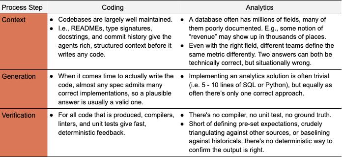

# Anthropic 如何利用 Claude 实现自助式数据分析

- **来源：** https://claude.com/blog/how-anthropic-enables-self-service-data-analytics-with-claude
- **分类：** 企业 AI
- **产品：** Claude Code
- **日期：** 2026 年 6 月 3 日
- **阅读时长：** 5 分钟

---


许多数据科学和数据工程团队都可以证实，传统上实现自助式业务分析是一项艰巨的工作。

为了让技术能力较弱的同事通过宽表和反范式化表更方便地访问数据模型，随着业务规模扩大，往往会产出定义不一致的重叠视图——而且对于不愿学习 SQL 的员工来说，这几乎毫无帮助。另一种做法是为用户创建更多受限环境，但这又会错失长尾业务问题，并随着团队各自为政导致指标和仪表盘泛滥。

大语言模型的兴起为自助式分析提供了第三条路径，可避免上述挑战。然而，将 Claude 直接指向数据仓库并让智能体执行查询，可能会造成一种虚假的精确感。

从临时需求中解放出来的最初兴奋感会迅速转变为担忧——意识到这种设置将利益相关者与底层基础设施、文档和专业知识分隔开来，而正是这些要素此前引导他们使用精心策划的数据集。

在 Anthropic，**95% 的业务分析查询通过 Claude 自动完成，整体准确率约 95%**。通过将这些重复性劳动交给 Claude，我们的数据科学团队得以专注于因果建模、预测和机器学习等更具战略性的工作。

在与数十位 Anthropic 顶尖 Claude Code 用户会面并看到无数分析智能体设计模式之后，我们为其他使用大语言模型的数据团队总结了一些最佳实践。在本文中，我们将分享这些技巧和方法，包括：

- 为什么分析准确性是一个上下文和验证问题，而非代码生成问题
- 导致大多数错误的三种失败模式
- 我们为解决这些错误而构建的智能体分析技术栈
- 如何衡量效果
- 我们创建大部分 skill 使用的基本模板（见附录）

---

## 数据不是软件

大语言模型的生成能力是一把双刃剑：能创造性解决复杂问题的机制，同样也会产生错误的输出。要理解分析智能体面临的挑战，将其与编码智能体进行对比会很有帮助。

编码是一个开放式的解空间，奖励模型的创造力，而文档和测试则为幻觉提供了天然的护栏。相比之下，对于分析用例，通常只有一个正确答案、使用一个正确的数据源，且没有确定性方法来证明其正确性。



对于自助式智能体业务分析，复杂性主要在于数据的模糊性。核心问题归结为：**能否将用户的问题映射到数据模型中特定且最新的实体，并知道处理它们的正确方式**。如果能做到这一点，后续的执行和 SQL 就变得轻而易举。

我们发现该问题的三个属性是导致绝大多数不准确回答的原因：

1. **概念 ↔ 实体模糊性**：数据模型中有数百个可选项（可能的字段达数百万），智能体无法选择最能回答用户问题的正确字段。例如，在衡量活跃用户数量时：什么行为构成"活跃"？是否包含欺诈用户？使用什么回溯窗口？

2. **数据过时**：数据源、业务定义和模式不断变化；资产和智能体知识会过时，开始返回微妙错误的答案。

3. **检索失败**：正确的信息可能确实存在于数据模型中并已正确标注，但由于搜索空间过于庞大，智能体根本找不到它。

---

## 我们的智能体分析技术栈

在 Anthropic，我们主要通过智能体数据栈来最大限度地减少这三类错误。每个层主要针对一个或多个问题：

1. **实体模糊性**：数据基础和单一事实来源将可能实体的范围缩小，直到只剩一个受管控的答案。
2. **过时性**：维护和验证流程确保一切不会随着业务变化而腐化。
3. **检索失败**：skill 确保智能体可靠地找到并正确使用该答案。


### 数据基础

确保分析智能体准确性的最重要方面是强大的数据基础，包括数据模型、转换、测试和数据仓库中的表，以及描述它们的元数据。标准的数据工程和数据质量实践，如[维度建模](https://en.wikipedia.org/wiki/Dimensional_modeling)、左移测试、关键流水线的新鲜度和完整性检查，仍然适用（我们不再赘述）。

变化在于，数据模型的终端用户不再是数据专家（如数据科学家），而是代表具有不同程度数据专业知识或底层基础设施理解的用户行事的智能体。这一转变带来了一个挑战：结果不能要求用户验证底层正确性，因为终端用户根本不知道。

数据基础层主要针对模糊性：例如，如果"收入"只能解析为一个受管控的数据集，而不是四十个看似合理的候选者，那么问题在智能体搜索之前就已经消失了。这里也是第一道过时防线的所在地，因为定义规范模型的同一仓库是确保其保持最新的天然场所。

我们发现以下实践特别有效：

- **创建规范数据集**：最常见的失败是智能体无法将概念（"产品 X 的收入"）映射到正确的表、列和指标定义，通常是因为有多个看似合理但实现方式略有不同的候选项。解决方法是更少、更严格管控的逻辑模型：策划一小组规范的、单一事实来源的数据集，它们有明确的所有者、可直接使用且可发现，然后积极废弃近似重复项。物化汇总和缓存对成本和性能仍然重要，但应从规范模型机械派生，而不是作为替代方案并存。目标是当智能体搜索概念时，能找到一个唯一的受管控答案。

- **执行标准**：我们发现，只有当规范模型和指标定义通过*工具*强制执行（智能体在结构上首先被路由到它们）、通过 *CI* 强制执行（绕过它们的变更无法通过审查）、通过*规定*强制执行（下游团队必须在受管控层之上构建，否则需要解释原因），基础才能稳固。没有执行力的治理很快就会退化回多个候选者的问题。

- **共置制品**：我们对抗不断变化的数据模型和业务逻辑的主要防线是共置。几乎所有数据代码（即建模、语义层、参考文档、规范仪表盘定义）都存放在单一仓库中，CI 检查保护跨层完整性。如果建模变更会破坏下游仪表盘或使已记录的指标失效，CI 会标记它，修复在同一 PR 中完成。

- **将元数据视为一等产品**：编码智能体表现良好，部分原因是代码库是*可读的*：README、类型签名、文档字符串等。你的数据仓库同样可以是可读的，但前提是列和表描述、规范指标定义、粒度文档、有效值范围、血缘关系、所有权和模型分层都以与转换本身同等严格的程度维护。

### 单一事实来源

如果数据基础是数据仓库本身，那么单一事实来源就是智能体用来导航它的参考表面。这一层减少概念 ↔ 实体模糊性，将利益相关者问题中的"周活跃用户"转换为数据模型中的特定受管控实体。按信任度从高到低排列：

- **语义层**：编译后的指标和维度定义。如果问题能清晰映射到已定义的指标，智能体调用函数得到一个数字——与公司其他所有表面产生的数字相同。我们的智能体被*结构性要求*（通过 skill 指令）首先利用语义层。一个我们尝试过但*不奏效*的想法：让大语言模型从原始表和查询日志自动生成指标定义来引导语义层。它生成了看似合理但编码了我们正试图消除的模糊性的定义，对我们评估的净影响是负面的。因此我们建议用 Claude 生成*文档*，但让人来拥有*定义*。

- **血缘关系和转换图**：当语义层无法覆盖某个问题时，血缘关系和表排名（基于引用次数）让智能体能推理哪些上游模型支撑某个概念、哪些已废弃、哪些共享粒度。这将"我不知道该指标"转变为"我知道从哪个受管控模型进行聚合"。

- **查询语料库**：来自仪表盘、笔记本和历史分析的 SQL。直觉上，这应该是高价值的：它是每个已正确回答的问题的记录。*实际上，我们发现让智能体直接检索访问数千条历史查询，准确率提升不到一个百分点*。非结构化检索无法将新问题映射到正确的先例。有效的是将语料库提炼为结构化的按领域参考文档和可复用的分析模式——在 **skill** 中描述。将查询历史视为策划的原材料，而非智能体直接阅读的来源。

- **业务上下文**：大多数团队跳过的层，也是我们低估最久的层。不了解你业务的智能体会回答用户问的问题，但不会回答他们的意图。它不会知道"Q2 发布"指的是特定产品，不会知道两个团队对同一术语有不同定义，也不会知道提问的原因是周四有董事会会议。我们接入了公司知识图谱，包含索引文档、路线图、决策日志和组织结构，以便智能体能解析周围引用并提出更好的澄清问题。

所有四个层的共同失败模式与数据基础层相同：**糟糕或过时的文档**。Claude 在弥合差距方面非常有用（起草列描述、从查询模式提出指标文档、在 CI 中标记未记录的模型），但策划和所有权由人类管理。

在接下来的两节中，我们讨论如何使这种所有权足够低成本，以至于真正被执行。

### Skill

如果说单一事实来源是智能体的*声明式*知识（即某指标的含义），那么 skill 就是其*过程性*知识：按什么顺序查询哪些来源、如何导航模糊的数据、以及完成的分析是什么样的。

在 Claude Code 中，[skill](https://code.claude.com/docs/en/skills) 是智能体按需读取的 Markdown 文件夹。在 Anthropic，我们开发的 skill 具有巨大的附加价值。没有 skill，Claude 准确回答分析问题的能力在我们的评估中不超过 21%。添加 skill 后，这些数字持续超过 95%，某些领域甚至经常达到 99%。参见附录中的骨架模板。

一些最佳实践：

**创建成对 skill**：***知识*** skill 充当轻量级顶层路由器，允许按需加载额外的领域细节。它说"先尝试语义层，但如果没有覆盖，这里有大约 30 个参考文件描述相关表、列、连接和注意事项。"这个路由器实际上是我们对检索失败的回答：不让智能体搜索一个百万字段的数据仓库，而是在写查询之前将其缩小到几十个策划文件。***操作手册*** skill 编码了高级分析师会遵循的流程：澄清问题、查找来源（通过知识 skill）、运行查询，然后通过对抗性审查子智能体循环审查结果。它还捆绑了十几个可复用的分析模式（留存曲线、速率分解、漏斗分析），使常见请求不会每次都重新发明。

**创建适当的参考文档**：为大语言模型检索而编写。我们的参考文档描述表（粒度、范围和排除项）、注意事项的机制（例如，"排除已知免费电子邮件域名，但保留 anthropic.com 等自定义域名"）和明确的路由触发条件（例如，"IF 问题关于实验提升……DO NOT 用于原始事件计数"），而不包含会过时的处方性配方。

```markdown
# [领域] 表

## 快速参考
### 业务上下文 — [用通俗语言说明该领域的含义]
### 实体粒度 — [一行代表什么]
### 标准过滤条件 — [该领域每个查询都应用的过滤条件]

## 维度
- [关键维度的编码方式，以及同一概念在不同表中的命名差异]

## 关键表
### [表名]
- **粒度**：[...] · **范围/排除项**：[...]
- **用法**：[何时使用、何时不使用、连接键、必需过滤条件]
[... 每个受管控表一个简短章节 ...]

## 注意事项
- [高级分析师会警告你的错误答案模式]

## 最佳实践 / 常见查询模式
- [默认选择、标准切分、精确查询形式即是难点的示例模式]

## 交叉引用
- [拥有相邻问题的领域文档]
```

**将 skill 维护视为一等公民**：Skill 文档描述的是每天都在变化的数据模型，如果没有积极维护，几周内就会过时。我们曾观察到离线准确率从上线时的约 95% 在一个月内下降到约 65%，直到我们将此视为工程问题。这意味着将 skill Markdown 文件与转换模型放在同一仓库中，更改模型的 PR 就是更新描述它的 PR 的同一个 PR。代码审查钩子标记任何未触及 skill 文件的报告模型变更。大约 90% 的数据模型 PR 现在在同一 diff 中包含 skill 变更。我们还随着模型改进和之前的失败模式不再适用，定期修剪 skill 脚手架。

**在所有表面创建一致无缝的体验**：同一个 skill 在 Slack、IDE、仪表盘工具和独立智能体会话中必须提供相同的答案。我们通过确保一个规范来源（数据仓库）并自动同步 skill 变更来实现这一点。合并时，skill 同步到插件市场（供 IDE 用户使用）、云存储 blob（供读取单文件的托管应用使用），并直接作为 MCP 资源提供服务。我们还从一开始就为可移植性设计，避免硬编码仓库路径和特定表面的命名空间。

### 验证

最后，验证是发现三种失败模式中哪些仍在泄漏的方法。

#### 离线评估

我们常见的一种模式是，数据团队设置了精心设计的分析环境，却没有任何流程来了解其分析智能体的准确性。

解决这一差距的一种方法是通过离线评估，即简单的问题/答案对。你可以将离线评估类比为机器学习模型的离线测试——它们不会告诉你在线智能体的表现，但能让你很好地了解是否存在关键差距。

我们在 Anthropic 部署了两种离线评估。**仪表盘评估**由 Claude 自动生成（然后经人工验证），涵盖最常见的利益相关者问题。**长尾评估**是我们将业务上下文（路线图、表文档）提供给 Claude，让它在整个领域生成看似合理的问题。我们还持续收割每次利益相关者在对话中纠正智能体的情况，因为每次纠正都是候选评估。

其他最佳实践包括：

- **锚定真值使其不会漂移**：针对实时数据编写的评估在底层数字变动的那一刻就过时了。将每个评估固定到快照日期、针对稳定的事实表编写，或者让评判者评估智能体的*查询*而非其数字。将套件接入 CI，以便触及依赖项的 PR 重新运行受影响的评估。
- **像遥测数据而非测试日志来存储结果**：每次运行都写入仓库表，包含 skill 版本、git SHA、模型 ID、每个断言的通过/失败、token 数量和墙钟时间。"那个变更有帮助吗？"变成一个查询，你可以获得时间序列来捕捉单次 CI 运行无法发现的缓慢回归。
- **按领域控制发布**：领域所有者只有在其评估集切片超过某个阈值（我们最初使用约 90%）后才能向其利益相关者宣布智能体。这迫使在用户看到失败之前修复参考文档。
- **创建适当数量的评估**：你应该有多少评估取决于业务领域的复杂性和底层数据模型的复杂性。通过跟踪离线准确率对在线准确率的预测程度来校准：我们发现每个主题（如"增长"）超过几十个后收益递减，并且随着每一代新模型的出现，上限会下降。
- **离线评估准确率应接近 100%**；每个正确答案也应该命中你的语义层（如果你有的话）。同样，这个准确率水平并不能告诉你系统不会产生错误答案，只是假设你有适当的评估覆盖，没有明显差距。

#### 消融技术

关于 skill 的每个结构性决策（例如，暴露哪些来源、子智能体是否值得其延迟、是否将两个 skill 合并为一个）都是通过保持我们的离线评估集不变来做出的。

我们只改变一个组件并比较通过率。每次运行只需一个小时，可以替代很多争论。方法论比任何单一结果都重要：

- **为无效结果设计**。我们最有用的消融是一个负面结果。我们让智能体直接 grep 访问我们整个仪表盘、转换和分析师笔记本的 SQL（数千个文件）。然后我们在对话记录中验证它确实在每次回答前都读取了它们。准确率在任一方向上的变化不到一个百分点。然后我们检查了明显的混杂因素：对于它答错的问题，答案实际上是否在语料库中？大约 80% 的情况下，是的。"答案存在"是否能预测"现在答对了"？不，翻转率是平坦的。信息就在那里，智能体也看到了，但它仍然没有使用。这个单一实验告诉我们，瓶颈不是对先前工作的*访问*，而是*结构*（即将问题映射到正确的实体）。这一洞见重新规划了数月的路线图。
- **在 PR 粒度进行消融**。每个有意义的 skill 编辑都会在相关评估切片上进行前后对比，差异写在 PR 描述中。这使"我改进了文档"保持诚实，并捕捉到一个令人惊讶的常见情况：善意的添加反而使事情变糟。
- **保留一份不起作用的清单**。我们的两份：超过某一点后继续堆叠额外的文档细化轮次（我们连续三轮出现净负效果：文档变得更长，而不是更好），以及将对抗性审查者换成更便宜的模型以减少延迟（它失去了大部分准确率收益，却没有实际加速）。负面结果记录成本低廉，它们能防止下一个人重新运行相同的实验。

#### 在线验证

最后一步是确保实际在线系统性能尽可能准确。我们采取的一些步骤包括：

- **对抗性审查**：我们发现，使用 Claude skill 对潜在最终答案的所有底层假设进行激进挑战，在我们的评估集中提高了 6% 的准确率，但代价是多消耗 32% 的 token 和 72% 更高的延迟。
- **来源页脚**：每个响应都带有页脚，包含其来源层级（语义层 › 策划参考 › 原始表）、底层数据的新鲜度以及模型的所有者。它不会使答案更正确，但确实帮助消费者判断可以信任多少。"原始表，新鲜度未知"的页脚是在转发上游之前进行验证的信号，也是我们应对静默失败为数不多的缓解措施之一。
- **数据质量检查**：你的智能体可能以适当的方式使用了正确的字段，但数据本身不正确。添加基本数据质量检查以确保引用的字段是最新、完整且无异常，通常是良好的卫生习惯。
- **被动监控**：我们持续跟踪的两个生产信号是：通过语义层解析的智能体查询比例，以及使用纠正语言的响应比例（"那是错误的表"、"你缺少欺诈过滤器"）。两者都纳入每周与离线通过率一起审查的仪表盘。
- **主动纠正收割**：闭环的部分。一个定时智能体每隔几小时扫描利益相关者频道寻找类似的纠正语言，起草一行对相关参考文档的修复，并打开一个标记给领域所有者的 PR。修复路径故意简单——编辑 Markdown 文件、合并、自动同步——这样领域所有者不会在任务上花费太多时间。同样的纠正反馈回离线评估集。

所有这些都无法完全捕捉的失败模式是**静默**失败。答案是错误的，但看起来合理，在没有异议的情况下被使用。我们的缓解措施是来源页脚、对任何面向领导层的内容进行明确的人工签字、以及每个领域顶级 KPI 的持续评估，每天与权威仪表盘进行合理性检查——尽管我们还没有一个稳健的解决方案。

---

## 开始使用

如果你从零开始，少量规范数据集、几十个离线评估和一个轻量级知识 skill 就能捕获大部分收益；本文中的其他一切都是我们在这些建立之后添加的。

我们也分享了很多最佳实践，但并非所有都适合每个数据团队。与你的组织对齐一些将影响你方法的原则：

- **今天正确的答案 vs. 未来的正确答案有多重要**？AI 模型正在快速进步。我们经常看到公司构建大量基础设施来弥补当前模型的不足，而这些不足在模型改进后就变得多余了。了解模型的不足之处，等待模型改进来填补差距，开销要小得多，但可能不符合你公司的风险承受能力。
- **你预期业务复杂度会如何随时间变化**？如果你产生的数据不多、只有少数输出消费者、或者你的数据模型可能保持简单，我们讨论的某些流程可能是过度的。
- **输出的目标受众技术能力如何**？换言之，如果你为能识别答案错误的数据科学家构建此分析系统，与受众对底层数据模型毫无了解的情况相比，你可能更能容忍错误。
- **你愿意为提高准确率投入多少**？我们发现某些流程（如对抗性验证）可以显著提高准确率，但通常以更高的成本和延迟为代价。
- **你对访问控制和内部数据隐私的舒适度如何**？智能体通常在拥有更多上下文时表现更好；然而，广泛的数据访问与大多数公司的治理姿态相悖。这决定了你是在构建一个智能体还是多个限定范围的智能体。

无论你选择什么路径，我们最大的收益来自于解决每一种失败模式：将模糊性折叠为单一受管控答案，使答案易于发现，并在两者之一过时发出标记。

*本文由 Chen Chang、Clement Peng、Justin Leder、Johanne Jiao 和 Josh Cherry 撰写，他们是数据科学和数据工程团队的成员。作者感谢 Michael Segner 的贡献。*

---

## 附录

#### Skill 文件骨架

以下是我们的主仓库 skill 的骨架：真实文件的结构，内部具体内容替换为 [方括号占位符]。它不是为了照搬；而是为了展示我们发现值得写下来的章节类型。

```markdown
---
name: [仓库-skill]
version: [x.y.z]
description: "IF 用户要求查询 [公司] 的数据仓库以获取任何
  [业务领域列表] 的问题 — THEN 调用此 skill。DO NOT 用于
  [相邻工程任务] 或没有数据仓库组件的问题。"
---

# [仓库] Skill 指令

## 描述
安全有效地查询 [仓库] 的唯一事实来源。
被其他 [列出的] skill 引用以获取查询执行指导。

充当数据分析师，提供战略洞察和数据驱动建议，
但沿途寻求指导。

**超范围决策**：[产品领域等] → 仅提供数据，
说明"决策是 [负责团队] 的事"，不要表态或编写代码修复。

## 执行查询
优先级：
1. **[托管连接]**（如可用）：[查询工具] / [模式工具]
2. **[CLI 回退]**（如已安装）：[默认项目，回退项目]
3. **都不可用** — 要求用户认证，然后停止

---

# 语义层（必需的第一步）

受管控的语义层是每个数据问题的**强制默认路径**
— 与 [BI 工具] 相同的数字，连接/粒度/过滤条件已内置。
通过下方参考文档的原始 SQL 是**回退**，仅在语义层路径
被证明不覆盖该请求时使用。

## 必需工作流
1. **加载** — [在每个运行时加载语义层的方式，含回退]
2. **发现** — 按关键词搜索度量/维度；**始终检查分群**
   （命名的规范人群过滤条件 — 手写的 WHERE 子句
   是主要的错误答案模式）
3. **编译 + 运行** — 构建规范 → 编译为 SQL → 执行
4. **回退** — 仅当发现未找到相关指标或编译失败时
   → 通过 `references/*.md` 使用原始 SQL（下方第 3 部分）

> **不要过早放弃。** 不要因以下理由回退到原始 SQL：
> - "[自定义日期过滤 / 队列]" → [时间维度规范已覆盖]
> - "[需要连接]" → [指标层已封装其连接]
> - [3-4 个更多智能体用来跳过语义层的预先反驳借口]

### 日期窗口和时区 — 在查询前决定
- **截至日期 vs 尾随 N 天**：[各自约定]
- **"上周/上月"** → 最后一个*完整*日历周/月，不是尾随 7/30
- **时区默认**：[TZ]；[某些报告汇总的例外]
- **新鲜度滞后**：[某些] 表结算较晚 — 基于 MAX(date) 而非"昨天"

---

# 第 1 部分：必须知道（每个请求先读）

## 快速开始工作流
1. **先检查红旗**：[受限/PII 请求、受控领域、高风险请求]
2. **超范围 — 升级，不要猜测**：[访问请求、流水线故障排除、
   过时仪表盘、根因断言、产品/定价建议] → 转给 [负责团队]
3. **澄清请求**：时间段、分群、它所支持的业务决策
4. **检查现有仪表盘**：[按领域仪表盘目录]
5. **确定数据源**：[下方导航图；优先受管控/聚合表]
6. **执行分析**：[必需过滤条件 + 对抗性审查]
7. **交付洞察**：展示方法论，区分观察与解释

## 业务上下文

### 实体消歧（必须澄清）
- **"[术语 A]" 可能指**：[实体 1] 或 [实体 2] — 始终澄清
- **"[术语 B]" 可能指**：[实体 1] → [实体 2] → [实体 3]（一对多链）
- **"用户"**：[哪个标识符给出准确计数，哪些会膨胀]

### 业务术语
- [当前产品名称 vs 已弃用别名（仍作为冻结值出现在数据层）]
- [关键内部缩写]
- **[头条指标] 计算**：[月度/默认窗口/领先指标]
- **不熟悉的术语 — 搜索 [内部文档]，不要猜测**

### 数据完整性要求 ⚠️
- **绝不**：编造数据/列；做出超出数据所显示的推测性断言
- **始终**：使用安全除法；区分观察（"数据显示 X"）和
  解释（"这暗示 Y"）；标记局限性

---

# 第 2 部分：如何做（执行期间遵循）

## 技术执行指南
- [托管连接工具和 CLI 调用详情]
- **PII 保护**：对于受限数据，将 SQL 返回给用户自行运行 —
  不要返回结果

## 分析最佳实践指南
1. 在查询前澄清请求
2. 展示你的工作（过滤条件、包含/排除、新鲜度）
3. 澄清分母
4. 考虑样本偏差
5. 连接到业务影响
6. **对抗性 SQL 审查（强制）** — 在最终答案前为每个查询
   生成 [sql-reviewer] 子智能体；阻断性发现必须修复并
   重新审查；不要自我认证
7. **带来源报告** — 每个答案以页脚结束：
   > **来源：** [语义层 | 受管控表 | 原始探索] ·
   > **置信度：** [层级] · **已审查：** [审查者 ✓，第 N 轮] ·
   > **新鲜度：** [数据中的最大日期] · **所有者：** [负责团队]

---

# 第 3 部分：数据参考与资源

## 知识库导航
### [领域 A] → `references/[domain_a].md`
- **用于**：[问题类型]
- **关键表**：[...]
- **仪表盘**：`references/[domain_a]_dashboards.json`

### [领域 B] → `references/[domain_b].md`
- **用于**：[...]

[... 每个业务领域一个条目 — 总共几十个 ...]

## 故障排除指南

### 当信息缺失时
- [缺失表/访问被拒/过时文档/未知枚举值 → 怎么做]

### 字段命名注意事项
- 使用 `[field_x_v2]` 而非 `[field_x]`
- [两个名称相似的表以不同粒度报告同一指标 — 用哪个]
- [两个看似合理的来源中哪个是头条指标的规范来源]
- [... 又十几个来之不易的一行提示 ...]
```
