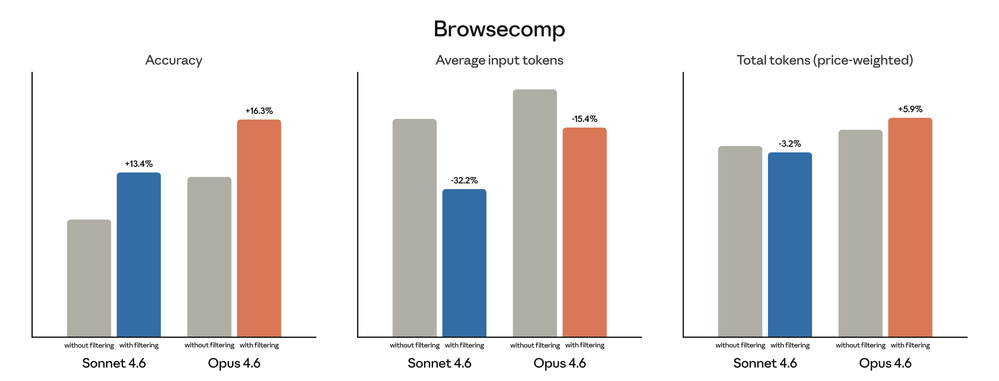

# 通过动态过滤提升网络搜索的准确性与效率

动态过滤让 Claude 在复杂的网络搜索任务上更准确、更高效。本文介绍其工作原理以及如何在 API 中启用它。

> **来源：** [Claude Blog - Increase web search accuracy and efficiency with dynamic filtering](https://claude.com/blog/improved-web-search-with-dynamic-filtering)
> **发布日期：** 2026 年 2 月 17 日
> **分类：** 产品公告 | 产品：Claude Platform | 阅读时长：5 分钟

---

伴随 Claude Opus 4.6 和 Sonnet 4.6 的发布，我们同步推出了新版网络搜索（web search）和网页抓取（web fetch）工具。Claude 现在可以在网络搜索过程中原生编写并执行代码，在搜索结果进入上下文窗口之前对其进行过滤，从而提升准确性和 token 效率。

---

## 一、带动态过滤的网络搜索

网络搜索是一项 token 消耗极高的任务。使用基础网络搜索工具的智能体需要发起查询、将搜索结果拉入上下文、从多个网站抓取完整 HTML 文件，然后在全部内容上进行推理，才能给出响应。但从搜索中拉入的上下文往往充斥着无关内容，这会降低响应质量。

为了提升 Claude 在网络搜索上的表现，我们的网络搜索和网页抓取工具现在能自动编写并执行代码，对查询结果进行后处理。Claude 不再需要在完整的 HTML 文件上进行推理，而是可以在搜索结果加载到上下文之前动态过滤，只保留相关内容，丢弃其余部分。

我们此前已在其他智能体工作流中验证了这一技术的有效性，并为 API 添加了代码执行和程序化工具调用等原生支持能力。现在，我们将同样的技术引入了网络搜索和网页抓取工具。

---

## 二、评估 Claude 的网络搜索能力

我们在 Sonnet 4.6 和 Opus 4.6 上，分别在启用和不启用动态过滤的条件下（不开启其他任何工具）评估了网络搜索性能。在 BrowseComp 和 DeepsearchQA 两个基准测试中，动态过滤平均将性能提升了 **11%**，同时减少了 **24%** 的输入 token 消耗。

### BrowseComp：通过网络搜索找到唯一答案

BrowseComp 测试智能体能否浏览大量网站，找到一个刻意难以在线获取的特定信息。动态过滤显著提升了 Claude 的准确率：Sonnet 4.6 从 **33.3%** 提升至 **46.6%**，Opus 4.6 从 **45.3%** 提升至 **61.6%**。



### DeepsearchQA：通过网络搜索找到多个答案

DeepsearchQA 向智能体提出需要找到多个正确答案的研究查询，所有答案都必须通过网络搜索获取。该测试衡量智能体能否系统性地规划和执行多步骤搜索而不遗漏任何答案，以「F1 分数」衡量，兼顾精确率和召回率——同时捕捉返回答案的准确性和搜索的完整性。

动态过滤将 Sonnet 4.6 的 F1 分数从 **52.6%** 提升至 **59.4%**，Opus 4.6 从 **69.8%** 提升至 **77.3%**。


> **关于 token 成本：** 实际 token 消耗因模型过滤上下文所需的代码量而异。价格加权 token 数在两个基准测试中对 Sonnet 4.6 均有所下降，但对 Opus 4.6 有所增加。为了更好地了解你自己的成本，我们建议针对智能体在生产环境中可能遇到的代表性网络搜索查询集合评估该工具。

---

## 三、客户案例：Quora

Poe（Quora 旗下产品）是最大的多模型 AI 平台之一，通过单一界面为数百万用户提供 200 多个模型的访问能力。

Quora 内部团队发现，带动态过滤的 Opus 4.6「在我们的内部评估中，对比其他前沿模型取得了最高准确率」，产品与研究负责人 Gareth Jones 表示，「这个模型的行为就像一位真正的研究员，会编写 Python 代码来解析、过滤和交叉引用结果，而不是直接在上下文中对原始 HTML 进行推理。」

---

## 四、在网络搜索和抓取工具中使用动态过滤

在 Claude API 上使用 Sonnet 4.6 和 Opus 4.6 的新版网络搜索和网页抓取工具时，动态过滤将**默认开启**。对于复杂的网络搜索查询（例如筛选技术文档或验证引用），你可以预期获得与上述结果相近的性能提升。

在 API 中的使用方式如下：

```json
{
  "model": "claude-opus-4-6",
  "max_tokens": 4096,
  "tools": [
    {
      "type": "web_search_20260209",
      "name": "web_search"
    },
    {
      "type": "web_fetch_20260209",
      "name": "web_fetch"
    }
  ],
  "messages": [
    {
      "role": "user",
      "content": "Search for the current prices of AAPL and GOOGL, then calculate which has a better P/E ratio."
    }
  ]
}
```

---

## 五、更多工具正式转为正式可用（GA）

我们还将多个工具升级为正式可用状态，帮助智能体在 token 密集型任务上表现更好：

- **代码执行（Code execution）**：为智能体提供沙箱环境，可在对话过程中运行代码，用于过滤上下文、分析数据或执行计算。
- **记忆（Memory）**：通过持久化文件目录跨对话存储和检索信息，让智能体无需将所有内容保存在上下文窗口中就能保留上下文。
- **程序化工具调用（Programmatic tool calling）**：以代码方式执行复杂的多工具工作流，将中间结果保留在上下文窗口之外。
- **工具搜索（Tool search）**：从大型工具库中动态发现工具，无需将所有定义加载到上下文窗口。
- **工具使用示例（Tool use examples）**：可在工具定义中直接提供示例工具调用，以演示使用模式并减少参数错误。

---

## 六、开始使用

改进的网络搜索和网页抓取工具，以及代码执行、记忆、程序化工具调用、工具搜索和工具使用示例，现已在 Claude Platform 上正式可用。请阅读我们的 API 文档以开始使用。
