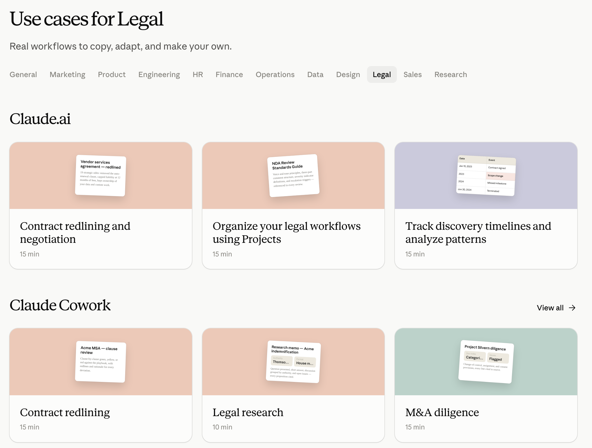
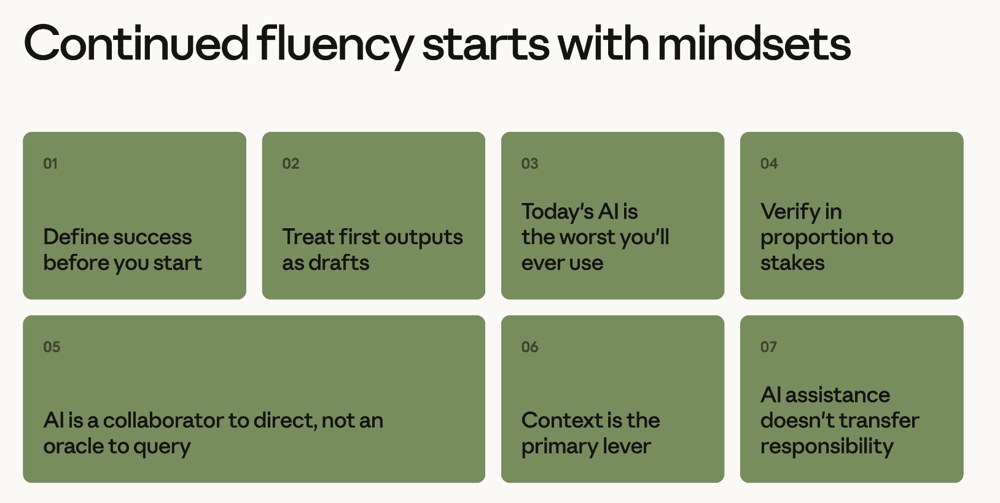
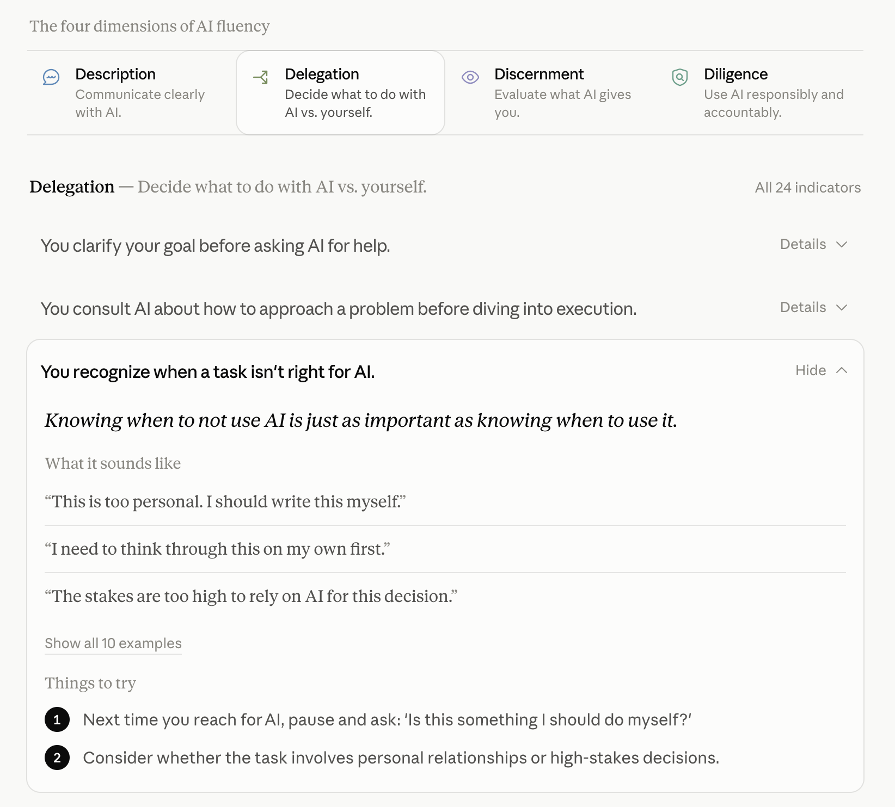
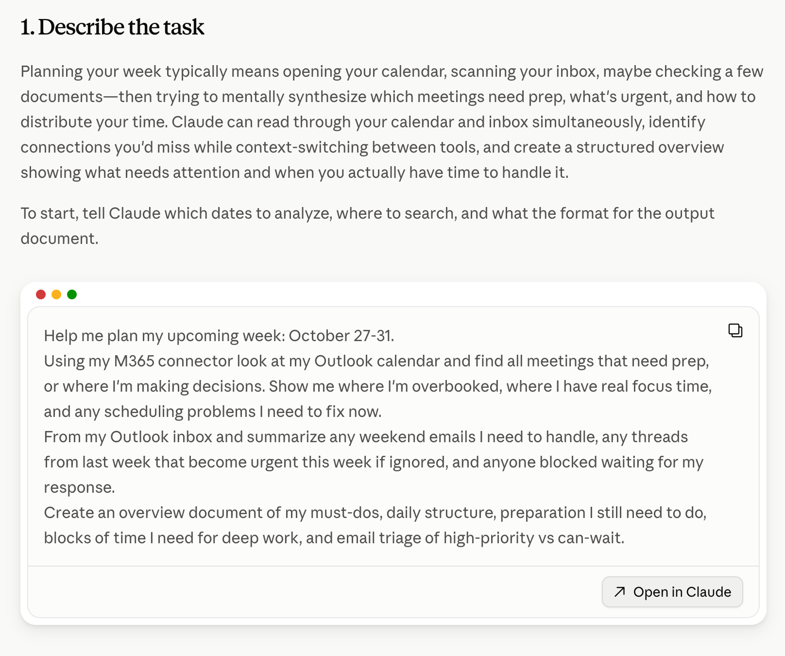

# Anthropic 教与学 AI 的方法论

> 原文：https://claude.com/blog/anthropics-approach-to-teaching-and-learning-ai

Claude Academy 为用户提供学习高效使用 AI 所需的教育工具。在这篇文章中，我们阐述推出它的原因，以及我们自身的教学理念如何影响了它的开发。

- **分类**：[Product announcements](https://claude.com/blog/category/announcements)、[Enterprise AI](https://claude.com/blog/category/enterprise-ai)
- **产品**：无
- **日期**：2026 年 8 月 20 日
- **阅读时长**：5 分钟
- **分享链接**：https://claude.com/blog/anthropics-approach-to-teaching-and-learning-ai

每个月都有数百万人访问 Anthropic.com，来了解如何使用 AI。在 Anthropic，我们视之为一项重大责任——我们有一支专门的教育团队，致力于编写关于如何安全、高效且有意识地使用 AI 的教材。AI 教学应当增强人的自主性，赋能学习者拓展自身能力。

今天，我们要分享我们的方法论：如何设计 AI 教学，并通过 [Claude Academy](http://academy.claude.com) 将其规模化地传递给全球数百万学习者。

## 为什么现在学习 AI 很重要？

随着模型智能不断演进，每个人理解如何安全高效地使用 AI 的需求变得愈发紧迫。AI 教育不仅帮助人们完成更多事情，还帮助他们就「希望 AI 以何种方式出现在自己的社区与职场中」做出知情的决策。

学会使用 AI，将帮助个人与组织在享受 AI 潜在收益的同时，缓解其中的部分风险。这包括减少手工劳动、解锁新的工作方式，以及在新领域提升技能。

## Claude Academy 的教学映射了 Anthropic 培养自身员工的方法

在 Anthropic，我们相信通往 AI 熟练度的旅程从员工入职第一天就开始了。在入职培训期间，我们向所有员工讲授 [4D AI 熟练度框架](https://academy.claude.com/collections/ai-fluency)、管理智能体已知信息的最佳实践，以及 AI 指数级演进的速度有多快。学习者要练习做出有意识的判断：哪些任务应当交给 AI，哪些任务应当自己完成。他们还会学习 AI 容易犯的错误，以便更高效地审阅 AI 生成的成果。入职培训之后，我们提供多种「持续入职」（ever-boarding，即始终在线的入职培训）项目，深入探讨 [AI 的能力与局限](https://academy.claude.com/tutorials/the-4-properties-of-ai)，以及在[人机协作团队](https://claude.com/blog/building-effective-human-agent-teams)中工作的循证实践。在一个变化如此之快的领域，持续学习是对每一个岗位的基本期待。

除了现场与在线教学，我们还为所有 Anthropic 员工提供由 Claude 驱动的工具（比如 Claude Tag），确保他们能就公司、自身工作或具体入职计划相关的几乎任何问题即时获得答案。我们还设有由 Claude 主持的 IT、法务与福利 Slack 频道，让大家能专注于最重要的事情。

当员工具备 AI 熟练度后，我们看到他们围绕真实问题灵活组队、承接范围更大的项目，并大规模地向公司内部专家学习。对 Anthropic 而言，AI 熟练度是产生影响力所必需的基础。

## 拆解我们的方法论

在 Claude Academy 中，所有教材的设计都力求广泛可及，让人们能便捷地获取关于「如何与 AI 协作」以及「AI 如何运作」的最新信息。我们当然提供关于如何使用 Claude 的学习内容，但同时也提供不依赖特定产品与模型的学习内容，把这项将对世界产生广泛影响的新技术的关键信息普及给大众。此外，我们遵循以下学习设计原则。

### AI 教育应当增强人的自主性

学会用好 AI，应当为学习者打开新的大门与机遇。我们的学习材料旨在帮助学习者解决他们最关心的问题。我们的教育并非简单地演示如何使用我们的产品与功能，而是以你在工作与生活中面对的真实问题为中心。值得一提的是，我们的教材还鼓励人们保持警觉，持续练习那些对自己重要的技能，以防技能退化。举例来说，这个[法务用例合集](https://academy.claude.com/use-cases?department=legal)在教你如何使用 Claude 的同时，也给了你一个机会去反思：哪些任务应当继续留在自己手中。

*Claude Academy 是围绕你需要用 AI 解决的问题来组织的。*

### 心智模式很重要

鉴于 AI 变化之快，仅仅掌握功能并不能带来持久的 AI 熟练度。即便是「描述你的受众」这类曾经很有用的具体做法，在使用最新模型时也已变得没那么重要。举例来说，过去你必须告诉 Claude 你的任务是给「法务部门的同事」看的，而现在，如果这个信息对产出高质量结果是必需的，Claude 会直接向你询问。我们的教育团队已经把重心从强调 AI 熟练度的具体行为，转向培育更宽泛、更持久的用 AI 心智模式。诸如「今天的 AI 是你今后会用到的最差的 AI」以及「按风险高低决定核实的力度」这样的理念，能帮助人们在产品与功能不断变化的情况下，依然对 AI 保持良好的判断力。

*Claude Academy 的课程体系建立在一组支持「有意识地采纳 AI」的心智模式之上。*

### 安全高效地使用 AI，远不止于人与 AI 的那些交互

大多数关于 AI 的学习内容几乎只聚焦于用户与智能体的对话。这固然至关重要，但我们同样认为，围绕 AI 使用的那些「前后时刻」也一样重要。举例来说，我们鼓励学习者先问自己：哪些任务一开始就该委派给 AI，哪些任务应当留给自己。比如，你可能想亲自起草一份备忘录中较为敏感的部分，而把汇总幻灯片的整理交给 AI；又或者，你可能想让 Claude 协助做一些探索性数据分析，但最终核查由自己完成。我们还教导学习者如何合乎伦理地向同事、客户及其他利益相关方披露 AI 的使用情况。这包括在与他人分享文档、分析或媒体内容之前，明确说明 AI 在其生产过程中是如何被使用的。这种更宽广的视角，确保学习者从一开始就与 AI 建立起一种有意识的关系。

*Claude Academy 的教程为你提供有效委派 AI 所需的基本构件。*

### 学习需要投入努力

我们的用例、教程与课程鼓励你边学边用 Claude 动手练习。我们的学习练习鼓励反思与实验，让学习者能发现在使用 AI 时什么方式最适合自己。值得一提的是，我们相信今天的 Claude Academy 体验将是它今后最僵化的一次。借助 Claude，我们将能够以前所未有的规模，交付高度个性化的学习活动与练习。

*Claude Academy 让你能够边学边练，其中整合了一套分步教程库。*

### 一旦学会使用 AI，它能为你在任何主题上的学习加速

学会高效使用 AI，不仅让你更容易在 AI 领域变得熟练；它还能帮助个人与组织在几乎任何主题上提升技能。想理解一段晦涩的解释？让 Claude 给你画一张图来说明它。有 Claude 作为你的学习伙伴，苏格拉底式的讨论或交互式讲解，都只需一个提示词的距离。今天的产品与模型，只不过触及了可能性的表层。

## 使用 Claude Academy

无论你是在日常工作中使用 AI 的个人，还是推动组织转型的领导者，Claude Academy 都能提供帮助你学会高效、安全地应用 AI 的工具。使用方式如下：

* 基于兴趣领域与已完成的学习，获得推荐课程
* 追踪课程完成情况与徽章
* 若想让 Claude 根据你的工作方式，从 Claude Academy 中推荐课程或学习路径，可以安装 [Claude Academy Skill](https://github.com/anthropics/skills/tree/main/skills/claude-academy-guide)。

你今天就可以通过 academy.claude.com 直接访问 Claude Academy，或从 Claude 个人资料菜单中的「Learn more」标签页进入。

## 展望未来

我们相信 Claude 可以成为一位出色的学习伙伴，我们也有宏大的计划要在 Claude Academy 中完整实现这一愿景，但前方仍有大量工作要做。随着 Claude 能力不断提升，我们预期个性化与交互式学习的新机会将不断涌现，我们也很期待与用户携手，共同塑造 Claude Academy 的未来。

我们欢迎你反馈哪种学习方式对你最有效。每一门课程、每一个教程、每一个用例，都给了你分享「什么对你有用」以及「我们该如何改进」的机会。

今天就在 Claude Academy [开始学习](http://academy.claude.com)吧。
