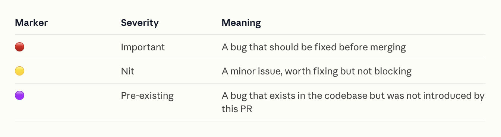
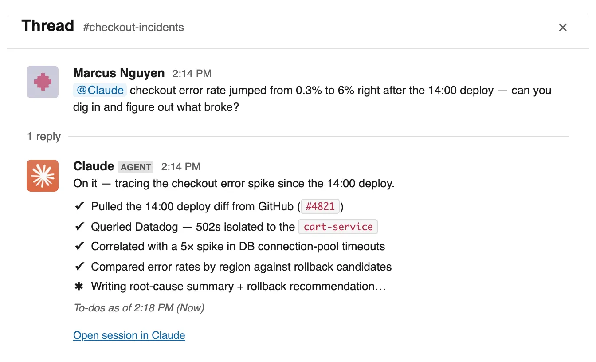

# Claude Code 初创公司指南

> 原文：https://claude.com/blog/claude-code-guide-for-startups

高速成长的初创公司如何用 Claude Code 交付产品——五条运作原则，源自对十余家公司的访谈。

- **分类**：[Claude Code](https://claude.com/blog/category/claude-code)
- **产品**：[Claude Code](https://claude.com/product/claude-code)
- **日期**：2026 年 8 月 20 日
- **阅读时长**：5 分钟
- **分享链接**：https://claude.com/blog/claude-code-guide-for-startups
- **作者**：Michael Segner

想要 PDF 版？

**本指南同时提供下载版** —— 同样的五条规则、创始人洞察与检查清单，排版适合离线阅读或分享给你的团队。

[下载 PDF ↓](https://cdn.prod.website-files.com/6889473510b50328dbb70ae6/6a96d932afebe800aba280e2_Startup%20Guide%20to%20Claude%20Code%20v3.pdf)

## 工作在前沿的 AI 原住民

如果你想窥见工作的未来，就去问初创公司今天是怎么运作的。我们就这么做了。

我们与十余家高速成长的初创公司聊了聊，了解他们如何使用智能体编码工具来构建产品、扩张公司。这些初创公司正在改写规则：谁有资格构建、什么该被舍弃、以及如何在「你怎么构建」与「你构建什么」之间形成飞轮。

而他们的交付速度，堪比规模是自己十倍的组织。

ClickHouse**30%**功能交付量提升

Omni**2–3 倍**工程效率

Clay**100%**的 bug 分类实现自动化

Artemis Security**每周 6,000+**个 PR

在本指南中，我们将深入这些组织各具特色的落地实践，了解他们为了快速交付、维持竞争优势所遵循的规则。

在此过程中，我们也将开始窥见这个问题的答案：如果一个组织从零开始、以 Claude Code 为基础搭建自己的产品开发生命周期，会是什么样子？

五条规则

1. [人人都能交付](#rule-1)
2. [自动化繁琐工作](#rule-2)
3. [信任，但要验证](#rule-3)
4. [为重建而构建](#rule-4)
5. [原型、内部试用、产品化](#rule-5)

创始人洞察来自

[Artemis Security](https://artemissecurity.com/)、[Cainex](https://www.cainex.com/)、[Clay](https://www.clay.com/)、[ClickHouse](https://clickhouse.com/)、[Commure](https://www.commure.com/)、[Crosby](https://crosby.ai/)、[Emergent](https://emergent.sh/)、[Harvey](https://www.harvey.ai/)、[Heidi](https://www.heidihealth.com/)、[Higgsfield](https://higgsfield.ai/)、[Omni](https://omni.co/)、[Parahelp](https://www.parahelp.com/)

**提示：** 只想看可落地的下一步？我们在[本指南末尾放了一份检查清单](#checklist)，汇总了各章节包含的关键技术要点。

**01**

## 人人都能交付

智能体编码降低了入门门槛，于是最懂这个问题的人，可以亲手交付修复的第一个版本。

智能体编码降低了非技术员工构建产品的门槛。有了 Claude Code，你不必精通某门编程语言、也不必会用 IDE，就能创建出可用的功能。

> "不只是工程师的交付量大幅提升，非技术人员（比如我）也突然开始交付 UI 改动和其他产品改进了。"

**[Mads Lunau Liechti](https://www.linkedin.com/in/mads-lunau-liechti/)** · 联合创始人，[Parahelp](https://www.parahelp.com/)

对初创公司创始人来说，这带来的优势是显而易见的。首先，他们没有大公司竞争对手那样的人头编制，所以必须「全员上阵」。但创始人追求的不只是原始产能——这些非技术的团队成员还带来了领域专业知识。

> "Claude Code 改变了在 Crosby 当一名律师的含义。律师们拥有最好的产品洞察，因为他们就是用户。看着他们大展身手，实在令人惊叹。"

**[Ryan Daniels](https://www.linkedin.com/in/crosbyryan/)** · 联合创始人兼 CEO，[Crosby](https://crosby.ai/)

我们从 Heidi 联合创始人兼 CEO Dr. Thomas Kelly 那里听到了同样的说法。

> "对我们来说，Claude Code 解决了『传话游戏』问题。一个新想法过去在团队里的传递路径是：有想法的人告诉 PM，PM 告诉设计师，设计师再告诉工程师……而想法的精髓不可避免地会在这条链条中丢失。等到东西真正交付出来，往往已经不像那个人当初设想的样子了。而且这要花上好几周。Claude Code 把这条链条压缩掉了。真正理解问题的那个人可以自己交付一个 PR，只在真正需要设计师和工程师专业能力的环节把他们请进来。"

**[Dr. Thomas Kelly](https://www.linkedin.com/in/tomkeykong/)** · 联合创始人兼 CEO，[Heidi](https://www.heidihealth.com/)

说「人人都能交付」很适合写成一条 LinkedIn 帖子，但现实中它到底怎么运作？难道市场团队在审批 pull request？法务团队在钻研如何二分定位不稳定的测试？

我们得到的答案是：分工依然存在。市场人员仍然专注于市场，开发者仍然专注于开发。但那个至关重要的第一步——把一个想法变成可运行的原型、从 0 到 1——是对所有人开放的。

我们还看到，最高效的初创公司会建立机制，让这些贡献成为系统性的，而不是交给运气或个人抱负。

### 建立连接

要求员工使用 AI 是一回事，让他们真正拿到 Claude Code 以及所需的工具是另一回事。

> "我们其实并没有在回避[让非技术员工参与贡献]，我们正朝它走去。我们的看法是，每个岗位都在变成工程岗位，因为你可以为它构建软件……所以我们招聘那些爱折腾、对构建东西有兴趣的人。"

**[Kareem Amin](https://www.linkedin.com/in/kareemamin/)** · 联合创始人兼 CEO，[Clay](https://www.clay.com/)

在 Crosby，团队没有把律师带到 Claude Code 面前，而是把 Claude Code 带到律师面前——把它连接到律师们熟悉、每天都在使用的工具和操作系统上。

**提示：** Claude 无法理解它看不到的东西。扩大 Claude 价值最有效的方式之一，就是把它连接到事实来源以及你团队每天使用的工具上。

[MCP](https://code.claude.com/docs/en/mcp) 是一个用于 AI 工具集成的开源标准，它让 Claude Code 能够访问你的工具、数据库和 API。每当你的团队发现自己在把信息从某个工具里复制粘贴到 Claude 时，就该考虑添加这类连接了。

当已经存在成熟的命令行工具（`gh`、`kubectl`、`bq`、`psql`），而你希望 Claude 基于与工程师相同的事实基准工作时，通过 CLI 连接可以更省 token。

*Claude Code 桌面端的 MCP 连接器目录。*

### 站会展示

想法总要在某个时点获得被优先排期的机会，这样组织资源才能帮它推向市场。对产品经理来说这条路很清晰——毕竟这是他们的工作——但对非技术员工就没那么清晰了。

Clay 设立了季度评审，在会上审议原型，通过的可以进入正式路线图。Clay 一位市场团队成员就是这样构建出一个自主智能体：它会访问你的网站、填写你的线索收集表单、计时统计响应耗时、给体验打分，并生成一份表现报告。

Omni 有一个专门的 Slack 频道用于 Claude 生成的原型，所有人都在里面贡献，包括资深技术人员。他们同时实践着「人人都能交付」的推论——「人人都要与客户交谈」。

> 尽管工程师天性上并不倾向于参加客户通话，Omni 仍刻意把他们推到客户面前，因为这样能更快闭合反馈回路。

**[Chris Merrick](https://www.linkedin.com/in/merrickchristopher/)** · 联合创始人兼 CTO，[Omni](https://omni.co/)

### 共享 skills

「人人都能交付」与「零散拼凑」之间的界线可能很薄。功能原型无论来自谁，最终都需要整合进一个感觉浑然一体的产品。这时 skills——把团队标准与上下文编码进去的可复用指令文件——就能帮助开发在流程日益民主化的同时保持对齐。

「团队里任何人都可以用我们的设计系统作参照，从 Claude Code 起草产品组件、市场素材或演示材料。触及产品本身的 AI 必须跨过更高得多的门槛，而 Claude Code 帮我们以更高的精度达到这条线。」Heidi 的 Dr. Thomas Kelly 说。

它们还能让新开发者和非技术员工快速完成上手、投入运转。

> 「……我们还有一个存放 Claude Code skills 的 GitHub 仓库，它充当共享知识库，用于快速引导一个 Claude Code 会话，让它带上已知的 Emergent 细节，比如数据库[与数据仓库]位置、部分 schema[信息]、公司整体上下文……在这件事上不必追求完美，只要智能体能够快速核实并自行纠偏，容忍上下文文件稍微过时是可以接受的。」

**[Mukund Jha](https://www.linkedin.com/in/mukund-jha-a1596413/)** · 联合创始人兼 CEO，[Emergent](https://emergent.sh/)

> 「我们的工程师用 Claude Code 搭起了一个内部专用智能体市场，按角色组织，于是工程、交付和销售各自都能拿到贴合他们真实工作方式的工具。」

**[Jack O'Hara](https://www.linkedin.com/in/jack-o-hara-/)** · 创始人兼 CEO，[Translucent](https://www.translucent.co/)

**提示：** skills [可以借助目录在公司范围内共享](https://code.claude.com/docs/en/plugin-marketplaces)，这样一名员工的最佳实践能被立刻传递给另一名员工。在仓库的每个子目录里使用 `CLAUDE.md` 文件，承载该子目录专属、每次都适用的编码约定。而按需触发的流程性工作流则交给 skills。更多信息请阅读：[Steering Claude Code: when to use CLAUDE.md, skills, hooks, and subagents](https://claude.com/blog/steering-claude-code-skills-hooks-rules-subagents-and-more)。

**02**

## 自动化繁琐工作

智能体接手生命周期中机械的那 80%，于是工程师把时间花在真正需要判断力的场景上。

自工业革命伊始，所有公司都在试图通过技术获得效率提升，但这些初创公司凭借采纳的速度与深度把自己区分开来。

这些创始人相信 AI 是他们使命中不可或缺的一环。许多人明确表示：智能体接手机械的那 80%，于是工程师把时间花在真正需要判断力的场景上。

> 「所有人都在争着构建 AI 产品，而着手重建自己公司实际运作方式的人要少得多。后者才是更大的解锁。Artemis Security 是作为一家 AI 原生公司在运转，而不是一家恰好用了 AI 的公司。这让我们的速度获得超级加成，也使我们能帮助客户以机器速度阻断攻击。」

**[Shachar Hirshberg](https://www.linkedin.com/in/shachar-hirshberg/)** · 联合创始人兼 CEO，[Artemis Security](https://artemissecurity.com/)

具体来说，我们看到 AI 在他们的 SDLC 各阶段里被整合得比其他公司更紧密，也看到更多为把重复任务端到端接手而专门构建的智能体。下面各看几个例子。

### AI 原生的 SDLC

本文提到的许多初创公司都实现了某种手段，加速团队成员上手他们的智能体编码流程。例如在 Emergent，Mukund 告诉我们：「入职第一天，新人只要把 Claude 指向正确的 markdown 文件，就能引导完成整套开发环境配置。如果 Claude 在上手过程中撞上任何损坏或过期的内容，它会更新那个文件。」

**提示：** [Code Review](https://code.claude.com/docs/en/code-review)（研究预览）是 Claude Code 中的一项托管式多智能体服务。它会对你启用的仓库中的 PR 执行一轮自动化评审。你可以手动修复发现的问题并推送，或者通过在该问题下评论 `@Claude` 来闭合回路（前提是你已设置并配置好 GitHub Actions）。

Code Review 为每条发现标注严重级别。

这些工程师需要被快速带上手，因为这些团队交付得很快。

> 「这里的工程师在编排智能体舰队，在发现生产数据问题的当天就把修复交付上线，并且同时推进多个 PR。有一名工程师用 Claude 子智能体并行跑了一个约 13 个工单的项目，每个子智能体负责一个工单及其 PR。」

**[Tanay Tandon](https://www.linkedin.com/in/tanaytandon/)** · CEO 兼创始人，[Commure](https://www.commure.com/)

在这些组织里，Claude Code 不只帮助生成代码，也评审代码。「我们对照经过审核的技术与合规框架运行自动化代码评审，标记关键问题，并在任何东西上线之前把建议改动路由给合适的评审人。」Heidi 的 Dr. Kelly 说。

其中一些组织还为代码评审、测试与 CI 构建了自定义智能体。这些初创公司在[构建回路](https://claude.com/blog/getting-started-with-loops)上投入了相当的注意力，而不只是部署代码。

「我最喜欢的[智能体]是『Translucent 代码评审者』，它会在一次改动上扇出展开，从多个角度评审，并像我们某位资深工程师那样综合结果，但比任何单个人都更快。」Translucent 创始人 Jack 说。

Clay「……构建了一个智能体，来处理……bug 分类，从初筛一直到为修复给出建议的代码改动。」Kareem 说。

**提示：** 过去几个月里，[Claude Tag](https://claude.com/product/tag) 一直是 Anthropic 内部 CI/CD 故障的 on-call 第一响应者。近期每一起有情况报告的事故，第一份报告都由 Claude 撰写，通常在 15 分钟内就发布了它的首轮分析。

[Claude Tag 有自己的服务账号](https://claude.com/blog/agent-identity-access-model)，并能访问 Anthropic 一名 CI 工程师所需的工具，比如 Datadog 或 Grafana。常驻指令以 skills 形式放在 markdown 文件里，提交进一个 GitHub 仓库。这样多位队友可以共同迭代它们，我们也能像管理代码那样管理这些变更。

Claude Tag 在 Slack 中接手一个 on-call 话题，并在频道内汇报进展。

‍

> 这一点在 [ClickHouse](https://clickhouse.com/) 最为突出，**联合创始人兼 CTO Alexey Milovidov 报告说**，这家数据库公司几乎已把 SDLC 的每个阶段都变成了自主回路。两个专门构建的智能体——分别用于修复不稳定测试和找出缺失的测试覆盖——现在是 ClickHouse 仓库的第 2 和第 3 大贡献者。另有一族智能体负责运维，而团队本身就是用 Claude Code 来构建并迭代这些智能体的。

### 用智能体加速流程

另一个一致的模式是：这些初创公司不仅在 Claude Code 中用智能体回路加速开发工作，还会创建智能体来加速那些重复且往往繁琐的流程。

这些通常是例行工作，把它们交出去，就能把更多注意力集中在竞争优势、客户关系和营收增长上。我们看到被 Claude 加速的最常见流程之一，是自助式数据分析。

这些公司几乎每一家都有某种机制，让自己能基于新鲜数据（包括非结构化数据）做出快速决策——而这正是初创公司生命中至关重要的转向所依赖的燃料。

例如，Clay 构建了一个内部分析智能体；Heidi 用 Claude Code 把客户与临床医生的反馈同使用数据放在一起归类，浮现出对产品洞察真正重要的信号。

ClickHouse 和 Omni 都在自己的产品里封装了这类 AI 数据分析能力，全部由 Claude 驱动。

其他例子还包括：用子智能体总结数千份法律文档（Crosby）、扫描理赔数据以标记跨站点的异常（Commure），以及持续挖掘医院财务数据、发现任何分析师团队都来不及捕捉的预警信号（Translucent）。

**提示：** [Dynamic workflows](https://claude.com/blog/a-harness-for-every-task-dynamic-workflows-in-claude-code) 可以用来扇出多个子智能体并行分析大量数据，或对另一个智能体的工作做对抗式评审。使用 Claude Opus 或 Claude Fable 这类模型时，直接说「fan out multiple subagents」或「use a workflow」即可。

**03**

## 信任，但要验证

除非你有可靠的手段监控并验证结果，否则你无法自动化一个流程。

这条规则是规则 2「自动化繁琐工作」的必要推论：除非你有可靠的手段监控并验证结果，否则你无法自动化一个流程。

> Artemis Security 联合创始人 Dan Shiebler 说，他们提升后的部署速度之所以行得通，……「是因为我们在测试基础设施、代码库组织和团队知识系统上做了很深的投入，让智能体能够端到端交付。这就是我们与 Claude 一起建起来的飞轮：以正确的方式组织你的代码库、知识库和团队，那么每一份贡献都会复利叠加。」

**[Dan Shiebler](https://www.linkedin.com/in/dan-shiebler-10219b42/)** · 联合创始人，[Artemis Security](https://artemissecurity.com/)

> 「早期我们给了 Claude 完全的自主权，它做出了 AI 会做的事：飞快地交付看似合理的代码。问题在于它以那种看起来对、实际不对的方式偏离了我们的架构。于是我们……把每一条不变量都写了下来。我们如何框定问题。无论如何都必须成立的是什么。如何证明某个东西真的可行，而不是去信任一个自信的答案。567 行关于这个团队如何思考的说明。」

**[Victor Hunt](https://www.linkedin.com/in/victor-c-hunt)** · 联合创始人兼 CEO，[Zingage](https://zingage.com/)

**提示：** 把不能变的东西放进仓库根目录的 `CLAUDE.md`。Claude 在每个会话开始时都会读它，于是你的架构规则、安全边界和不可妥协项会跟随每一个会话。

需要说明的是，这些初创公司没有一家是让智能体直接合并进 main 然后祈祷一切顺利。其中许多身处高度受监管的行业，需要强有力的治理框架。Cainex 是一个特别有说服力的例子——它把智能体与确定性检查结合起来，读取病历并生成用于指导医院计费的编码。

> 「在医疗编码里，一个错误的编码不是错别字，而是一起计费与合规事件。这一个事实主宰了我们的构建方式。」

**[Uriah Israel](https://www.linkedin.com/in/uriah-israel/)** · 联合创始人兼 CTO，[Cainex](https://www.cainex.com/)

「这是 Claude Code 为我们运行的回路。我们用一个智能体处理一批数据，我们的审核员在一个内部应用里评审输出。他们看到的不只是编码，还能看到模型的推理过程，并且对两者都作出评注……一切都有版本、可审计。」他说。

「然后 Claude Code 接手。它直接从数据库读取原始预测，以及每一条修正与评注。每条修正都按涉及的编码种类打了标签，于是 Claude Code 知道自己面对的是诊断类问题、操作类问题还是别的类别，从而能直接找到主宰那类特定编码的指引。

从那里出发，它会定位到产生这个错误的那部分智能体指令并加以修订，或者在案例确实是新的时候写下新的指引。每一次改动都针对一套带版本的指令进行，并对照那些失败的记录做测试。我们强制执行的规则是：修正原则，而不是修正个例。」他接着说。

「然后是回测。一份记录可能有不止一种可接受的编码方式，所以这不是字符串匹配。这项检查把针对我们已接受集合的语义匹配，与一个提问『这是真错误还是只是另一条同样有效的路径』的裁判结合起来，Claude Code 还会在此之上加入它自己的比对。

它会把候选改动跑遍一个 golden set 加上随机抽样，并在任何东西上线之前浮现出所有回归。返回的是一份简短清单：建议的编辑、它无法定论的记录，以及它希望得到解答的问题。工程师把时间花在真正困难的案例上，而不是机械的那 80%。」他说。

创始人们可以从这套医疗计费专用工作流里提炼出许多通用的启示。

例如，Cainex 让领域专家例行评审并引导 Claude 的推理，并确保那些引导成为自我改进回路的一部分。但这些专家不是逐个例子去修的，他们的引导被用作自我改进回路的一环。用 Uriah 的话说：「修正原则，而不是修正个例。」

**提示：** 回路（loops）是重复执行工作周期、直到满足停止条件的智能体。它们可以有效地让 Claude Code 承担更自主或更长周期的工作。[你可以用 skills 来定义智能体需要满足的判定标准](https://claude.com/blog/building-verification-loops-in-claude-code-with-skills)（定义得越清晰越好），并让智能体持续迭代直到达成目标。

例如，许多组织会创建不稳定测试智能体（或回路），因为停止条件清晰且自成闭环：智能体可以通过反复重跑测试直到通过，来验证自己的修复。

回路重复执行工作周期，直到满足停止条件。

‍

另一个启示是，他们在维护一套强健的评估「golden set」上投入了勤勉——那是一组经过验证的问答对，团队用它来核实智能体的准确性。每家初创公司都应该为自己的关键用例维护多套 evals，并定期更新，这样才能防止漂移，也才能评估未来的模型。

> 「[Claude Code] 还改变了我们管理模型迭代速度的方式。新的视频与图像模型不断到来，每一个在部署前都需要新的 skills、评估、路由逻辑和生产测试。Claude Code 把这个周期从数天压缩到数小时，让我们能在同一个会话里发现生产问题并部署修复……当你在与人头是自己 10 倍的公司竞争时，这种杠杆会改变一切。」

**[Alex Mashrabov](https://www.linkedin.com/in/amashrabov)** · 联合创始人兼 CEO，[Higgsfield](https://higgsfield.ai/)

**提示：** 团队刚开始构建智能体时，靠手工测试、内部试用和直觉的组合，能走得出人意料地远。断裂点往往出现在用户反馈说智能体在改动之后变差了，而团队却在「盲飞」——除了猜测和试错，没有任何验证手段。团队无法区分真实回归与噪声，无法在上线前对照数百个场景自动测试改动，也无法度量改进。更多信息请阅读：[Demystifying evals for AI agents](https://www.anthropic.com/engineering/demystifying-evals-for-ai-agents)。

Uriah 提出的最后一点是，这套流程需要一些功夫。「一开始并没有这么干净。我们的第一版过拟合了。它会通过把具体个例编码进去来『修复』问题，于是我们是在积累补丁，而不是变得更聪明。我们改变了做法，强制走向通用原则，并限制一次改动里最多能进入多少具体细节。」

**提示：** AI 智能体不是确定性的，但大量受高度监管的工作要求流程每次都以相同方式完成。Claude Code 具备一些特性，可以帮助把前沿智能与确定性流程结合起来。

[Hooks](https://code.claude.com/docs/en/hooks) 是用户自定义的命令，在 Claude Code 生命周期的固定节点触发，可以充当硬性闸门。无论模型作出什么决定，它们每次都会执行。例如可以用它们拦截未通过 lint 的写入、在提交前要求测试通过，或在任何东西离开沙箱之前剥除密钥。

[Dynamic workflows](https://code.claude.com/docs/en/workflows#orchestrate-subagents-at-scale-with-dynamic-workflows) 以确定性的时序、独立的上下文窗口和聚焦的目标来编排子智能体。`/goal` 适用于那些长而复杂的任务——在这类任务里 Claude 可能过早宣告完工、在评审时偏向自己的结论，并偏离最初的目标。

**04**

## 为重建而构建

模型能力在这些团队脚下不断移动，于是几乎没有什么被当作永久之物。

这些 AI 原生初创公司中的许多，都处在持续再造的状态里。

AI 往往既是他们所构建之物的核心，也是他们构建方式的核心。由于模型能力持续演进，开创性的功能和关键的脚手架一旦成为沉没成本，就会在那一刻被丢弃。这些组织中许多把这种不断重建视为自身竞争优势的一部分。

「我们在 Clay 的做法是：你构建它，然后再构建一遍，然后再构建一遍。到你第四次构建的时候，你已经知道所需的一切，于是你把它做对了。所以我们并不一定是把东西扔掉，我们只是重建它——而这一次带着更高的清晰度。」Kareem 说。

「一次重建不是在新路径上线时完成的，而是在旧路径消失时完成的。拆除工作以前在优先级之争里从来都是输的：它繁琐，而且不产出任何功能。」Commure 联合创始人 Tanay 说，「现在 Commure 的一位工程师只需调用一个 Claude skill，大意是『对每一个已经向所有人发布的功能开关，开一个 PR 把它和相关代码删掉』，然后工程师评审返回的结果。以往吞掉大量开发周期的迁移工作，现在只是一份计划加一次扇出，几个小时就完成了。」

**提示：** 使用 [git worktrees](https://code.claude.com/docs/en/worktrees) 在仓库的隔离副本里执行重建，同时保持当前版本毫发无损。Claude Code 可以帮你拉起一个——于是你得到 v2 与 v1 并排运行，对两者都跑你的 evals，只在新版本胜出时才合并。这正是「构建四次」变得便宜的原因。

一个仓库、一个对象存储——三个可同时工作的 checkout，各自在自己的分支上。

每个链接的 worktree 都是一个普通目录，带有自己已 checkout 的分支；三者共享 acme-web 内部那唯一的 .git 对象存储。

Kareem 还把 Clay 护城河的一部分描述为持续重建、演进并创建自我改进回路的能力。

「我认为当下任何一家公司的护城河，都在于它必须是自我改进的。所以 Clay 是一台自我学习的营收引擎。你用得越多，我们就越了解谁是你最好的客户、你该说什么、什么奏效过、什么没有——而这些会随时间变化。」他说，「这场竞赛真正比的是谁能最快触达分发……这样你才能帮到每一位[客户]，从而实现自我改进。」

在[2026 年 5 月的 Code with Claude 活动](https://www.youtube.com/live/OFDm3T7pVlc?si=Z_RENcJSqm8H79aj)上，Harvey 的 Applied AI 负责人 Niko Grupen 谈到，每一波新的模型能力——涌现式推理、智能体自动化、规划与编排——都要求平台做一次彻底的重新架构。

> 「如果你六个月前问我我们的架构是什么样，我给出的答案会和今天的样子有根本性的不同。如果我们当时不愿意说『嘿，我们得把这个推倒重来、走 agent native 路线』，我们的平台现在根本不可能拥有这些能力。」

**[Niko Grupen](https://www.linkedin.com/in/nikogrupen)** · Applied AI 负责人，[Harvey](https://www.harvey.ai/)

**提示：** 对于非琐碎的重写，用 [plan mode](https://code.claude.com/docs/en/permission-modes#analyze-before-you-edit-with-plan-mode) 启动 Claude Code（`--plan` 或按 Shift+Tab）。Claude 会先探索代码库、提出重建方案，然后才动笔写代码——你来批准或重新引导。这是拦住一次即将偏离你架构的重建的最廉价位置。

**05**

## 原型、内部试用、产品化

用 AI 构建，帮助这些初创公司做出用 AI 颠覆行业的产品——这是他们流程核心的飞轮。

这些初创公司中许多在开发流程核心都有一个关键飞轮：用 AI 构建，帮助他们创造出用 AI 实现颠覆的产品。

当开发者把自己的智能体编码实践推进一步时，他们对模型能力的把握会更牢，也会获得关于工具链设计如何在前沿演进的洞察。随后他们能把这份灵感用进自己的智能体与产品里。

「我们从[Anthropic 的]文件式与 embedding 式方案对比中获得了启发，这让我们有胆量在自己的产品里保持简单。我们避开了一条 RAG 流水线本会带来的大量复杂度。」Omni 的 Chris 说，「我们还看到 Claude Code 的工具链是如何让用户并行做事的，并把其中一些概念改造进了我们自己的 UI。」

这也帮助他们对自家产品的表现保持敏感。

「因为我们的 app builder 背后也用 Anthropic 的模型，所以一旦我们在产品上看到某种行为……就可以通过 Claude Code 快速在本地调试，判断这是模型行为还是工具链问题。这极大地帮助我们改进了问题分诊周期。」Emergent 的 Mukund 说。

我们反复听到的模式是：用 Claude Code 构建一个内部智能体，在内部使用（内部试用），并依据反响把它提升为面向客户的产品——通常借助 Claude API、SDK 或 Claude Managed Agents。

「我们[在产品里]构建了自己的 AI 智能体，团队可以直接与它们交互，其中包括 SQL 控制台里的一个智能体和一个 AI SRE。我们用 Claude Code 来构建并迭代这些智能体本身。为客户的 AI 体验提供动力的工具链，本身就有一部分是用 AI 构建的。」ClickHouse 的 Alexey 说。

## 检查清单

本指南覆盖了很多内容。以下是关键要点汇总在一页上：

#### 第 1 章：人人都能交付

[ ] Claude 无法理解它看不到的东西。通过 [MCP](https://code.claude.com/docs/en/mcp) 或 CLI 把它连接到事实来源以及你团队每天使用的工具上。[ ] 建立一个[公司插件市场](https://code.claude.com/docs/en/plugin-marketplaces)，让一名员工的最佳实践能以 skill 形式立刻传递给另一名员工。在仓库的每个子目录里使用 CLAUDE.md 文件，承载该子目录专属、每次都适用的编码约定。按需触发的流程性工作流交给 skills。

#### 第 2 章：自动化繁琐工作

[ ] 在某个仓库上启用 [Code Review](https://code.claude.com/docs/en/code-review)（研究预览），对 PR 执行自动化评审。[ ] 把 [Claude Tag](https://claude.com/product/tag)（公开测试）纳入你的 CI/CD on-call 响应与 bug 分诊。[ ] [Dynamic workflows](https://code.claude.com/docs/en/workflows#orchestrate-subagents-at-scale-with-dynamic-workflows) 可用于扇出多个子智能体并行分析大量数据，或对另一个智能体的工作做对抗式评审。

#### 第 3 章：信任，但要验证

[ ] 把不能变的东西放进仓库根目录的 CLAUDE.md。[ ] 对更自主或更长周期的工作，使用[回路](https://code.claude.com/docs/en/workflows)——重复执行工作周期、直到满足停止条件的智能体。[ ] 建立一套[创建与维护智能体评估](https://www.anthropic.com/engineering/demystifying-evals-for-ai-agents)的流程。[ ] [Hooks](https://code.claude.com/docs/en/hooks) 是在 Claude Code 生命周期固定节点触发的用户自定义命令，可以充当硬性闸门。当工作中的某些环节必须是确定性的时候，就用它们。

#### 第 4 章：为重建而构建

[ ] 使用 [git worktrees](https://code.claude.com/docs/en/worktrees) 在仓库的隔离副本里执行重建，同时保持当前版本毫发无损。这正是「构建四次」变得便宜的原因。[ ] 对于非琐碎的重写，用 [plan mode](https://code.claude.com/docs/en/permission-modes#analyze-before-you-edit-with-plan-mode) 启动 Claude Code（/plan 或按 Shift+Tab）。Claude 会先探索代码库、提出重建方案，然后才动笔写代码——你来批准或重新引导。这是拦住一次即将偏离你架构的重建的最廉价位置。

## 前沿的初创公司在前沿构建

这些洞察来自正在前沿构建的同行，我们希望你觉得它们实用且可落地。Claude 初创公司社区是灵感、最佳实践与建议的持续来源。你可以通过以下方式加入这个社区：

* [订阅 Startup Newsletter 并加入 startup program](https://claude.com/programs/startups)。
* [收藏即将举办的 Claude Code 线上分享](https://academy.claude.com/code/webinars)。
* [参加你附近的活动](https://luma.com/claudecommunity)
* 在 [Reddit](https://www.reddit.com/r/ClaudeAI/) 和 [Discord](https://discord.com/invite/6PPFFzqPDZ) 上贡献。
* 早期阶段公司还可以申请 [Claude for Startups program](https://claude.com/programs/startups)，获取额度与支持。
