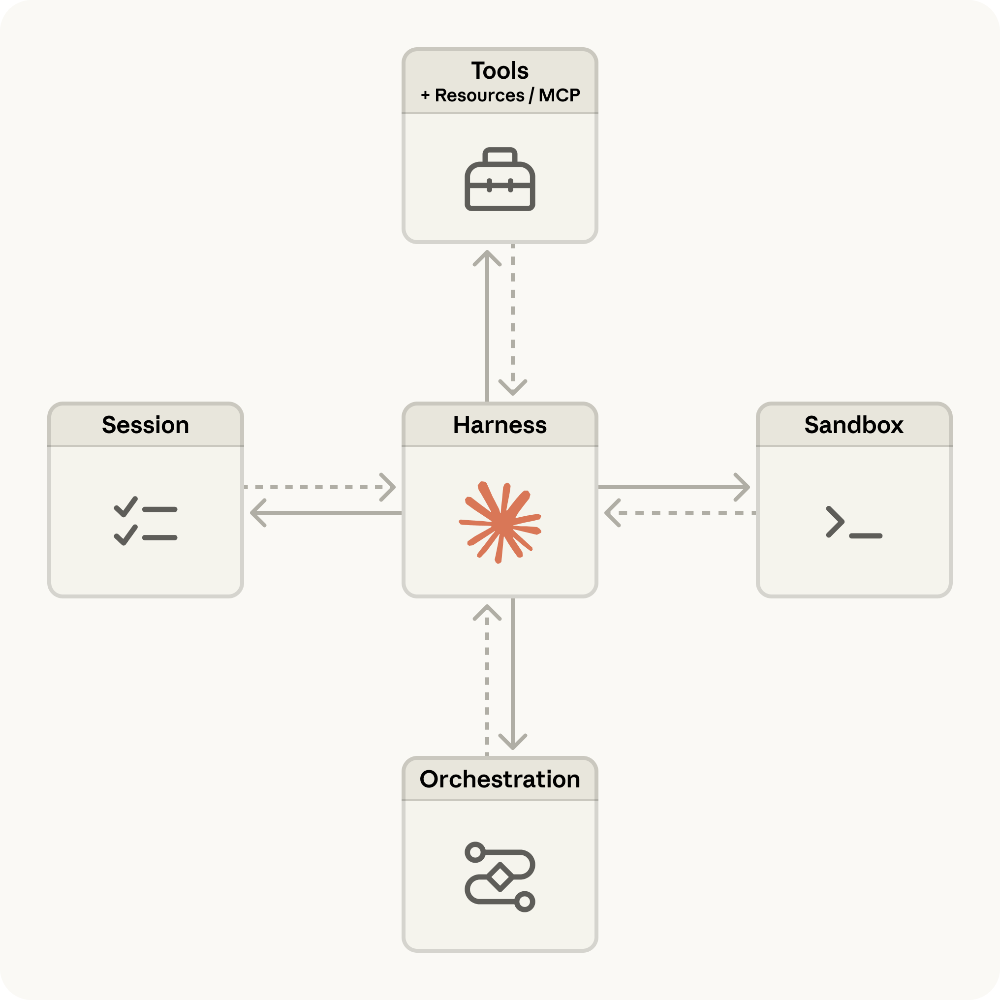

# Claude Managed Agents：将生产部署速度提升 10 倍

> 原文：https://claude.com/blog/claude-managed-agents 
> 分类：Product announcements | 产品：Claude Platform | 日期：2026年4月8日 | 阅读时长：5分钟

---

今天，我们正式推出 Claude Managed Agents——一套用于大规模构建和部署云端托管智能体的可组合 API。

在此之前，构建智能体意味着要把大量开发周期花在安全基础设施、状态管理、权限控制上，还要为每一次模型升级重新调整智能体循环。Managed Agents 将一套为性能调优的智能体工具链，与生产级基础设施相结合，让你从原型到正式上线只需数天，而不是数月。

无论你是在构建单任务执行器，还是复杂的多智能体流水线，都可以专注于用户体验，而不必操心运维负担。

Managed Agents 现已在 Claude Platform 上开放公开测试版。

## **将智能体的构建与部署速度提升 10 倍**

要将一个智能体投入生产，需要沙箱化代码执行、检查点机制、凭证管理、权限范围控制，以及端到端的执行追踪。在用户看到任何成果之前，这些基础设施工作往往就要耗费数月。

Managed Agents 帮你处理这些复杂性。你只需定义智能体的任务、工具和护栏，其余交给我们的基础设施运行。内置的编排工具链会决定何时调用工具、如何管理上下文，以及如何从错误中恢复。

Managed Agents 包括：

* **生产级智能体**：安全沙箱、身份认证和工具执行均由平台代为处理
* **长时间运行的会话**：可自主运行数小时，进度和输出即使在连接中断后也能持久保存
* **多智能体协同**：智能体可以派生并指挥其他智能体，实现复杂工作的并行化（目前处于*研究预览版*，可在[此处](http://claude.com/form/claude-managed-agents)申请访问权限）
* **可信治理**：让智能体能够访问真实系统，同时内置权限范围控制、身份管理和执行追踪

*Claude Managed Agents 架构图*

## **专为充分发挥 Claude 能力而设计**

Claude 模型天生适合智能体任务。Managed Agents 专为 Claude 打造，让你用更少的精力获得更好的智能体成果。

使用 Managed Agents，你只需定义目标和成功标准，Claude 会自我评估并持续迭代直至达成（目前处于*研究预览版*，可在[此处](http://claude.com/form/claude-managed-agents)申请访问权限）。它同样支持传统的"提示词-响应"工作流，以便在需要时进行更精细的控制。

在围绕结构化文件生成的内部测试中，相比标准的提示循环，Managed Agents 将任务成功率最高提升了 10 个百分点，在最难的问题上提升幅度最大。

会话追踪、集成分析和故障排查指引均已直接内置于 Claude Console 中，你可以查看每一次工具调用、每一个决策和每一种失败模式。

## **团队正在用它构建什么**

各团队已经在借助 Managed Agents，将多种生产场景的交付速度提升 10 倍：能够读取代码库、规划修复方案并提交 PR 的编码智能体；能够加入项目、领取任务并与团队协同交付成果的生产力智能体；能够处理文档并提取关键信息的财务与法务智能体。在每一个案例中，以"天"为单位的交付速度，都意味着能更快地为用户带来价值。

* [**Notion**](https://claude.com/customers/notion-qa) 让团队可以直接在其工作区内把工作委派给 Claude（目前已在 Notion Custom Agents 中开放私有内测）。工程师用它来交付代码，知识型员工用它来产出网站和演示文稿。数十个任务可以并行运行，同时整个团队协同处理输出结果。
* [**Rakuten**](https://claude.com/customers/rakuten-qa) 在产品、销售、市场和财务等部门部署了企业级智能体，并接入 Slack 和 Teams，让员工可以分配任务并收到电子表格、幻灯片、应用等交付成果。每个专家智能体都在一周内完成部署。
* [**Asana**](https://claude.com/customers/asana-qa) 构建了 AI Teammates——与人类协同工作、在 Asana 项目中承担任务并起草交付成果的协作型 AI 智能体。该团队借助 Managed Agents，以远超以往的速度添加了高级功能。
* [**Vibecode**](https://claude.com/customers/vibecode) 默认使用 Managed Agents 作为集成方案，帮助客户从一句提示词直接走到应用部署上线，为新一代 AI 原生应用提供动力。用户现在启动同样的基础设施，速度至少提升了 10 倍。
* [**Sentry**](https://claude.com/customers/sentry) 将其调试智能体 Seer，与一个由 Claude 驱动、能够编写补丁并提交 PR 的智能体相结合，让开发者从"发现 bug"到"获得可审查的修复方案"一气呵成。这项集成基于 Managed Agents，仅用数周就完成交付，而非数月。

> **Notion**
>
> "我们希望 Notion 成为团队与智能体协作、完成工作的最佳场所。为此，我们集成了 Claude Managed Agents，它能够处理长时间运行的会话、管理记忆，并长期保持高质量输出。现在，我们的用户可以把开放式的复杂任务——从编码到生成幻灯片和电子表格——完全委派出去，而无需离开 Notion。"
>
> —— Eric Liu，产品经理

> **Rakuten**
>
> "有了 Claude Managed Agents，我们的资深用户变得像达·芬奇一样，能够跨越单一专业领域，在多个方向上做出贡献。我们在一周内就能部署每一个专家智能体，管理横跨工程、产品、销售、市场和财务的长时间运行任务，在沙箱环境中生成应用、提案演示和电子表格。随着智能体能力不断增强，Managed Agents 让我们能够安全扩展，而无需自建智能体基础设施，从而可以把全部精力放在推动公司范围内的创新普及上。"
>
> —— Yusuke Kaji，AI for Business 总经理

> **Asana**
>
> "Claude Managed Agents 极大加速了我们 Asana AI Teammates 的开发进程——帮助我们更快交付高级功能——让我们能够专注于打造企业级的多人协作用户体验。"
>
> —— Amritansh Raghav，首席技术官

> **Vibecode**
>
> "在使用 Claude Managed Agents 之前，用户必须手动在沙箱中运行大语言模型、管理其生命周期、为其配备合适的工具并监督其执行，这个过程可能需要数周甚至数月才能搭建完成。现在，只需几行代码，用户就能以至少快 10 倍的速度启动同样的基础设施。这为开发者和'氛围编程者（vibe coder）'都打开了新的可能性。我们即将迎来 Web 和移动端 AI 原生应用的爆发式增长。"
>
> —— Ansh Nanda，联合创始人

> **Sentry**
>
> "事实证明，仅仅告诉开发者代码哪里出了问题是不够的——他们还希望你把它修好。现在，客户可以从 Seer 的根因分析，直接对接到一个由 Claude 驱动、能够编写修复方案并提交 PR 的智能体。我们选择 Claude Managed Agents，是因为它提供了安全、全托管的智能体运行时，让我们能够专注于打造从'发现问题'到'交接修复'之间的无缝开发体验。Managed Agents 不仅让我们能在数周内（而非数月）完成初期集成，还消除了维护定制智能体基础设施所带来的持续运维负担。"
>
> —— Indragie Karunaratne，工程高级总监（AI/ML）

> **Atlassian**
>
> "Atlassian 帮助企业协同编排人类与智能体的工作。借助 Claude Managed Agents，我们能够在数周内（而非数月）把面向开发者的智能体直接构建进团队已经在使用的工作流中，让客户可以直接从 Jira 分配任务。Managed Agents 处理了沙箱化、会话管理和权限范围控制等困难环节，这意味着我们的工程师可以少花时间在基础设施上，把更多精力投入到为终端用户打造出色功能上。"
>
> —— Sanchan Saxena，高级副总裁、Teamwork Collection 产品负责人

> **（一家法律科技公司）**
>
> "使用 Claude Managed Agents，我们构建了一套系统，能够从用户的文档和往来信函中提取信息，回答他们提出的任何问题——即便我们并未为此专门构建过检索工具。在使用 Managed Agents 之前，我们必须预判用户可能提出的每一个问题，并为每一个问题单独构建工具或提示词工作流。现在，借助 Managed Agents，系统可以随需即时编写所需的任何工具，从而能够处理几乎任何用户查询。这将开发时间缩短了 10 倍，让我们能够专注于用户体验，并接入更多数据源。"
>
> —— Javed Qadrud-Din，首席技术官

> **Blockit**
>
> "Claude Managed Agents 让我们构建生产级会议准备智能体的速度提升了 3 倍。我们从想法到正式上线，只用了几天时间。我们的智能体会在会议前研究每一位参会者，找出推动对话进展的关键信息。自定义工具让我们能够接入自己的日历和联系人数据，MCP 让连接会议记录工具、CRM 等外部系统变得简单，而托管工具链承担了包括沙箱化执行和内置网页搜索在内的繁重工作，让我们能够专注于打造产品本身，而不是基础设施。"
>
> —— John Han，联合创始人

## **开始使用**

Managed Agents 按用量计费。标准 Claude Platform token 费率照常适用，此外每个会话小时的活跃运行时另收取 $0.08。完整定价详情参见[文档](https://platform.claude.com/docs/en/about-claude/pricing#claude-managed-agents-pricing)。

Managed Agents 现已在 Claude Platform 上线。阅读我们的[文档](https://platform.claude.com/docs/en/managed-agents/overview)了解更多，或前往 [Claude Console](https://platform.claude.com/workspaces/default/agent-quickstart)，也可以使用我们全新的 CLI 部署你的第一个智能体。

开发者也可以使用最新版本的 Claude Code 及内置的 claude-api Skill 来基于 Managed Agents 构建应用。只需输入"start onboarding for managed agents in Claude API"即可开始。
