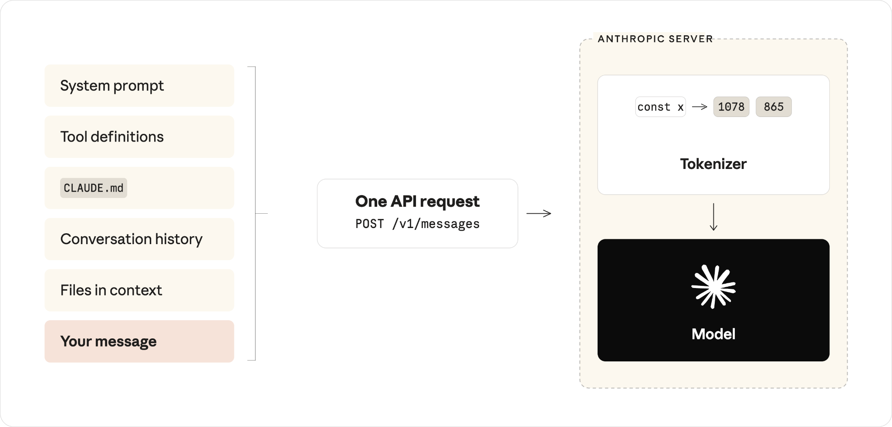
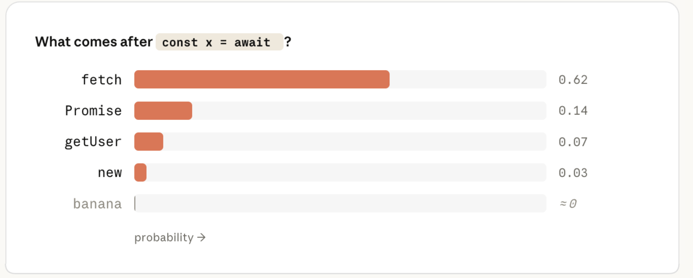
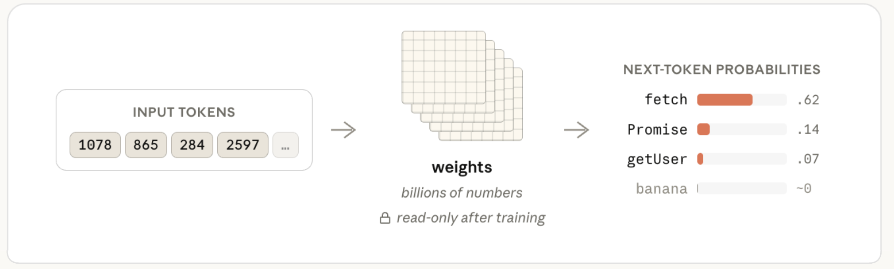
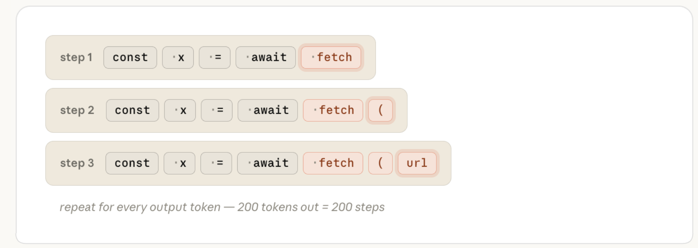
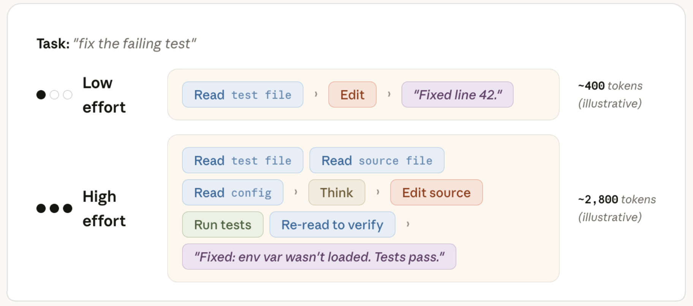
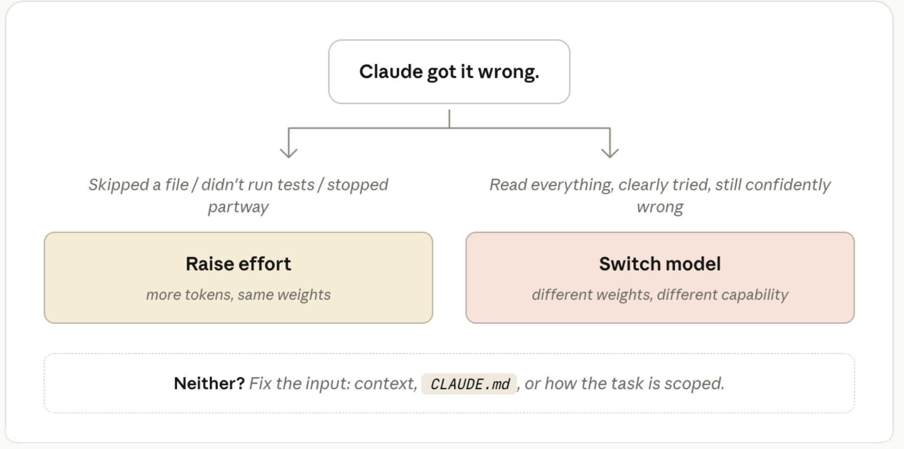
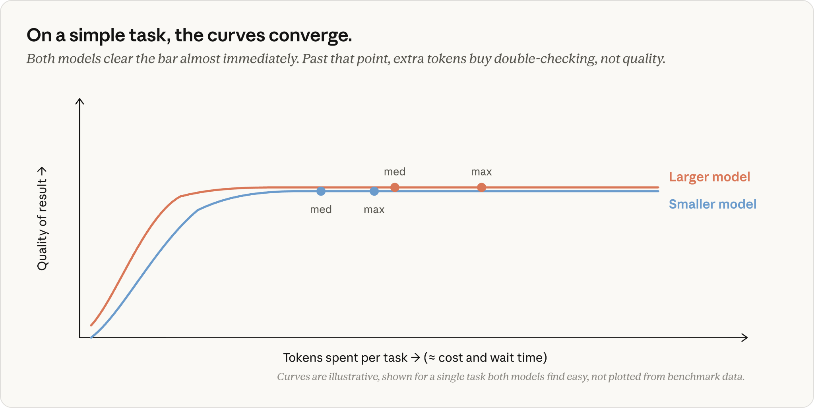
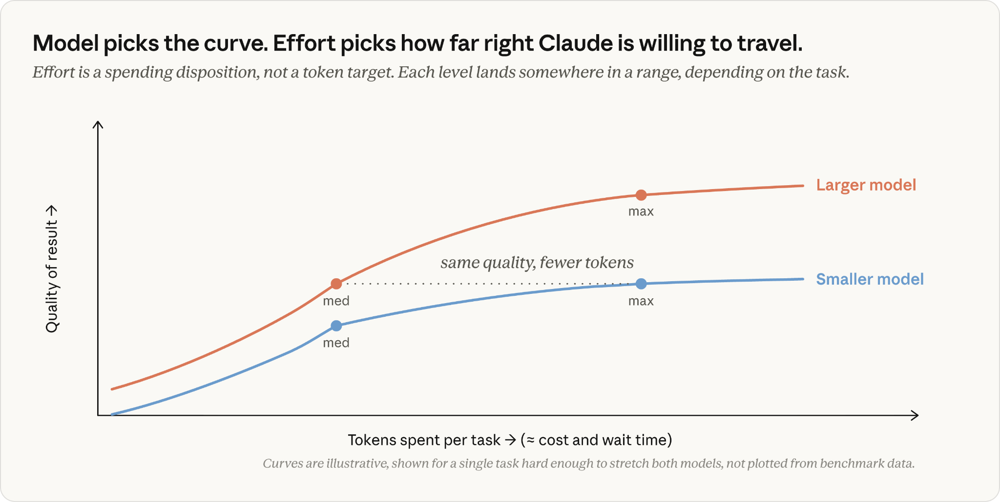

# 在 Claude Code 中选择 Claude 模型与 Effort 等级

> 原文：https://claude.com/blog/claude-model-and-effort-level-in-claude-code 
> 分类：Claude Code | 产品：Claude Code | 日期：2026年7月7日 | 阅读时长：5分钟

---

**关键要点**：

* 模型选择决定的是一组固定的权重，也就是模型的整体能力范围。虽然模型可以被提供上下文或引导，但模型的整体知识储备和能力是固定不变的。
* Effort（努力程度）的含义不止是"思考时间"。它控制的是 Claude 为你的请求整体投入多少工作量，包括读取多少文件、使用多少工具，以及在与你确认之前会推进多少步骤。
* 常规任务选择较小的模型，更复杂或更模糊的任务选择较大的模型。先从每个模型的默认 effort 等级开始，再根据你所从事工作的类型作为一种整体偏好去调整，而不是逐个任务地调整。
* 如果 Claude 已经拥有全部相关上下文、也明显尝试过了，但结果依然错误，这就是该换用能力更强模型的信号。如果 Claude 出错的原因是跳过了某个文件、没有运行测试，或者重构做到一半就放弃了，这就该调高 effort 等级。

## **Claude Code 的 Effort 等级与模型选择**

Claude Code 提供了两个看起来都能"让答案变得更好"的设置项：模型设置和 effort 等级。你可能会以为，像 Claude Fable 5 这样更大的模型会比 Claude Sonnet 给出更聪明的输出，而更高的 effort 等级则意味着 Claude 会在回答前思考更久。

第一个假设是准确的。按照行业标准基准测试，我们最大的模型确实能力更强。

但 effort 的含义不止是"思考时间"。Effort 等级控制的是 Claude 为你的请求整体投入多少工作量。这确实包括模型思考的时长，但也包括：

* 它会读取多少文件；
* 它会做多少验证；以及
* 在与你确认之前，它会在一个多步骤任务上推进多远。

在更高的 effort 等级下，Claude 在回到你面前之前，会执行更多这类动作（例如读取文件、运行测试、反复核查）。在较低的 effort 等级下，它更倾向于向你索要更多上下文，而不是花费 token 自己去摸索答案。

## **模型选择的工作原理**

当你按下回车时，Claude Code 会把你的消息与系统提示词、工具定义、你的 CLAUDE.md、对话历史，以及上下文中的任何文件组装在一起。所有这些内容作为一个请求发送给 API。

*Claude Code 拥有的一切都被打包进一个 API 请求。在服务端，文本在到达模型之前会先被分词（tokenize）。*

不过，模型看到的并不是纯文本。服务端最先发生的是**分词（tokenization）**：文本被切分成若干片段，每个片段被映射为模型训练时所用固定词表中的一个整数。`const` 可能被映射为 1978，`await` 可能被映射为 4293。从这一步开始，你的提示词就变成了一个整数数组。

*分词器把你的文本切分成若干片段，并将每个片段映射为固定词表中的一个整数。上排的每个片段对应下排的 token ID；图中 ID 仅为示意。*

模型的任务是接收这个数组，并预测下一个 token 是什么。它的做法是：为词表中的每一个 token 计算一个*概率*，再从概率最高的选项中挑选。在 `const x = await` 之后，一个训练良好的模型会给 `fetch`（很可能）分配很高的概率，而给 `banana`（几乎不可能）分配接近于零的概率。

*模型的预测，本质上是词表中每个 token 的一个概率值。排名第一的猜测与一个不相关选项之间的概率差距是巨大的。*

真正把输入 token 转化为这些概率的，是**权重（weights，也称为*参数*）**。这是组织成大型矩阵的数十亿个数字。为了预测一个 token，模型会让你的输入经过这些矩阵——一长串矩阵乘法运算——并在最后读取概率结果。模型"知道"的一切，都存在于这些权重之中。

**每个模型的权重都是在训练阶段确定的，到你发送请求的那一刻，它们已经是只读的了。**你的提示词、你的 CLAUDE.md，或者你的上下文中的任何内容，都不会改变这些权重。（如果你遇到过"推理（inference）"这个词，它指的正是这个含义：在训练完成、权重固定之后使用模型。）

*你的提示词进入，概率输出。中间的权重不会发生变化。*

Claude 关于 TypeScript、流行框架、地道的 Go 语言写法，或任何其他通用编程知识的一切了解，都是在训练阶段被编码进了这些权重之中。

你的提示词和上下文仍然可以*引导（steer）*预测结果（把你的真实代码放在 Claude 面前就是一种引导，而且效果很好），但它们并不会给权重本身增添任何新内容。

如果某个库在模型训练时还不存在，它就不会出现在权重里。你可以把相关文档放进上下文，Claude 会加以利用，但这属于*引导*，而不是*教学*。Claude 的回答只会在这一次请求中受到影响；底层模型并不会保留这些信息。

所以，当 Claude 信心满满地调用一个根本不存在的 API（也就是所谓的幻觉）时，那是权重根据训练模式生成了一段"看起来合理"的 token 序列，而不是一次查找失败。

那么，切换模型实际上改变了什么？它切换的是**处理你请求的那一组固定权重**。

模型并不会一次性生成整段答案。它每次预测一个 token，将其追加到序列末尾，然后重新完整运行一遍计算来得到下一个 token。一段 200 个 token 的回复，意味着经过权重的 200 次独立计算。你等待的大部分时间，以及你的大部分输出成本，都来自这个循环。

*序列每一步恰好增长一个 token。模型每次都要重新读取整个数组，才能预测接下来会出现什么。*

所以，**模型设置**决定的是*哪一组权重*处理你的请求，同时也决定了每个输出 token 的成本。

它不决定的，是最终会生成多少个 token。对于同一条提示词，这个数字可能相差很大，具体取决于 Claude 决定投入多少工作量。

而这正是 **effort 等级**所控制的：Claude 在每一轮交互中决定投入*多少工作量*。

## **Effort 的工作原理**

当 Claude Code 处理一项任务时，它生成的 token 大致可以分为几类：

* **思考（Thinking）**：你在动作之前和之间看到的、以流式方式呈现的推理过程
* **工具调用（Tool calls）**：命名某个工具（如 Read 或 Edit）及其参数的结构化代码块，Claude Code 随后会解析并执行它
* **给你的文本（Text to you）**：计划、进度更新，以及最后的总结

这些本质上都是同一个循环产出的普通输出 token，按同样的费率计费。例如，思考 token 的生成方式与其他输出 token 完全相同，并会在该轮交互接下来的过程中留在上下文里。

当 Claude 开始写代码时，它此前的推理过程会像它读取过的某个文件一样，成为输入的一部分。

*Claude 的所有输出都是 token。思考、工具调用和给你的文本，都产自同一个循环。*

那么 effort 究竟改变了什么？Effort 等级会作为请求的一部分，随你的提示词一起发送给模型。模型经过训练，能够理解在每种 effort 等级下该如何表现，这种习得的行为被固化在了那组固定权重之中。

当你的请求到达时，effort 等级和你的提示文本一样，是模型会响应的又一项输入。它决定了 Claude 在认为任务完成之前，需要做到多彻底、多确定。

**这一考量会在每一轮交互中都发生**，其结果是：为了产出置信度更高的答案，会生成更多 token。

*同一条提示词，两种 effort 等级。高 effort 路径为了得到置信度更高的答案，生成的 token 数量大约是低 effort 路径的 7 倍。*

在更高的 effort 等级下，Claude 通常会先制定一份计划，而 effort 的高低会影响这份计划的深度和广度。不过，这份计划并非一成不变。随着 Claude 从其执行的动作中获得反馈，它会更新已取得的进展，以及对已积累结果的确定程度。

因此，如果一个包含三个假设的调试计划，在第一步就找到了 bug，那么"排查假设 2 和假设 3"可能就不再是必要的动作了。Claude 通常会明确说明这一点，比如"第一项检查已经找到问题，因此不再需要剩余的检查"，然后直接跳过。你在 Claude Code 中看到任务清单在运行过程中被修订，正是这种情况的体现。

在更高的 effort 等级下，Claude 会更倾向于反复核查其他假设或验证正确性，但它通常不会在简单任务上人为地虚增用量。事实上，我们的团队在模型训练过程中会密切关注"过度思考"的问题，因为这会损害效果。

## **选择 Effort 等级**

我们的建议是：**对于大多数任务，你应该使用模型的默认 effort 等级**。默认等级是 Claude 会按照大多数人愿意为一项任务投入的程度来调整 token 用量的那个等级。

可以把 effort 理解为一个手动开关，用来调节 Claude 工作的力度和时长。当你基于所在领域或所从事工作的类型，对彻底程度或速度有明确偏好时，再有意识地去调整它。把这更多地看作一种整体偏好，而不是逐个任务的决策。

在[ Claude Opus 4.8 发布](https://www.anthropic.com/news/claude-opus-4-8)之后，有一些实用的经验可能对你有帮助：在我们的测试中发现，在使用 Opus 4.8 的默认 effort 设置时，相比使用 Opus 4.7 的默认 effort 设置处理同一任务，前者能以大致相同的 token 数量产出更好的结果。

## **当 Claude 出错时该调整什么**

当 Claude 出错时，你的第一反应不应该是去调某个旋钮，而是先审视你提供的上下文。你的提示词是否太模糊？Claude 是否连接了正确的工具？是否配备了合适的 skills？

如果你正在为一个*本不需要*更高 effort 的任务调高 effort，问题往往出在更上游——你的上下文、你的 CLAUDE.md，或者任务的界定方式。

但假设你已经提供了清晰的上下文，Claude 依然出错了，这时你该问自己的问题是：它是没有*足够努力地尝试*，还是没有*足够的知识*？

*两个问题，一个兜底方案。把这个启发式规则当作一个起点，而不是一条硬性规则。*

### **模型：问题本身太难**

当问题确实很难时，选择更大的模型。例如，微妙的 bug、不熟悉的领域，或架构决策类问题。当较小的模型无论获得多少上下文都会自信地给出错误答案时，更大的模型会很有帮助。

更大的模型也更擅长处理模糊性，而具体明确的执行指令则更适合在较小的模型上取得成功。

当工作是常规性的时候，选择更小的模型。例如，你能精确描述的编辑、机械性的改动，或是关于已经在上下文中的代码的问题。没有必要为任务不需要的能力付费。

如果 Claude 已经拥有全部相关上下文、也明显尝试过了，但结果依然错误，这就是该选择更大模型的信号。如果你正在使用更大的模型，而工作在一段时间内一直都很常规，切换到更小的模型通常能提升速度，并在不影响输出质量的前提下降低成本。

### **Effort：Claude 没有足够努力地尝试**

如果 Claude 出错的原因是跳过了某个文件、没有运行测试，或没有反复核查自己的工作，就该调高 effort 等级。当你选择的 effort 等级低于模型默认等级时，这一点尤其适用。

Fable、Opus 与 Sonnet：专家中的专家、通才中的专才

我喜欢这样理解这两个设置之间的关系：Fable 是一位见过几乎没人见过的问题的专家，Opus 是行家，Sonnet 则是一位非常出色的通才。而 effort 等级决定的是，无论是谁，会在你的任务上花多少时间。

**低 effort 的 Opus**，就像是获得了一位在你所面对的这类问题上经验深厚的专家的五分钟时间。他们带来的知识，是你代码库中哪里都找不到的：他们见过的模式、他们知道要留意的坑，这类东西只能从解决过大量类似问题中获得。但只给他们五分钟，意味着他们只能快速浏览你的代码，而无法仔细审阅。

**高 effort 的 Sonnet**，就像是给了一位非常出色的通才整整一个下午的时间。他们会阅读所有内容、运行各种操作、反复核查自己的工作，最终对*你的具体代码*形成透彻的理解。他们相对欠缺的，是那种"这个我以前见过一模一样的"的直觉。

**即便是低 effort 的 Fable**，也依然是那位专家——扫一眼所有人都卡住的问题，依然能发现其他人都发现不了的关键点。这种识别能力正是你花大价钱购买的东西，所以最好把它留给真正需要它的任务。

这几者中没有哪一个是全面更优的。模型设置大致对应*能力有多强*；effort 设置大致对应*做得有多彻底*。大多数实际任务两者都需要一些。

## **Effort、模型与 Token 消耗**

那么模型选择、effort 和 token 消耗之间究竟是如何相互作用的？这取决于具体任务。

在同样 effort 等级下的常规工作中，两种模型通常都能做对。较大的模型会因为额外的验证步骤而消耗更多 token，且单 token 单价更高。这就是为什么在常规工作上切换到较小的模型，能在不影响质量的前提下切实省钱。

*曲线仅用于示意，展示的是一个足够简单、两种模型都能快速完成的单一任务，不代表真实基准测试数据。*

而在更难、需要多步骤的工作中，情况就不同了。较小的模型必须不断逼近自身能力的极限，消耗大量迭代次数；而较大的模型则能以更少的步骤达到同样的质量标准。

虽然使用较大模型时每个 token 的价格更高，但在那些真正让较小模型捉襟见肘的任务上，每个任务的总成本反而可能更低。更重要的是，较大的模型能够完成一些较小模型即便在最高 effort 设置下也无法完成的任务。

这一点在 Fable 身上表现得最为明显。在长周期、多步骤的工作中，它遥遥领先。在我们的测试中，它完成了 Opus 和 Sonnet 在任何 effort 等级下都无法完成的任务。它每个 token 的成本也最高，这也是要把它留给真正需要它的工作的另一个原因。

*曲线仅用于示意，展示的是一个足够困难、会让两种模型都捉襟见肘的单一任务，不代表真实基准测试数据。*

上面这些图表中的关键点在于：effort 等级决定的是 Claude **愿意在这条曲线上走多远**，但同样，这并不意味着 Claude **需要走那么远**才能完成任务。

还有一个细微差别：effort 会影响 token 消耗，但不会限制它。系统中唯一的硬性上限是 [max_tokens](https://platform.claude.com/docs/en/build-with-claude/extended-thinking#max-tokens-and-context-window-size-with-extended-thinking)，一旦触及，它会在响应中途将其截断——这是一种相当生硬的手段，主要与 API 开发者相关。相比之下，像 [task budgets](https://platform.claude.com/docs/en/build-with-claude/task-budgets#task-budgets-are-advisory-not-enforced)，或者在提示词中要求 Claude 保持简洁这类更柔性的控制方式，会更有帮助。它们更像是模型经过训练会去遵循的指引——当接近上限时，它会主动设法收尾任务——而不是一堵它会一头撞上去的墙。

## **从默认设置开始，再去调旋钮**

大多数时候，你都不需要去操心这两个设置中的任何一个。当结果不尽如人意时，问一句"是 Claude 知识不够，还是没有足够努力地尝试？"，再据此进行调整。

*本文作者：Lydia Hallie，Claude Code 团队技术成员。*
