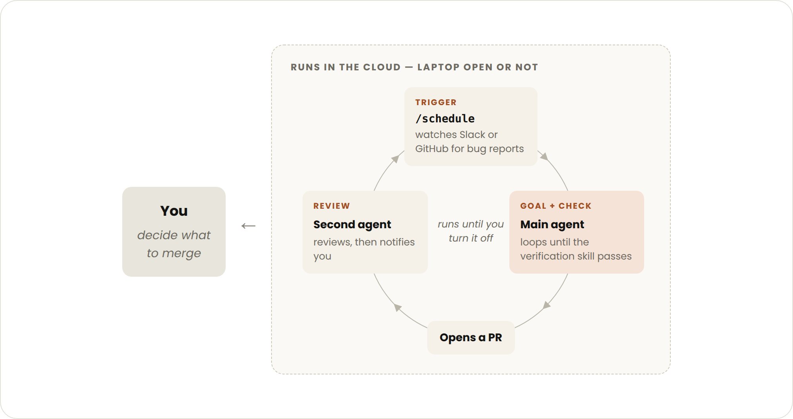

# 开始使用 Loops（循环）

> 原文：https://claude.com/blog/getting-started-with-loops<br/>
> 副标题：了解 Claude Code 团队如何定义智能体循环（agentic loop），包括从基于轮次到基于目标、基于时间、主动式循环的实践指南，以及各自的适用场景。<br/>
> 分类：Claude Code | 产品：Claude Code | 日期：2026年6月30日 | 阅读时长：5分钟

---

眼下关于"设计循环（loop）"而非直接向编码智能体下达提示词的讨论很多。如果你花点时间在 X 上追问"循环到底是什么"，会发现答案五花八门。

在 Claude Code 团队内部，我们将**循环定义为：智能体不断重复工作周期，直到满足某个停止条件**。我们根据以下几个维度对循环进行分类：

* 如何被触发
* 如何被停止
* 使用 Claude Code 的哪个原语（primitive）
* 每种类型最适合什么样的任务

本文将介绍主要的循环类型、各自的适用场景，以及如何在管理 token 用量的同时保持代码质量。并非所有任务都需要复杂的循环；请从最简单的方案开始，有选择地使用这些模式。

## **基于轮次的循环（Turn-based loops）**


* **触发方式**：用户下达的提示词
* **停止条件**：Claude 判断任务已完成，或需要更多上下文
* **最适用于**：不属于常规流程或固定日程的短任务
* **用量管理方式**：编写具体的提示词，并借助 skills 改进验证方式以减少轮次

你发送的每一条提示词，都会开启一个由你主导每一轮交互的手动循环。Claude 收集上下文、采取行动、检查自己的工作、按需重复，最后给出回应。我们称之为智能体循环（agentic loop）。

例如，让 Claude 创建一个点赞按钮：它会读取你的代码、进行修改、运行测试，然后交回一个它*认为*可行的结果。接下来你需要手动检查这项工作，并撰写下一条提示词。

你可以把手动验证步骤编码为一份 SKILL.md，让 Claude 能够端到端地检查更多自己的工作，从而改进验证环节。（关于在这类自动化场景中如何在 skills、hooks 和 subagents 之间做选择，参见我们的[《Steering Claude Code》指南](https://claude.com/blog/steering-claude-code-skills-hooks-rules-subagents-and-more)。）

这应当包括能让 Claude *查看*、*测量*或*操作*结果的工具或连接器。检查项越量化，Claude 自我验证就越容易。

例如，你可以在 SKILL.md 文件中这样描述：

```
---
name: verify-frontend-change
description: Verify any UI change end-to-end before declaring it done.
---

# Verifying frontend changes
Never report a UI change as complete based on a successful edit alone. Verify it the way a human reviewer would:

1. Start the dev server and open the edited page in the browser.

2. Interact with the change directly. For a new control (button, input, toggle): click it, confirm the expected state change, and screenshot before/after.

3. Check the browser console: zero new errors or warnings.

4. Use the Chrome Devtools MCP, run a performance trace and audit Core Web Vitals.

If any step fails, fix the issue and rerun from step 1 — do not hand back partially verified work.
```

## **基于目标的循环（/goal）**


* **触发方式**：实时手动输入的提示词
* **停止条件**：目标达成，或达到设定的最大轮次
* **最适用于**：拥有可验证退出条件的任务
* **用量管理方式**：设定具体的完成标准和明确的轮次上限，例如"尝试 5 次后停止"

有时候，单轮交互并不够用，尤其是面对更复杂的任务时。当智能体可以持续迭代时，表现会更好。你可以通过 `/goal` 定义"完成"的标准，从而延长 Claude 持续迭代的时长。

当你定义了成功标准后，Claude 就无需自行判断"是否足够好"并提前结束循环。每次 Claude 尝试停止时，一个评估模型会检查你设定的条件，并将任务打回，直到目标达成或达到你设定的轮次上限。

这也是为什么诸如"通过测试数量"或"达到某个分数阈值"这类确定性标准如此有效的原因。

例如：

```
/goal get the homepage Lighthouse score to 90 or above, stop after 5 tries.
```

## **基于时间的循环（/loop 和 /schedule）**

* **触发方式**：设定的时间间隔
* **停止条件**：你主动取消，或工作已完成（PR 已合并、队列已清空）
* **最适用于**：周期性重复的工作，或与外部环境/系统对接的场景
* **用量管理方式**：设置更长的间隔，或改为基于事件而非时间触发

有些智能体工作是周期性重复的：任务本身不变，只有输入在变化。例如，每天早晨汇总 Slack 消息。还有一些工作依赖外部系统，与这类系统对接的简单方式，就是按固定间隔检查它，并对变化做出反应。例如，一个可能收到代码审查意见或 CI 失败的 PR。

针对这类场景，你可以用 `/loop` 触发 Claude 的运行，它会按设定间隔重新执行某条提示词。例如：

```
/loop 5m check my PR, address review comments, and fix failing CI
```

`/loop` 运行在你本地电脑上，一旦你关闭电脑，它就会停止。你可以通过 `/schedule` 创建一个例行任务（routine），把循环迁移到云端运行。

## **主动式循环（Proactive loops）**



* **触发方式**：事件或计划任务，无需人类实时参与
* **停止条件**：每个任务在目标达成时退出；例行任务本身会持续运行，直到你关闭它
* **最适用于**：定义清晰、反复出现的工作流：bug 报告、issue 分诊、迁移、依赖升级等
* **用量管理方式**：将例行任务路由给更小、更快的模型，仅在需要判断力时使用能力最强的模型

上述这些原语，加上 Claude Code 的其他功能，如 **auto 模式**和**动态工作流（dynamic workflows，研究预览版）**，可以组合成一个用于长时间运行工作的循环。

例如，要处理不断涌入的反馈，你可以这样组合：

1. 使用 **`/schedule`**（研究预览版）运行一个例行任务，持续检查新报告
2. 使用 **`/goal`** 定义"完成"的标准，用 **skills** 记录如何验证
3. 使用**动态工作流**编排多个智能体，分别负责分诊每份报告、修复问题、审查修复结果
4. 使用 **auto 模式**，让例行任务无需暂停请求权限即可持续运行

综合起来，一条提示词可能是这样的：

```
/schedule every hour: check #project-feedback for bug reports. /goal: don't stop until every report found this run is triaged, actioned, and responded to. When fixing a bug, use a workflow to explore three solutions in parallel worktrees and have a judge adversarially review them.
```

## **保持代码质量**

循环产出的质量取决于其所处的系统。在设计这套系统时：

* **保持代码库本身整洁**：Claude 会遵循代码库中已有的模式和约定
* **让 Claude 拥有验证自身工作的方式**：用 [skills](https://code.claude.com/docs/en/skills) 把你和团队认可的"好"标准编码下来
* **让文档易于查阅**：框架和库的文档中包含最新的最佳实践
* **用第二个智能体做代码审查**：一个带着全新上下文的审查者更少偏见，也不会受主智能体推理过程的影响。你可以使用内置的 `/code-review` skill，或 GitHub 上的 [Code Review](https://code.claude.com/docs/en/code-review) 功能

当某一次结果不达标时，不要止步于修复这一个问题，而应尝试把改进方式编码下来，让整个系统在未来所有迭代中都受益。

## **管理 Token 用量**

为了管理 token 用量，循环应当有清晰的边界：

* **为任务选择合适的原语和模型**：小任务不需要多个智能体或循环；有些任务可以用更便宜、更快的模型完成
* **定义清晰的成功标准和停止条件**：明确说明"完成"是什么样子，让 Claude 能更快（但不要太快）得出方案
* **大规模运行前先做试点**：动态工作流可能会派生数百个智能体，先在一小部分工作上评估用量
* **对确定性工作使用脚本**：运行脚本比让 Claude 逐步推理更省成本。例如，一个 PDF skill 可以内置一个填表脚本，供 Claude 每次直接运行，而不必重新推导代码
* **不要比实际需要更频繁地运行例行任务**：让检查间隔匹配你所关注对象的实际变化频率
* **审查用量**：`/usage` 命令会按 skills、subagents 和 MCP 拆分近期用量；不带参数的 `/goal` 会显示目前为止的轮次和 token 用量；`/workflows` 会显示每个智能体的 token 用量，你可以随时停止某个智能体

## **开始使用**

总结一下：

| 循环类型 | 你交出去的是 | 适用场景 | 使用工具 |
| :--- | :--- | :--- | :--- |
| 基于轮次 | 检查环节 | 你正在探索或做决策 | 自定义验证 skills |
| 基于目标 | 停止条件 | 你清楚"完成"是什么样子 | `/goal` |
| 基于时间 | 触发时机 | 工作按计划在你的项目之外发生 | `/loop`、`/schedule` |
| 主动式 | 提示词本身 | 工作是重复出现且定义清晰的 | 以上全部，再加上动态工作流 |

要开始使用循环，先看看你目前正在做的工作。挑出一个你是瓶颈所在的任务，思考可以把哪一部分交出去：你能写出验证检查吗？目标是否足够清晰？工作是否按固定计划到来？

一旦有了想法，运行这个循环，观察结果——比如它在哪里卡住或做得过头——不要害怕在此基础上持续迭代。

如需了解更多信息，请阅读 Claude Code 文档中关于[并行运行智能体](https://code.claude.com/docs/en/agents)，以及 [loop](https://code.claude.com/docs/en/goal)、[schedule](https://code.claude.com/docs/en/routines)、[goal](https://code.claude.com/docs/en/goal) 和[动态工作流](https://code.claude.com/docs/en/workflows#orchestrate-subagents-at-scale-with-dynamic-workflows)相关页面。

*本文作者：Delba de Oliveira 和 Michael Segner*
