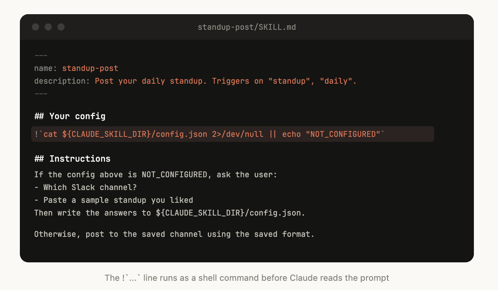
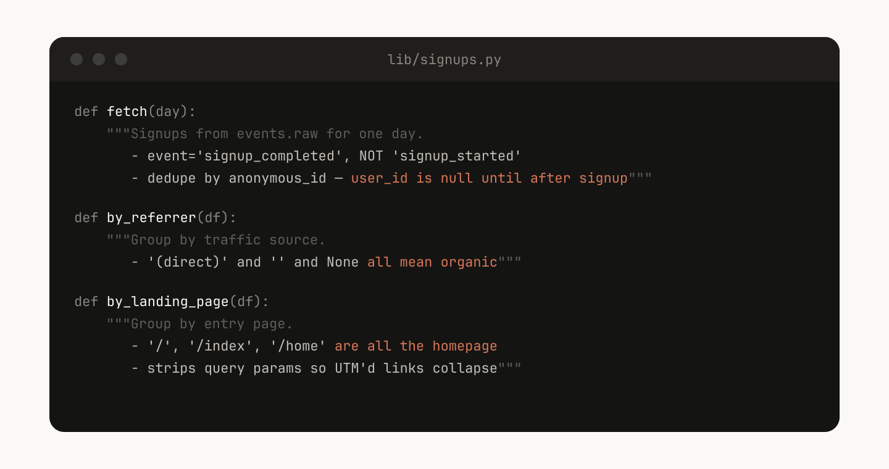
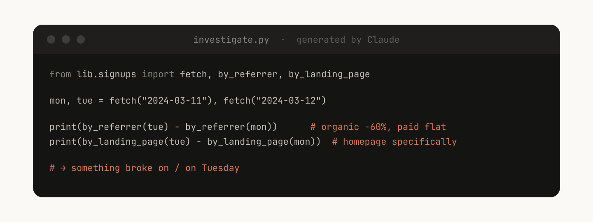

# 构建 Claude Code 的经验：我们如何使用 skill

> 我们在 Anthropic 内部构建和扩展数百个 skill 所学到的经验。
>
> **分类：** Claude Code | **日期：** 2026 年 6 月 3 日 | **阅读时长：** 5 分钟
>
> **来源：** https://claude.com/blog/lessons-from-building-claude-code-how-we-use-skills

---

Skills 已成为 Claude Code 中使用最广泛的扩展点之一。它们灵活、易于创建，也易于分发。

但这种灵活性也让人难以判断什么最有效。哪类 skill 值得制作？如何构建一个 skill？何时与他人共享？

我们在 Anthropic 内部大量使用 Claude Code 的 skills，目前有数百个在活跃使用中。以下是我们在使用 skills 加速开发过程中总结的经验。

## 什么是 skill？

Skills 是指令、脚本和资源的文件夹，供智能体发现和使用，以便更准确、更高效地完成任务。本文假设读者已熟悉 skills 基础知识；如果你是新手，请先学习 [Skilljar 上的智能体 skills 入门课程](https://anthropic.skilljar.com/introduction-to-agent-skills)。

关于 skills，我们常听到一个误解：它们"只是 Markdown 文件"。实际上，它们是文件夹，可以包含脚本、资源、数据等，供智能体发现、探索和操作。

在 Claude Code 中，skills 还有[丰富的配置选项](https://code.claude.com/docs/en/skills#frontmatter-reference)，包括注册动态 hooks。

我们发现，Claude Code 中最有效的 skills 往往充分利用了这些配置选项和文件夹结构。

## skill 的类型

在对 Anthropic 内部所有 skills 进行分类后，我们注意到它们可以归入九个类别。最优秀的 skills 清晰地归属于其中一个类别；而那些试图面面俱到的 skills 则横跨多个类别，反而让智能体感到困惑。这不是一个终极分类清单，但它是识别自身 skills 库空白点的有用框架。

*Claude Code 团队对内部 skills 进行了分类，发现它们可以归入九个不同的类别。*

### **1. 库与 API 参考**

这类 skills 解释如何正确使用某个库、CLI 或 SDK。可以是内部库，也可以是 Claude Code 有时难以处理的常用库。这类 skills 通常包含一个参考代码片段文件夹，以及 Claude 在编写脚本时应避免的常见坑。

示例包括：

* `billing-lib` — 你的内部账单库：边界情况、常见陷阱等
* `internal-platform-cli` — 你的内部 CLI 封装的每个子命令，并附带何时使用的示例
* `sandbox-proxy` — 为开发工作配置你的组织出口网关：哪些主机可访问、如何调试"connection refused"错误、如何添加白名单条目

### **2. 产品验证**

这类 skills 描述如何测试或验证代码是否正常工作。它们通常与 playwright、tmux 或其他外部工具配合使用进行验证。

验证类 skills 在内部对 Claude 输出质量的提升最为显著可量化。让一名工程师花一周时间专门打磨验证 skills 是值得的。

可以考虑的技术包括：让 Claude 录制其输出视频，以便你能看到确切的测试内容；或在每个步骤强制执行程序化状态断言。这些通常通过在 skill 中包含多种脚本来实现。

示例包括：

* `signup-flow-driver` — 在无头浏览器中完整走一遍注册 → 邮件验证 → 引导流程，并在每个步骤提供状态断言钩子
* `checkout-verifier` — 使用 Stripe 测试卡驱动结账 UI，验证发票确实以正确状态落地
* `tmux-cli-driver` — 用于需要 TTY 的交互式 CLI 测试

### **3. 数据获取与分析**

这类 skills 连接到你的数据和监控系统。它们可能包含携带凭证获取数据的库、特定仪表板 ID，以及常见工作流或数据获取方式的说明。

示例包括：

* `funnel-query` — "我需要 join 哪些事件来查看注册 → 激活 → 付费"，以及实际包含规范 `user_id` 的数据表
* `cohort-compare` — 比较两个队列的留存率或转化率，标记具有统计显著性的差异，链接到细分定义
* `grafana` — 数据源 UID、集群名称、问题 → 仪表板查找表
* `datadog` — 字段参考（`@request_id` vs `trace_id`）、服务列表、指标前缀约定

### **4. 业务流程与团队自动化**

这类 skills 将重复性工作流自动化为一个命令。这类 skills 通常是较简单的指令，但可能对其他 skills 或 MCP 有更复杂的依赖。对于这类 skills，将先前结果存入日志文件可以帮助模型保持一致性，并回顾工作流之前的执行情况。

示例包括：

* `standup-post` — 聚合你的工单系统、GitHub 活动和之前的 Slack 记录 → 生成格式化的站会报告（仅显示增量变化）
* `create-<ticket-system>-ticket` — 强制执行 schema（有效枚举值、必填字段）并执行创建后工作流（通知评审人、在 Slack 中关联）
* `weekly-recap` — 已合并 PR + 已关闭工单 + 部署记录 → 格式化的周报

### **5. 代码脚手架与模板**

这类 skills 为代码库中的特定功能生成框架样板。你可以将这类 skills 与可组合的脚本结合使用。当你的脚手架有自然语言要求、无法纯粹用代码覆盖时，它们尤其有用。

示例包括：

* `new-<framework>-workflow` — 为带有你的注解的新服务/工作流/处理器搭建脚手架
* `new-migration` — 你的迁移文件模板及常见注意事项
* `create-app` — 带有预配置的认证、日志记录和部署配置的新内部应用

### **6. 代码质量与审查**

这类 skills 在组织内部强制执行代码质量并帮助审查代码。可以包含确定性脚本或工具以实现最大健壮性。你可能希望将这类 skills 作为 hooks 的一部分或在 GitHub Action 中自动运行。

* `adversarial-review` — 生成一个"全新视角"子智能体进行批评，实施修复，迭代直到发现的问题降级为挑剔性意见
* `code-style` — 强制执行代码风格，尤其是 Claude 默认情况下处理不好的风格
* `testing-practices` — 关于如何编写测试以及测试什么的说明

### **7. CI/CD 与部署**

这类 skills 帮助你在代码库中获取、推送和部署代码。这类 skills 可能引用其他 skills 来收集数据。

示例包括：

* `babysit-pr` — 监控 PR → 重试不稳定的 CI → 解决合并冲突 → 启用自动合并
* `deploy-<service>` — 构建 → 冒烟测试 → 逐步流量滚动（带错误率对比）→ 遇到回归时自动回滚
* `cherry-pick-prod` — 隔离的工作树 → 挑选提交 → 解决冲突 → 创建带模板的 PR

### **8. 运行手册**

这类 skills 接收一个症状（如 Slack 线程、告警或错误特征），执行多工具排查，并生成结构化报告。

示例包括：

* `<service>-debugging` — 为你流量最高的服务建立症状 → 工具 → 查询模式的映射
* `oncall-runner` — 获取告警 → 检查常见可疑原因 → 格式化发现结果
* `log-correlator` — 给定一个请求 ID，从所有可能接触过它的系统中拉取匹配日志

### **9. 基础设施运维**

这类 skills 执行常规维护和操作程序，其中一些涉及破坏性操作，受益于护栏保护。它们让工程师更容易在关键操作中遵循最佳实践。

示例包括：

* `<resource>-orphans` — 查找孤立的 pod/卷 → 发布到 Slack → 缓冲期 → 用户确认 → 级联清理
* `dependency-management` — 你的组织的依赖审批工作流
* `cost-investigation` — "为什么我们的存储/出口账单突然激增"，附带具体的 bucket 和查询模式

## 制作 skill 的技巧

确定了要制作的 skill 之后，该如何编写？以下是 Claude Code 团队在制作 skills 方面的一些最佳实践、技巧和窍门。

### 不要重述显而易见的内容

Claude 已经知道如何编码，并且可以读懂你的代码库。一个只是重述 Claude 默认行为的 skill 只会增加上下文，而不会增加价值。如果你正在发布一个主要关于知识的 skill，请专注于能推动 Claude 突破其常规思维方式的信息。

[frontend design skill](https://github.com/anthropics/skills/blob/main/skills/frontend-design/SKILL.md) 是一个很好的例子；它由 Anthropic 的一名工程师通过与用户迭代改进 Claude 的设计品味而构建，避免了 Inter 字体和紫色渐变等经典模式。

### 构建"坑点"章节

任何 skill 中信号最强的内容是"坑点（Gotchas）"章节。这些章节应从 Claude 在使用你的 skill 时遇到的常见失败点中积累构建。理想情况下，你会随着时间推移不断更新 skill 来记录这些坑点。

例如：

> "`subscriptions` 表是追加写入的。你要找的行是 version 最高的那行，而不是最新的 `created_at`。"
> "这个字段在 API 网关中叫 `@request_id`，在账单服务中叫 `trace_id`。它们是同一个值。"
> "Staging 即使 Stripe webhook 实际上没有处理，也会返回 200。请检查 `payment_events` 获取真实状态。"

### 使用文件系统和渐进式披露

*SKILL.md 文件指向 Claude 可以在特定情况下参考的多个其他文件。例如，如果任务处于待处理状态，它应该参考 stuck-jobs.md。*

正如我们之前所说，skill 是一个文件夹，而不仅仅是一个 Markdown 文件。你应该将整个文件系统视为上下文工程和渐进式披露的一种形式。告诉 Claude 你的 skill 中有哪些文件，它会在适当的时机读取它们。

渐进式披露最简单的形式是指向其他 Markdown 文件供 Claude 使用。例如，你可以将详细的函数签名和使用示例拆分到 `references/api.md` 中。

另一个例子：如果你的最终输出是一个 Markdown 文件，你可以在 `assets/` 中包含一个模板文件供复制和使用。

你可以有参考资料、脚本、示例等文件夹，帮助 Claude 更有效地工作。

### 避免"强制引导" Claude

Claude 通常会尽力遵循你的指令，而且由于 skills 的可复用性很强，你需要注意不要在指令中过于具体。给 Claude 它需要的信息，但给它灵活适应不同情况的空间。

例如：

### 考虑设置流程

*上面的 skill 被编写为在配置中未包含 Slack 频道时提示用户。*

某些 skills 可能需要由用户提供上下文来进行设置。例如，如果你正在制作一个将站会报告发布到 Slack 的 skill，你可能希望 Claude 询问发布到哪个 Slack 频道。

一个好的模式是将这些设置信息存储在 skill 目录中的 `config.json` 文件中（如上例所示）。如果配置未设置，智能体则可以询问用户所需信息。

如果你希望智能体呈现结构化的多选问题，可以指示 Claude 使用 `AskUserQuestion` 工具。

### 为模型而非人类编写描述

当 Claude Code 启动一个会话时，它会构建一个包含所有可用 skills 及其描述的列表。这个列表正是 Claude 用来判断"是否有一个 skill 适用于这个请求？"的依据。这意味着 `description` 字段不是摘要，而是关于**何时触发该 skill** 的描述。

*在 skill 的描述中包含触发词很有帮助，比如"babysit"。*

### 帮助 Claude 记忆

*这个文本日志文件帮助 Claude 记住过去的事件，比如审查了 Sarah 的 auth PR。*

某些 skills 可以通过在其中存储数据来实现一种记忆形式。你可以将数据存储在任何简单的形式中，如追加写入的文本日志文件或 JSON 文件，也可以是复杂的 SQLite 数据库。

例如，一个 `standup-post` skill 可能保留一个 `standups.log`，记录它写过的每篇站会报告，这意味着下次运行时，Claude 会读取自己的历史记录，并能判断自昨天以来发生了什么变化。

你可以使用环境变量 `${CLAUDE_PLUGIN_DATA}` 获取一个稳定的数据存储目录，详情请参阅 <https://code.claude.com/docs/en/plugins-reference#persistent-data-directory>。

### 存储脚本并生成代码

你能给 Claude 的最强大工具之一就是代码。给 Claude 提供脚本和库，让 Claude 将精力花在组合上——即决定下一步做什么，而不是重建样板代码。

例如，在你的 `data-science` skill 中，你可能有一个从事件源获取数据的函数库。为了让 Claude 进行复杂分析，你可以提供这样一组辅助函数：

然后 Claude 可以即时生成脚本，将这些功能组合起来，完成诸如"星期二发生了什么？"这类提示词的高级分析：

### 使用按需 hooks

Skills 可以包含仅在 skill 被调用时激活、且只在会话期间有效的 hooks。对于那些不希望一直运行但有时极为有用的强主张 hooks，可以使用这种方式。

例如：

* **`/careful`** — 通过 `PreToolUse` 匹配器屏蔽 `rm -rf`、`DROP TABLE`、force-push、`kubectl delete`。只有当你知道自己在操作生产环境时才需要这个——如果一直开着会让人崩溃。
* **`/freeze`** — 屏蔽任何不在特定目录中的 Edit/Write 操作。在调试时很有用："我想添加日志，但我一直不小心'修复'了无关的代码。"

## 分发 skills

Skills 最大的好处之一是可以与团队其他成员共享。

共享 skills 有两种方式：

* 将 skills 提交到你的代码库中（位于 `./.claude/skills` 下）
* 创建一个 **plugin** 并建立一个 Claude Code Plugin 市场，用户可以上传和安装 plugins（详情请参阅[文档](https://code.claude.com/docs/en/plugin-marketplaces)）

对于在相对较少代码库中工作的小团队，将 skills 提交到代码库中效果不错。但每个提交的 skill 也会稍微增加模型的上下文。随着规模扩大，内部 plugin 市场允许你分发 skills，让团队成员决定安装哪些，并包含设置流程。

## 管理 skills 市场

如何决定哪些 skills 进入市场？人们如何提交？

在 Anthropic，我们没有专门负责决策的中心化团队；相反，我们尝试有机地发现最有用的 skills。如果有人有想让别人试用的 skill，可以将其上传到 GitHub 的沙盒文件夹，并在 Slack 或其他论坛中向大家推荐。

一旦某个 skill 获得了足够的关注（由 skill 所有者自行决定），就可以提交 PR 将其移入市场。

## 组合 skills

你可能希望让 skills 相互依赖。例如，你可能有一个上传文件的 skill 和一个生成 CSV 并上传的 skill。这种依赖管理目前还没有内置到市场或 skills 中，但你可以直接按名称引用其他 skills，如果它们已安装，模型就会调用它们。

## 衡量 skills

为了了解某个 skill 的使用情况，我们使用了一个 `PreToolUse` hook，让我们可以在公司内部记录 skill 的使用情况（[示例代码在此](https://gist.github.com/ThariqS/24defad423d701746e23dc19aace4de5)）。这意味着我们可以找到哪些 skills 很受欢迎，或者哪些 skills 的触发率低于预期。

## 开始使用

Skills 的最佳实践仍在不断发展。我们大多数最优秀的 skills 最初只有几行内容和一个坑点，然后随着 Claude 不断遇到新的边界情况，人们持续向其中添加内容，它们才变得越来越好。

理解 skills 的最好方式是开始动手、多做实验，看看什么适合你。

* 查看 [skills 文档](https://code.claude.com/docs/en/skills)
* [找到可定制的示例 skills](https://github.com/anthropics/skills)

---

*本文由 Anthropic 技术成员 Thariq Shihipar 撰写，他负责 Claude Code 方向。*
