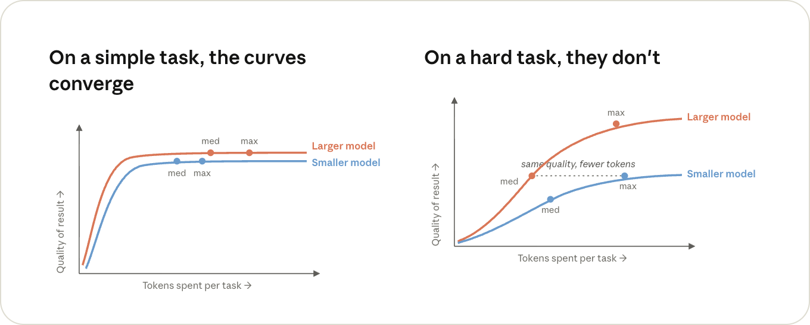
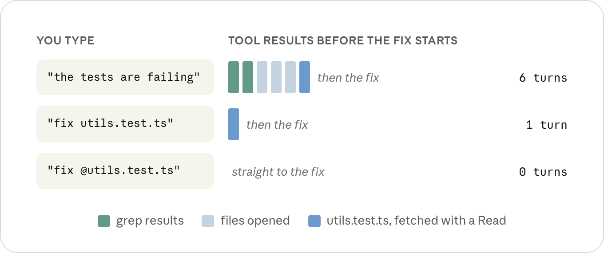
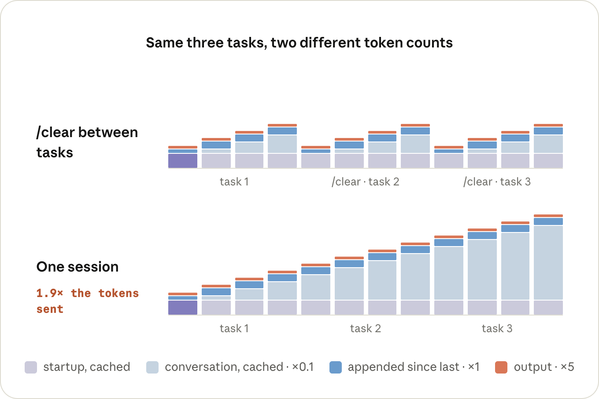
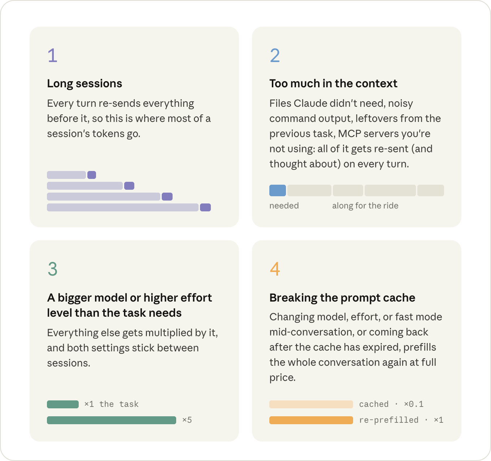

# 让 Claude Code 会话的每个 token 都物有所值

如何运行高效的会话，让每个 token 都发挥最大价值。

> **来源：** [Claude Blog - Maximizing the value of your Claude Code sessions](https://claude.com/blog/maximizing-the-value-of-your-claude-code-sessions)
> **发布日期：** 2026 年 8 月 14 日
> **分类：** Claude Code / Enterprise AI | 产品：Claude Code | 阅读时长：5 分钟
> **作者：** Lydia Hallie

---

## 一、太长不看版

* **在任务之间运行 `/clear`。** 这能防止之前无关的上下文被重新发送给模型，从而减少 token 用量。
* **在开始前就设定好模型和努力程度（effort level）。** 会话中途更改任一项都会打破提示词缓存，从而增加 token 成本。
* **用 @ 提及文件，而不是直接说文件名。** 文件会直接附加到你的消息中，省去一次 Read 调用，或者省去 Claude 去查找文件的一次搜索。
* **给输出繁杂的命令加上静默参数，或者在子智能体中运行它们。** 命令输出会像文件一样被加入对话，并在本次会话余下的时间里始终留在其中。
* **在新会话中运行一次 `/context`。** 它会显示已加载的内容（`CLAUDE.md`、MCP 工具定义），你可以据此裁剪掉不必要的部分。
* **离开键盘休息前先 `/compact`。** 提示词缓存一小时后就会过期，而在缓存仍然有效时对对话进行摘要要便宜得多。

## 二、让每个 token 物有所值

直到不久之前，你用来写代码的工具还是固定收费（或者免费）的。无论那天下午你修复了一个测试还是五十个，你的编辑器花费都是一样的，所以单个任务本身并没有一个独立的"价格"。

而对于像 Claude Code 这样的智能体式编程工具，情况变了。同样一个已完成的任务，根据你使用它的方式不同，花费也可能不同。

在一个会话中，Claude 读取测试及其覆盖的文件，完成编辑，几轮对话就搞定了。而在另一个会话中，它先在仓库里到处 grep，沿途读了十几个文件才找到同样的那两个文件，而且此后每一轮对话都会拖着从今天早上开始读入对话的所有其他内容。

同样是这个修复，你为它花费的 token 数量却不同，而且整个过程中模型还要一直"惦记"着十个它根本不需要的文件。

高效使用 token，并不意味着总体上用得更少。它意味着确保你所使用的 token 都真正花在了你实际要求的事情上。

那么，我们先来看看什么决定了一个 token 的价格，再看看什么决定了一次会话会发送多少个 token，并在此过程中，看看这对你该如何运行一次会话意味着什么。

## 三、什么决定了一个 token 的价格

你按 token 计费，但你实际付费购买的是推理（inference）：即 GPU（或 TPU，或模型实际运行所在的任何硬件）处理你的 token 所花费的时间。

有三件事决定了一个 token 会占用多少这类时间：你运行的是哪个模型、它是输入 token（进入模型）还是输出 token（从模型输出），以及它是否被缓存过。

### 模型

更大的模型在输入和输出 token 上都会做更多的运算。哪种模型适合哪种工作，这本身是一个独立的话题，我们在[《在 Claude Code 中选择 Claude 模型与努力程度》](https://claude.com/blog/claude-model-and-effort-level-in-claude-code)一文中已有介绍。

在本文中，你只需要知道：我们接下来要讲的所有内容，都会按模型的价格进行乘算——当问题确实困难或含糊不清时使用更大的模型，当工作是常规性的时候使用更小的模型。

*曲线仅供示意，不代表真实的基准测试数据。*

### 输入 token 与输出 token

一次请求要经过 GPU 的两个阶段，这两个阶段的花费是不同的。

首先，在预填充（prefill）阶段，模型读取你的请求和上下文：系统提示词、你的 `CLAUDE.md`、你的消息，以及此后被加入对话的一切内容（Claude 读取的文件和它运行命令产生的输出）。这些都是你的输入 token。

然后，在解码（decode）阶段，模型写出输出 token：它的思考内容、它发起的工具调用，以及你看到的文本。这个过程是逐个 token 进行的；一个 200 token 的响应意味着模型要连续运行 200 次。按每个 token 计算，解码阶段占用 GPU 的时间要长得多，这也是为什么输出的定价大约是输入的 5 倍。

一次会话中很多输出 token 都是思考 token，而模型每一轮思考多少，是由努力程度（effort level）决定的。和模型选择一样，你用 `/effort` 选定的等级也会在下一次会话中作为默认值延续下去。

> **提示：** 在新会话中运行一次 `/model` 和 `/effort`，看看你实际用的是什么。两者都会记住你上次的选择，你需要确保这个选择是刻意做出的。

> **提示：** 如果你已经知道某次会话只是体力活，`MAX_THINKING_TOKENS=0 claude` 可以为这一次会话关闭思考（Fable 5 除外），这比 `/effort low` 还要低一档。

### 提示词缓存

如果一个请求的开头与服务器刚刚处理过的某个请求完全相同，那么这段共同开头对应的状态计算结果也会相同，因此服务器可以保留上次的结果，只需预填充这段开头之后的部分。这就是所谓的提示词缓存。

从缓存中读取的花费是输入价格的 0.1 倍，因为服务器是直接加载状态而不是重新计算。把 token 写入缓存的花费会比正常输入贵一些，最多可达 2 倍，因为服务器之后还要保留这份状态。但写入只会针对每个 token 发生一次，而 0.1 倍的读取则会在此后的每一轮都发生。

Claude Code 会在每次请求时自动管理提示词缓存，不需要你手动开启。不过你也可能把它打破，所以了解如何避免这类成本突增很重要。

假设我们输入"修复 `utils.test.ts` 中失败的测试"。以下是 Claude Code 为此发送的内容：

1. Claude Code 把系统提示词（包含工具定义）、你的 `CLAUDE.md` 和你的消息组装成第一个请求并发送出去（输入 token）。此时缓存中还什么都没有，所以全部内容都要被预填充并写入缓存。

2. 模型无法修复一个它还没看到的测试，于是它思考片刻，回复一个针对 `utils.test.ts` 的 Read 调用（输出 token）。Claude Code 读取该文件，将其追加到对话中，并再次发送整个内容（输入 token）。这一次，请求 1 中的全部内容都以十分之一的价格从缓存中读出，唯一以全价预填充的是新增内容：这次 Read 调用和该文件。

3. 现在模型想要查看被测试的那个文件（输出）。又是一次 Read，又一次追加，全部内容再次发送出去：请求 1 和请求 2 来自缓存，第二个文件按全价计算（输入）。

4. 模型回复一个 Edit（输出）。Claude Code 应用这个编辑，追加结果，再次发送全部内容。情况相同：这次的 Edit 及其结果是新内容，它们之前的一切都是缓存读取（输入）。

5. 模型运行 `npm test`（输出）。Claude Code 追加测试输出并再次发送全部内容，其中测试输出是唯一的新增部分（输入）。

6. 测试通过，模型给出简短总结作为回复（输出）。没有工具调用意味着没有内容需要追加，也就没有第 6 次请求，任务完成。

为了一个小小的修复，一共发出了五次请求，而每一次都包含了到那时为止的整段对话。典型的一轮对话是极不对称的：输入端是数万个 token，输出端只有几百个。但每一轮中只有新增的部分会以全价被预填充。

这就是每一轮的完整账单构成：对历史部分进行缓存读取，对新增部分按全价计算输入费用，再加上响应部分的输出费用。

> 这同样适用于订阅制场景。你不会直接看到这些价格，但正是这些请求在消耗你的额度上限。

缓存必须从请求的最开始处开始逐一匹配，而请求内容的顺序始终固定：工具定义，然后是系统提示词，然后是对话内容（`CLAUDE.md` 位于对话内容的最前面）。

如果这段前缀中的任何内容发生变化，其后的所有内容都要重新预填充。把工具结果追加到对话末尾是最理想的情况，因为它后面没有任何内容。真正会让缓存失效的，是任何改变了请求中更靠前部分的操作，或者改变了缓存键（cache key）所依据的内容：

* **`/model`：** 每个模型都有自己独立的缓存，所以下一轮整段对话都要以全价重新预填充。（这也包括 opusplan 模式，它每次进入或退出 plan 模式时都会切换模型。）
* **`/effort`：** 努力程度同样是缓存键的一部分，所以情况相同。这也是为什么 `/model` 和 `/effort` 在会话中途切换时都会要求你确认。
* **Fast 模式：** 同样是缓存键的一部分，重新预填充会按 Fast 模式的价格计算，所以如果你打算开启它，就在会话开始时就开启（再关闭它则不产生缓存方面的费用）。
* **`/compact`：** 对话会被替换成一段更短的内容，因此其中没有任何内容能再匹配上（它前面的系统提示词部分不受影响）。只要旧对话仍在缓存中，生成摘要本身的花费就很低，所以在长时间休息之前做这件事，比休息之后再做要便宜得多。
* **时间：** 每一轮对话都会重置计时，但缓存在订阅制下一小时后过期，在 API key 下五分钟后过期（设置 `ENABLE_PROMPT_CACHING_1H=1` 可以延长到一小时）。如果你晚于这个时间才回来，下一轮就要重新预填充整段对话。恢复一个旧会话几乎总是如此：那时缓存通常已经失效，而且系统提示词在启动时也会被重新构建。

这并不意味着你永远不该切换模型或努力程度。而是说存在做这件事的便宜时机——会话刚开始的时候，或者刚 `/clear` 之后——也存在昂贵的时机——一段长对话进行到中途的时候。

> **提示：** 如果最近几轮对话的方向不是你想保留的，用 `/rewind` 回退到这几轮之前，而不是运行 `/compact`。回退只会切掉末尾的这几轮，前面的内容依然留在缓存中，不产生任何费用。而压缩会重写整段对话，所以总会产生一些费用。

## 四、什么决定了一次会话会发送多少个 token

这里要知道的关键一点是：没有任何内容只会被发送一次。所有最终进入对话的内容——Claude 读取的一个文件，或它运行的一条命令的输出——都会在此后的每一轮中被重新发送，直到本次会话结束。

由于有缓存，每一次重新发送的费用都很低，但便宜不等于免费，而且它还占用着模型在每一轮都要围绕其进行思考的上下文空间。

这其实就是一次会话的完整成本模型：多少 token 最终进入了上下文，它们在其中停留了多少轮，以及你同时运行了多少个上下文。

### 哪些内容会进入上下文

在你输入任何内容之前，上下文中就已经存在一部分内容了：工具定义、系统提示词、`CLAUDE.md`，以及启动时加载的其他内容。

> **提示：** 在一个新会话中运行 `/context`，看看你还没输入任何内容时里面已经有什么。把 `CLAUDE.md` 限定在具体的指令上，把与特定工作流相关的内容移到技能（skill）中，技能只在被用到时才会被加载。如果本次会话中有个你不需要的 MCP server，用 `/mcp` 关掉它。

此后在会话过程中新增的几乎所有内容都是工具结果：Claude 读取的文件，以及它运行命令产生的输出。

Claude 需要读取多少内容，很大程度上取决于它需要自己摸清楚多少东西。如果你说"测试挂了"，它首先得弄清楚是哪些测试：一两次 grep，打开几个文件来判断哪个才相关，而这些结果会在它们不再有用之后依然长期留在上下文中。

"修复 `utils.test.ts` 中失败的测试"跳过了搜索环节，只需为该文件花费一次 Read 调用；而"修复 `@utils.test.ts` 中失败的测试"则连这次 Read 调用都省掉了。

> **提示：** 提到文件时，用 @ 提及它，而不是直接输入路径。Claude Code 会在任何内容被发送之前就把该文件附加到你的消息中，所以它在第一个请求中就已经存在，不需要额外的 Read 调用。无论哪种方式，文件本身在上下文中占用的空间是一样的，所以每次对话你只需要提及一次：它会一直留在那里，而在之后的某一轮再次 @ 提及它，通常会附加进第二份副本。

另一个会填满上下文的东西，是 Claude 运行命令产生的输出。每次它运行你的测试、构建或者 `git log`，打印出来的内容都会像它读取的文件一样被追加到对话中，并停留同样多的轮次。

真正体量很大的输出反而没什么问题：超过 30,000 个字符后，Claude Code 会把输出写入一个文件，只在对话中放一段简短预览和文件路径（如果你想修改这个阈值，可以设置 `BASH_MAX_OUTPUT_LENGTH`）。

真正的问题在于低于这个阈值的输出。一个测试运行器逐行打印 400 个通过的测试，完全在限制之内，而这 400 行现在会成为此后每一轮对话的一部分。

Claude 通常会主动用参数和 tail 帮你处理这个问题，如果你不想把这件事交给 Claude，文档里有一个小的 hook，能在命令运行前重写输出繁杂的命令，让只有真正重要的那几行内容返回。

> **提示：** 把你每天都会用到的两三条命令写进 `CLAUDE.md`，包括静默参数，就按你自己会输入的方式写（比如"用 `npx vitest run <file> --reporter=dot` 运行单个测试文件"）。这只是个小小的补充，但此后每次会话都能省下一轮对话和几百行输出。

### 内容在上下文中停留多少轮

同样的工作量，一次长会话所花费的成本，会比分散在几个短会话中完成时高出很多，而且高出的幅度会超出你的想象，因为第 40 轮同时也在重新读取此前的 39 轮。你希望会话中的上下文保持简短且相关，所以不要把一个任务的上下文带入下一个任务：开始新任务时用 `/clear`，同一任务的前半部分完成后用 `/compact`。

> **提示：** 如果你之后还想找回这个会话，在 `/clear` 之前先执行 `/rename`。执行 `/compact` 时，告诉它要保留什么内容，或者如果每次都是同样的诉求，就在 `CLAUDE.md` 里加一节"压缩说明"（Compact instructions）。如果你用的是 100 万 token 上下文的模型，并且希望自动压缩的安全网恢复到原来的触发点，`/autocompact 200k` 可以把它调回去（需要 Claude Code v2.1.221 及以上版本）。

也要留意那些发生在你没有输入任何内容时的对话轮次。`/loop` 在你设置它的那个会话里，每次触发都算作一次完整的对话轮次，并携带着整段对话一起发送，而如果距离上一轮已经超过一小时，还会额外触发一次缓存未命中。最好在另一个终端里开一个新会话，从那里运行这个循环。

### 子智能体

另一种让某些内容不进入你的上下文的方法，是让它在另一个上下文中发生，这正是子智能体（subagent）的用途。子智能体拥有自己独立的上下文窗口，包含自己的系统提示词、工具，以及你的 `CLAUDE.md`，但不包含你的对话内容。它独立运行自己的对话轮次，唯一返回主会话的是它的最终答案。其余的一切在它完成后都会被丢弃。

不携带你的对话内容的代价是，子智能体有时需要重新读取主会话早已读过的内容，而且它在这么做的过程中也要为自己的对话轮次付费。对于小任务来说，这就只是额外开销。

而当一项任务会产生大量你并不需要保留的输出时，比如翻查一份日志，这种方式就很值得。Claude 常常会主动为这类任务调用子智能体，而当它没有主动这么做时，你也可以直接要求它这样做（"在子智能体中翻查这份日志"）。只是要记住，主会话只能拿回子智能体选择汇报的那部分内容。

> **提示：** 如果有一项繁杂的任务你反复地委托出去，为它单独定义一个使用 `model: haiku`（或 `sonnet`）的子智能体。否则它会运行在你主会话所使用的模型上。

## 五、优先关注哪里

在上面提到的所有内容中，有四件事最值得留意，大致按它们的成本高低排序：

---

## 致谢

本文由 Anthropic 团队撰写，作者 Lydia Hallie。
