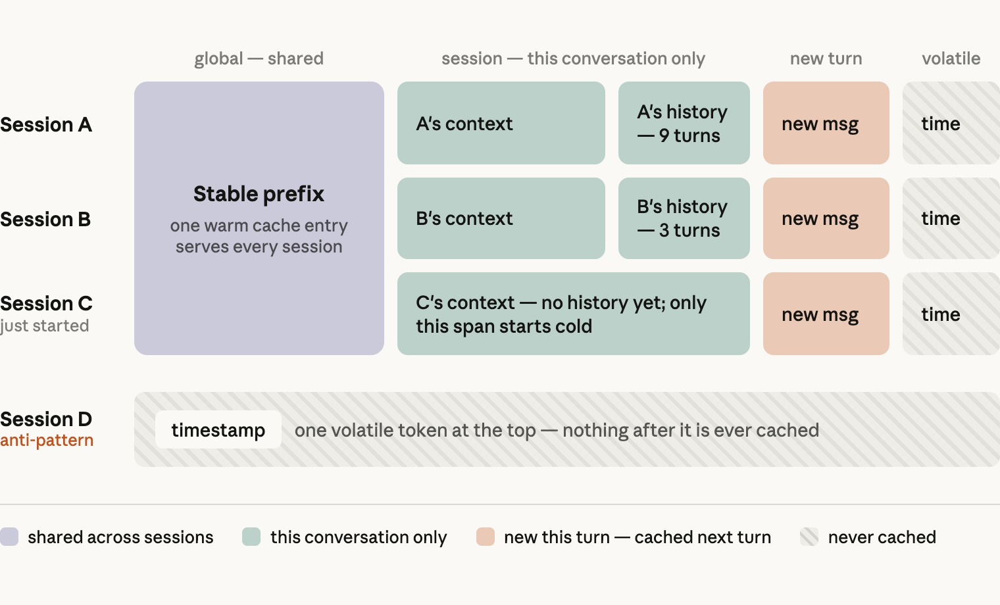
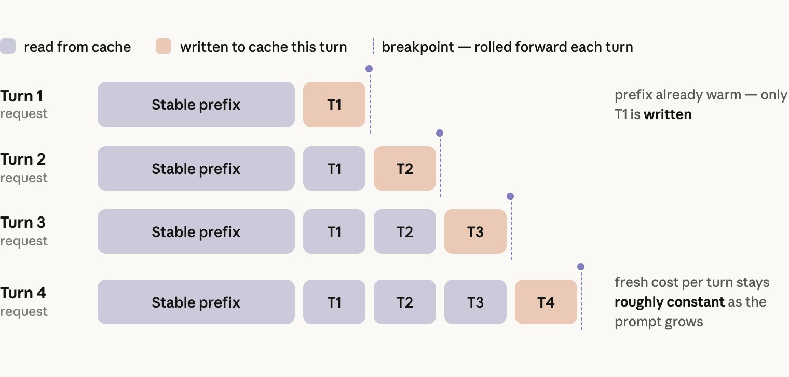
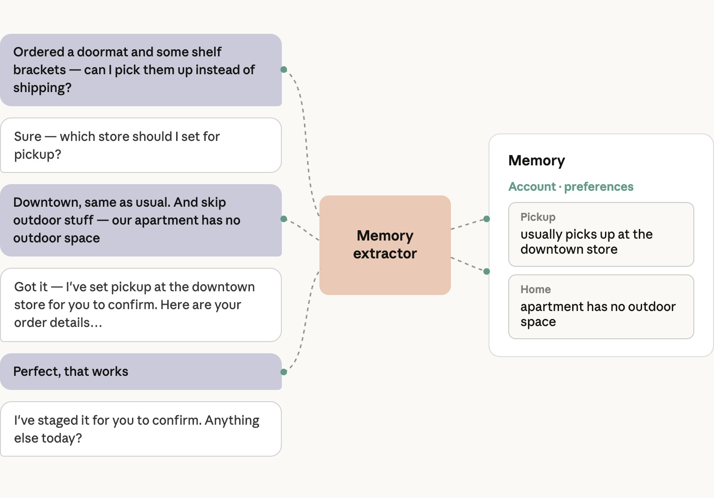

# 高效电商智能体的解剖指南

让线上买卖更轻松的智能体——其架构、延迟与成本技巧，以及 eval 实践。

* 分类

  [Agents](https://claude.com/blog/category/agents)
* 产品

  [Claude Platform](https://claude.com/platform/api)
* 日期

  2026 年 9 月 2 日
* 阅读时长

  5

  分钟
* 分享

  复制链接

  https://claude.com/blog/the-anatomy-of-effective-commerce-agents
* 作者

  Ali Shazal

  Matthew Koen

过去一年，我们与电商行业的各类团队合作——零售商、交易平台、旅游、娱乐和电信服务商——用 Claude 构建电商智能体。

这些智能体已经在生产环境运行，企业客户在使用后看到了更大的购物车和更高效的卖家运营。它们还共享一个简单的架构：处于智能体循环中的 Claude，配备一组 skill、工具，以及一套强有力的 eval 套件。

本文面向构建这类（或其他面向消费者的）智能体的工程师与工程负责人。第 1 部分讲架构，这是你只需决定一次的事。第 2 部分讲延迟与成本。第 3 部分讲生产环境：记忆、安全、eval，以及如何在一个组织内部推广这项工作。

参考实现

我们还提供了一份**蓝图**，帮助你在 Claude 上构建电商智能体。它包含一个工程团队让电商智能体在数天内跑起来所需的工具链、模式与护栏，并附有面向零售、旅游、电信和票务平台的购物智能体与商家智能体参考实现。

[anthropics/commerce-agents →](https://github.com/anthropics/commerce-agents)

本指南目录

1. [第 1 部分：架构](#ca-p1)
   1. 什么是电商智能体？
   2. 用 skill，而不是子智能体
   3. 系统提示词还是 skill：按频率决定
   4. 智能体工具的工程实现
   5. UI 组件就是工具
2. [第 2 部分：做得又快又省](#ca-p2)
   1. 最小化任务完成延迟
   2. 感知延迟
   3. Prompt caching
   4. 选择模型及其配置
3. [第 3 部分：在生产环境运行](#ca-p3)
   1. 能跨会话存活的记忆
   2. 安全：强制约束住在工具链里
   3. Eval：交付一个非确定性系统
   4. 在大型组织中交付
4. [展望未来](#ca-p4)

**01**

## 架构

一个模型跑在标准智能体循环里，用 skill 覆盖长尾，用工具调用你已经在运行的系统。这件事你只需决定一次。

### **什么是电商智能体？**

我们把电商智能体定义为：在一个线上商品目录中简化买卖过程的智能体。

有些智能体面向消费者：它们搜索、比较、替换商品，并组装订单。这可以是一个零售购物车、一份旅行行程、一次手机套餐变更，或者为某场演出锁定的座位。有些智能体面向商家：它们回答关于销售的问题，运营促销与营销活动，管理库存与定价。

核心架构是一个模型跑在[标准智能体循环](https://www.anthropic.com/engineering/building-effective-agents)中：围绕目标推理、探索上下文、通过工具采取行动、通过 skill 学习流程、提出澄清性问题，并观察结果，直到目标达成。

它前面没有一个把对话切分开的意图路由器，后面也没有一组按领域划分的智能体。

### **上下文的工程实现**

#### **用 skill，而不是子智能体**

一个电商智能体必须覆盖横跨众多品类与意图的广泛能力，这让人很想为每个领域创建一个子智能体。

实践中这种做法并非最优，因为一次电商对话是跨越多个意图与多个回合的、紧密耦合的单一会话，需要相当多的共享上下文。

在子智能体架构中，编排者持有购物车或暂存的改动、用户偏好以及对话历史。

每一次向子智能体的移交都是一次有状态损耗的操作，这往往会影响子智能体回复的质量，进而影响整体回复质量。除此之外，每次移交可能耗费数倍的 token，并增加数秒延迟。

各领域也很少能干净地分开。一个退货流程可能同时需要订单历史、当前购物车和商品目录，这意味着「每领域一个子智能体」的做法要么在各处重复这些访问权限，要么在任务中途做移交。

随着模型变得更聪明，它们也能处理更长的上下文、更多的 skill 和更多的工具，因此今天这些「该放哪里」规则背后的限制，会随每一代模型而放宽。

作为替代，[agent skills](https://platform.claude.com/docs/en/agents-and-tools/agent-skills/overview) 能给你类似的按领域模块化与上下文控制能力，却不必付移交税——因为 skill 指令是加载进那个已经持有全部历史的主智能体的。

在我们对多个企业部署所做的对比中，「单智能体 + skill」在质量上持续优于「一个提示词包打天下」和「子智能体」两种设计，而且每个任务的成本与延迟往往更低。

子智能体真正配得上自己位置的场景是：编排者可以把它当作工具来调用，用于某个狭窄或自成闭环、且能从独立上下文窗口中受益的任务。

一个常见的生产例子是深度研究子智能体——子智能体在其中搜索并阅读文档、编写并运行代码、遍历数据模型、撞上死胡同。所有这些工作都发生在一个或多个子智能体内部，只有一份紧凑的答案回到编排者手里。

另一个例外是某个领域已经有了自己专门构建的智能体。如果你的药房或金融服务体验运行着一个带有自身合规界面的专用智能体，正确的做法可以是移交（hand-off）——由那个智能体接手任务，通过它自己的循环直接与用户协作，直到任务完成。

其中的区别在于对话的归属权。移交让领域智能体成为用户的对话方，而委派（delegation）保留编排者的归属，把领域智能体在单个回合内反复调进调出，每一次往返都在退化。

#### **系统提示词还是 skill：按频率决定**

决定把一组指令放进系统提示词还是 skill，主要因素是智能体多久会需要它。加载一个 skill 要花掉一个模型回合，所以智能体在大多数回合都需要的东西，一般放进系统提示词。

不过这确实取决于你的流量如何分布，以及你的 eval 显示出什么样的智能体行为。一个好的起点是：任何与三分之一及以上流量相关的内容——无论是上线前预判到的还是在生产中观察到的——放进系统提示词，其余放进 skill。

如果某个 skill 可以从你已有的信号中预测出来，比如用户是从哪个页面进来的，我们建议在第一次模型调用之前就从工具链侧注入它，省掉加载 skill 的那个额外回合。

关键指令——比如安全与法律规则、品牌约束，以及诸如过敏原之类的重要用户事实——始终放进系统提示词。

对电商智能体而言，这意味着商品搜索住在提示词里，因为几乎每个会话都会触及它，而 skill 承载功能的长尾。

在我们的[参考实现](https://github.com/anthropics/commerce-agents)中，购物智能体的提示词持有事实基准、购物车与结账语义以及呈现规则，其余部分由以下 skill 覆盖：search-discovery、purchase-research、planning-goals、customer-care 和 memory-personalization。

商家智能体以同样方式拆分，它的 skill 是 performance-insights、catalog-listings、inventory-operations、pricing-promotions 和 marketing-campaigns，每个运营领域一个。

**放在提示词里***购物智能体*事实基准、购物车与结账语义、呈现规则，以及商品搜索。

**购物类 skill***长尾部分*search-discovery · purchase-research · planning-goals · customer-care · memory-personalization

**商家类 skill***每个运营领域一个*performance-insights · catalog-listings · inventory-operations · pricing-promotions · marketing-campaigns

### **智能体工具的工程实现**

我们那篇[为智能体编写高效工具](https://www.anthropic.com/engineering/writing-tools-for-agents)的文章涵盖了工具设计的一般原则。在电商场景中最关键的有两点：

**把智能体工具构建在你的核心系统与业务逻辑之上。**

一家电商公司已经拥有搜索与排序、购物车、偏好与档案存储、库存系统、促销与营销活动引擎、销售分析等等，每一项都编码了经年调优的逻辑，也在观察模型永远看不到的信号。

智能体的工具应当调用那些系统，而不是重新实现它们；工具边界正是那些系统的逻辑终止、模型的判断开始接手的地方。

例如，当智能体调用 `search_products` 时，返回的结果应当已经排好序；它的工作是判断哪些结果服务于用户的目标、展示多少条，以及如何呈现。

**工具结果就是上下文。**

只返回模型用来推理的字段，其余的丢掉。每一行搜索结果里的图片 URL 是最常见的罪魁祸首。

必要时在工具内部重塑原始响应，包括在下一步无法从数据本身看出时把它附加上去。

这一点在错误场景中尤其相关——模型从指令中受益，而不是从错误码中受益。例如，加一条错误指令「查询库存时请附带商品 ID」，而不是一个笼统的 403。

#### **UI 组件就是工具**

大多数电商智能体的回复是 UI 组件而非散文，无论是商品轮播、行程单、座位图还是图表。这意味着智能体必须输出一个 schema，而不是文本。

团队有时会从「提示模型输出自定义标签、然后在客户端解析」开始。随着界面规模变大，这条路会走不通，原因是：

* 模型在你的标记语言上受到的训练远不如在工具调用上充分，因此随着嵌套组件增多，可靠性会下降。仅靠提示词无法保证数据格式良好。
* 标签定义住在系统提示词里，于是每个新组件都会膨胀上下文，而每次编辑都可能在提示词的别处引发回归。
* 历史对话最终被存成只有你自己的解析器能读的格式，于是加载历史意味着要么在客户端解析原始消息，要么额外保留一份非模型 API 原生格式的副本。

站得住脚的模式是：把每个 UI 组件都做成一个工具。模型带着类型化参数调用 `present_products`、`present_itinerary` 或 `present_plan_comparison`；你的服务端校验并丰富这次调用，然后发出一个事件；你的客户端把它渲染出来。

由于这些组件本身就是工具调用，它们已经以原生格式存在于 messages 数组里，因此你在重新加载旧对话时不需要再解析一遍。下方以及[参考仓库](https://github.com/anthropics/commerce-agents)中展示了一份呈现工具契约的示例。

代价是流式输出的粒度。工具调用的每个顶层参数都会在服务端缓冲以便校验，因此即便开启了流式，呈现工具的各个子组件也是分步到达的。这会影响感知延迟。

要获得 token 级别的流，在工具定义上设置 `eager_input_streaming:` true，这会跳过缓冲，同时也跳过服务端的 schema 保证。

在我们的 eval 中，Claude Sonnet 级别及以上的模型出现 schema 违规极为罕见，但仍应为漏网的情况给调用套上重试。

呈现工具还为智能体提供了一份「屏幕上有什么」的记录。当顾客说「第一家酒店」或「左边往下第三个」时，布局就在 messages 数组里，在最后一次呈现调用的参数中。

要让这一点成立，参数必须反映渲染出的布局，所以要按 UI 的结构去组织它们——用有序的行与轮播，而不是一个由客户端重新排列的扁平列表。

**02**

## 做得又快又省

从两条战线进攻延迟——端到端延迟与感知延迟——并让缓存承担成本。这一切都不应以牺牲智能为代价。

延迟在电商中很重要，而面向消费者的界面最不宽容。然而在智能体界面上，我们持续看到真正推动留存、参与度和购物车规模这类指标的，是结果的质量。

答案是否切题、任务是否真的完成，对这些指标的影响远比边际的延迟收益更关键。

所以要从两条战线进攻延迟。通过良好的工程实现把端到端延迟压到最低，同时降低感知延迟（因为花在观看智能体工作上的时间会被读作「进展」）。

每个用户都有一份延迟预算，下面这些技巧能让智能体待在预算之内，而不必为此牺牲智能。

### **最小化任务完成延迟**

任务完成延迟是各个模型回合上「到最后一个 token 的时间」加「工具处理时间」的总和。这给了你三根可以使力的杠杆：更少的回合、更快的工具、更快的 token。这些杠杆有时互相竞争，所以要最小化的是总和，而不是其中任何单独一项。

**更少的回合**预先加载可能用到的上下文，提升模型智能，并让模型并行调用相互独立的工具。

**更快的工具**优化工具自身的后端，并在参数补全的那一刻就急切派发工具。

**更快的 token**通过在你的 eval 套件上做扫描来选择模型及其配置。

#### **更少的回合**

查询的复杂度会增加回合数，而这通常不在你的控制范围内。模型智能与相关上下文能帮助智能体用更少的回合完成任务。我们在这方面的一些关键经验包括：

* **预先加载可能用到的上下文。** 如果用户是从某个商品页打开助手的，或者商家是从某个营销活动看板打开的，就把那个页面的数据放进会话上下文。对话很可能与它有关，而从上下文里作答不花费额外回合。
* **提升模型智能。** 更聪明的模型能减少完成一个任务所需的总回合数，因为智能体能更高效地规划并发出工具调用。这往往能抵消它们更慢的 token 速度。如果你的查询偏复杂，或者生产环境显示每个任务超过大约五个回合，那么更快的模型通常就是更聪明的那个。具体是哪一个取决于你的流量，所以要通过扫描来选择，做法见下文「选择模型」。
* **让模型并行调用相互独立的工具。** 电商用例常常需要许多操作并行进行：无论是搜索多个商品、查询多份政策文档，还是从多个销售数据源拉取记录。并行工具确保多个相互独立的查询不会烧掉额外的回合。提示模型在一个回合内调用多个工具，并把结果以工具结果数组的形式放在一条用户消息里返回（见[并行工具调用文档](https://platform.claude.com/docs/en/agents-and-tools/tool-use/parallel-tool-use)）。

#### **更快的工具**

* **优化工具自身的后端。** 有时一个工具确实需要扇出——一个商家智能体的「获取今日快照」查询会用三次相互独立的调用读取销售、库存和活动状态。但我们经常看到工具边界变成了缝合缺失后端逻辑的地方：一个库存可用性检查去商品目录查 SKU、按门店逐个查库存服务、再向履约服务查截单时间，然后在工具自己的代码里套用替换规则与自提资格，最后才给出答案。这个工具现在被领域知识压得过载，在规则变化时很难保持正确，并且承载了本该待在上游系统里的逻辑。当你发现自己正在工具里写这类逻辑时，正确的修法是做一个能回答该问题的后端端点，然后用一个智能体工具去调它。
* **急切派发工具。** 工具参数像其他 token 一样从模型流式吐出，因此工具链可以在每个工具的参数补全时就执行该调用，并在模型仍在流式输出其他并行工具或内容块时就处理它。我们看到这能把数秒的空档压到几百毫秒，而 [Claude Agent SDK](https://code.claude.com/docs/en/agent-sdk/overview) 默认就这么做。为获得最大的延迟收益，你应当提示模型先输出它最慢的那次调用。

### **感知延迟**

感知延迟是用户感觉到「屏幕开始有反应」之前的时长。它在面向消费者的用例中尤其关键——任何交易摩擦都会影响结账率与营收。有两种技巧可以在不触碰模型的前提下缩短它：

* **组件成形即流式送出。** 一条渲染出来的电商回复通常是 500–700 个输出 token，若不做流式就是五秒以上的转圈等待。把呈现工具的每个参数在流式产出时就发给客户端，让页面渐进式渲染。
* **把过程展示出来。** 在智能体收集上下文期间，为每一步用平实语言渲染一行简短的进度说明（例如「正在寻找靠海的酒店」）。你可以用工具已有的参数来构造它（比如商品搜索的查询词），或者额外增加一个 user\_facing\_message 参数工具，提示模型自己写这行文字。

*上方两个面板运行的是同一个智能体，工具与提示词都相同，只有工具链不同。总耗时大致相当，但用户看到内容的时间差别很大。*

### **Prompt caching**

Prompt caching 是你最大的降本候选项，而电商流量非常适合它。缓存输入 token 的读取成本是新鲜 token 的十分之一；虽然缓存写入带有约 1.25 倍的溢价，但一个缓存前缀在第二次使用时就已回本。在流量巨大的面向消费者应用中，你有一个独特的机会——用最便宜的、默认 5 分钟的缓存过期时间就达到很高的缓存命中率。

我们见过的最好的电商部署运行在 90–99% 的缓存命中率上，这也是你从一开始就该按之设计的区间。我们的经验显示，在约 10 万 token 规模下，缓存 token 的读取还要快约 1.5 到 2 倍，且 token 越多，这种加速的扩展越接近线性。

缓存是基于前缀的。一个请求会一直从缓存读取，直到遇上与此前请求不同的第一个字节；因此重要的不只是上下文里有什么，还有它们的排列顺序。把一个请求看成三段，按变化频率排序：

* **全局段**：系统提示词的大部分与工具定义，在每个会话中都完全相同。这是你最热的缓存，在规模化之后大概不会过期。要让它跨回合、跨会话保持逐字节一致，并在它的末尾放一个缓存断点。
* **会话段**：每个用户的上下文与对话历史，跨会话不同但在同一会话内保持稳定。这一段排在全局段之后。
* **易变段**：任何在会话内会变的东西，比如当前时间或当前页面。把它放在请求的最末端——要么作为最新一个用户回合里的带标签块，要么在支持[对话中系统消息](https://platform.claude.com/docs/en/build-with-claude/mid-conversation-system-messages)的模型上，作为追加到 messages 数组的 system 角色消息。我们见到的最常见错误，是把时间戳或当前页面放在系统提示词顶部，这会在每个请求上静默地击穿缓存。

这里有两个实现细节要记住。第一，skill 应当作为工具结果加载，而不是追加到系统提示词里。这样 skill 正文就落在了对话前缀中，随之一起被缓存。

第二，每个回合都要把断点向前滚动：一个请求允许的断点数量有限，所以要把最新的那个移到每个用户回合的末尾。这样每一轮都能从缓存读取累积的历史，包括搜索响应之类的长工具结果。

### **选择模型及其配置**

[模型规模与 effort 设置](https://claude.com/blog/claude-model-and-effort-level-in-claude-code)是同一种取舍——智能对延迟与成本——而这两者你都应当通过测量来选择：

1. **确定你的指标与下限。** 挑出你的业务真正依赖的质量指标（任务完成率、答案切题度、有事实依据的准确性）、你绝不容许跌破的 eval 分数，以及你的 p50 与 p99 延迟与成本预算。
2. **做扫描。** 在你会考虑的*每一个*模型与 effort 级别上跑完整的 eval 套件。我们建议商家智能体从 Opus 起步，因为它们的任务偏重分析；消费者智能体从 Sonnet 起步，因为延迟的权重更大。如果你有生产流量，就按真实的查询构成对结果加权。然后让数字来定夺。有时 Opus 5 在推动购物车的任务上带来的提升值得它相对 Sonnet 的成本差，有时则不值。**‍**
3. **仔细阅读结果。** 有两件事经常让团队意外。第一是提示词是针对某个模型调优的，所以用同一份提示词跑出的扫描，可能让那些并非为它编写的模型表现偏低。较小的模型通常需要当前模型自己就能推断出来的指令，而更大的模型会一字不差地遵循那些较小模型原本忽略掉的指令。在排除任何候选者之前，针对它各自失败的用例迭代几轮，是一个廉价的步骤。第二是更智能的配置有时反而在延迟上胜出（最常见于 p90 和 p99），尽管它的 token 更慢——因为它把工具调用规划得更好，在最复杂的请求上需要更少的轮次。

要衡量的是每个已完成任务的成本，而不是每次模型调用的成本，因为一个需要更多回合、或更常失败的便宜模型并不更便宜。当结果接近，且成本符合你每任务的经济性与延迟要求时，选择智能。质量才是驱动采用与留存的东西，也为未来 6 个月随模型变强而继续建设留出了空间。

**03**

## 在生产环境运行

记忆、安全、eval，以及在一个组织内推广这项工作：让智能体扛过生产环境、并且留在那里的东西。

最后，我们来谈让智能体扛过生产环境的那些东西：记忆、安全、eval，以及在一个组织内推广这项工作。

### **能跨会话存活的记忆**

你与客户之间的关系和互动是重要的。记忆让智能体能从上次对话结束的地方接着走，而不是从零开始。一位三月里提过坚果过敏的顾客，不该在六月还得重说一遍；一位每周一都要查看同样那三个营销活动的商家，不该每次都得把它们的名字念一遍。长期记忆——那些应当跨会话存活的事实——是一套你要自己构建的系统，它有三个部分：事实如何存储、如何写入、如何读取。

#### **存储记忆**

记忆属于你的系统，而不是模型。

当档案很小、且智能体是唯一读取方时，一份扁平的 markdown 档案是够用的。大多数生产环境的电商智能体会长得超出它，而实用的替代物就是你已经在运维的数据库。一条事实是一个小的类型化记录：一个键（比如 shoe\_size、default\_store、preferred\_report\_cadence）、一个短值、一个类别，以及它来自哪个会话。有些键是你预先定好、每个用户都有的；其余则由提取器自行发现。数据库在存储量增长后依然可查询，让你能基于特定属性构建确定性行为，并能与你已有的用户数据做关联。

对面向商家的智能体，记忆要按人而不是按账号来做键。商家登录账号常常在多个操作员之间共用，所以每个操作员需要自己的档案，而读取必须遵守该操作员的权限：一位门店经理的智能体不应召回一位大区经理陈述过的事实。

在电商领域，智能体记忆持有个人数据。值得记住的事实往往正是受监管最严的那些，而各司法辖区之间的规则并不相同。要把记忆当作一个数据处理设计问题，而不仅仅是存储问题。实践中这意味着四件事：

* **决定你愿意持有哪些类型的记忆。** 在写入路径上强制执行这一点——用一个所有保存操作都必须经过的校验器，而不是仅仅依靠提示词。
* **给用户一条查看、更正和删除已存内容的途径。** 把删除接进你的账号注销与数据请求流程。
* **设置保留期。** 几年前的一条偏好很可能已经过时，所以保留期有助于让记忆中的事实保持新鲜。
* **记忆应当是一个按部署粒度的开关。** 这让那些无法承担这些义务的地区可以在不启用它的情况下运行。

#### **写入记忆**

异步写入记忆。在每个回合结束时，或在长会话中每隔几个回合，由一个位于独立线程或进程中的智能体读取对话，并在存储中创建、更新或删除事实，同时随会话推进维护它自己的工作上下文。

这不会给对话增加任何延迟，并且在我们内部的电商记忆 eval 套件上取得了高出 13% 的事实召回率。

那个显而易见的替代方案——让智能体调用一个工具来保存事实——对延迟敏感的电商智能体来说是错的。每次保存都是一次发生在面向用户回合内部的工具调用；而且除非整个存储都在上下文里，一次保存需要先做一次读取才能更新或去重，那又是独立的一轮。

它还在每个回合都给智能体多摆了一个决策，而在我们的 eval 中，这种对注意力的争夺表现为记忆遗漏。

把提取器分离出来，还让你可以精确地为它编写提示词。它只读取用户与助手的文本，绝不读工具结果，因此一段商品描述或一条评论不可能变成关于用户的事实。它的提示词说明什么算事实——一个陈述过的尺码、一项饮食限制、一种履约偏好、一位商家惯用的物化视图——以及什么不算，比如任何来自商品列表的内容或一次性的细节。

#### **读取记忆**

分三层读取记忆。

**始终在上下文中**一小组固定的事实会在每个回合进入上下文：那些几乎每个请求都依赖的事实，比如顾客的默认门店与履约偏好，或者操作员的门店与角色。

**按回合预取**与当前请求相关的事实按回合预取，依据的信号与预加载 skill 所用的相同：一次鞋类搜索会拉出尺码与品牌偏好，一个营销活动问题会拉出该操作员惯用的指标。

**藏在查询工具之后**其余一切都待在一个查询工具后面。

由于记忆是按用户的上下文，它全部进入会话段，位于全局缓存断点之下。

### **安全：强制约束住在工具链里**

提示词是安全行为的起点，但在电商里它不能是安全被强制执行的地方。这里的失败是金钱层面的，而且往往不可逆；一条提示词规则距离被跳过，只差一次注入或一个糟糕的采样。下面每一条规则都是在代码中强制执行的，消费者智能体与商家智能体两侧都是如此，并且只定义一次，让每个运行时共享它。

#### **模型只做暂存；由人或策略来执行**

没有任何模型工具调用可以转移资金或改变业务。下单、支付、退款、改价和活动上线，最终都落在一个由工具链而非模型控制的动作上。

在消费者一侧这是结构性的：结账工具把购物车连同一个下单按钮渲染出来，而智能体调用的后端接口根本没有扣款方法。

在商家一侧，每个写入工具都产出一个带服务端生成 ID 的暂存改动，而 `apply_change` 只对那些经由真实界面批准过的 ID 才会成功：操作员门户里的一个按钮、CLI 里的一次确认，或者当智能体运行在 Managed Agents 上时平台自己的工具审批提示。

护栏在应用（apply）时会对照*当前*限额重新检查，而不是改动被暂存时生效的限额。无论是哪种界面，形态都相同：模型最危险的动作是「提议」，而批准会走你的业务对该类改动本就在用的双人复核（maker-checker）流程。

#### **写入与渲染只接受服务端签发的 ID**

工具链按会话维护一份记录，登记服务端交给模型的每一个 ID，而那份记录是任何写入或渲染唯一接受的钥匙。

购物车只接受服务端在本会话中返回过的商品 ID，商家工具只接受智能体确实读取过的商品列表 ID 与活动 ID。任何以其他途径到达的 ID——幻觉出来的、用户粘贴的、埋在某条评论里的——都会在后端看到它之前被拒绝。

同样的规则也覆盖 UI。呈现工具接收 ID，而服务端自己填入商品、订单或改动记录，因此一张卡片只会渲染服务端自己填入的记录。

它同样覆盖被委派者：商家分析子智能体读取数据，但绝不会往「智能体可写入的 ID 集合」里添加任何东西。

对于费用、披露声明及其他受监管内容，模型选择披露哪个商品，而每一个字都由服务端从已审批文案中提供。同样这些费用字段也在商家智能体的受保护清单上，因此柜台两侧都不能修改或转述它们，而 eval 会逐字节检查渲染出的字符串。

#### **有上限的交易必须扛得住重复请求**

大多数电商界面都会限制单个用户能买多少件某商品——出于票务配额、促销定价或反欺诈的考虑——而智能体会以人类点按钮时从未有过的方式重试、改述并并行化。

因此上限是按「写入之后会呈现的状态」在明细行上强制执行的，这样第二次「再加两件」就无法叠加越界；并且同一会话的购物车写入是串行化的，使得单个回合内的并行工具调用不可能合起来突破它。

商家侧的改动以同样方式对照上限检查：价格变动幅度、折扣深度、补货数量和活动预算，外加一份任何改动都不得触碰的受保护字段清单。这条规则可以推广：对结果状态而非请求本身强制执行每一项限制，并按会话串行化写入。

#### **第三方内容要做净化**

在电商中，大部分上下文是由与你无关的人写的——卖家、评论者、竞争对手——所以每一次后端读取都是不可信输入，都要经过同一个净化器。

每一个由第三方撰写的工具结果，比如商品列表、评论、政策、卖家消息和已存储的记忆，都会在模型看到它之前被净化，并用带固定标签的围栏包裹起来。

净化器会剥除控制字符与双向文本字符、移除任何模仿围栏标记的内容、化解模仿对话回合或工具调用的文本，并对体量设上限；这套设计用于阻止一条恶意商品列表冒充系统或撑满上下文。

提示词承担契约的另一半：围栏内的文本是用来报告的素材，绝不是用来据以行动的指令。

### **Eval：交付一个非确定性系统**

从一处小小的提示词改动，到新增一个工具，任何变更都可能以难以预测的方式改变智能体行为，而你正在交付的那个改动往往并不是引发回归的那个。Eval 就是你在部署之前发现这件事的手段。我们此前那篇关于[智能体 eval](https://www.anthropic.com/engineering/demystifying-evals-for-ai-agents) 的博客覆盖了一般实践。本节讲电商智能体的具体做法。

**评估快照，而不是对话**

模型的 API 是无状态的，所以智能体的输出是系统提示词、工具和 messages 数组的函数。这意味着一次电商对话能到达的任何状态都可以被直接构造出来。于是创建一个 eval 用例就是：构造测试状态、追加测试用的用户消息，然后让智能体从那里开始跑。

然后给结果打分：最终状态与渲染出的回复，包括最后一次写入的参数。在大多数情况下，我们不建议给智能体到达那里所走的路径打分，因为这类测试用例既脆弱又束缚人。

模拟用户 eval——由第二个模型扮演用户、再由一个裁判给整段对话打分——作为测量工具是很差的。两个非确定性系统相互作用，需要更大的样本量、每次试验成本更高、更难裁判，而且产生的失败难以归因。它们在发现覆盖缺口和对智能体做一次总体「体感检查」时有用，所以用它们去发现用例，然后把每个用例写成快照。

#### **针对困难条件下的行为做评估**

大多数团队没能恰当地测试注入的状态。一个用例应当编码某次失败的前置条件，而不只是那个任务本身。如果某种行为只在一个包含数次工具调用的繁忙首回合之后、或者在会话早些时候出现矛盾之后才浮现，那么一个从干净状态出发的用例会在每种配置上都通过，提供不了任何有意义的数据。

我们观察到大多数套件都偏重这类干净状态用例，所以要确保你的套件中有一部分是从长的、混乱的或自相矛盾的历史出发的。

##### **覆盖电商智能体 eval 的不同类型**

有效的评估要求同时测试期望行为与非期望行为。

为每个正面用例写出它的反面对照：每个「应当拒绝」都配一个「应当服务」，每个「应当追问」都配一个「应当直接做」。缺失反面用例是我们在套件中发现的最常见缺口。

要评估以下这些：

* **核心请求**——构成你流量主体的那些，因为这里的失败会影响大多数会话。它们包括简单查询、多约束请求、商品与套餐问题，以及多意图消息。对于这些问题，检查每一个价格、库存状态和属性都能追溯回返回的数据，并且在数据缺失时智能体会明说而不是凭空编造。
* **依赖上下文的请求**，比如对屏幕上内容的指代、从早先回合延续下来的约束，以及针对已有购物车的写入。评估记忆也归入这一类。检查记忆是否被提取、被检索，并且确实改变了答案。
* **安全与品牌用例**，这类失败会付出金钱或信任的代价。它们包括尝试注入、尝试读取其他用户的数据，以及受监管的表述——后者是逐字节检查的。把注入拆成两类用例：用户撰写的注入，指令来自用户自己的消息；以及数据面注入，指令被埋在经由工具结果到达的商品名、评论或网页片段里。
* **界面评估**，用于确保渲染出正确的组件、遵守单品数量上限，且面向用户的文本里没有内部标识符。也要测试超时与空结果。
* **同时归属多种能力的请求。** 一位操作员问「如果我把这个降价 15%，我的库存够不够覆盖需求？」这既是定价问题也是库存问题。正确答案会暂存这次降价，并附上一份库存预测；错误答案是只做其中一件、跳过另一件。按能力分别编写的 eval 抓不到这个，因为每个只给自己那一半打分。要为「需要两个相邻能力协同」的请求编写用例，并给答案的两半都打分。

##### **与领域专家一起编写 eval，并利用真实事故**

与那些第一手看到失败的领域专家合作设计测试用例，比如产品、法务、商家运营、客户服务和品类管理团队的成员。真实的失败能做出最好的 eval，而每条用户流程 50–100 个 eval 用例是一个好的起点。

务必按上文所述保持用例的多样性。生产环境的对话记录是获取新用例——尤其是那些棘手用例——的极佳来源。编码智能体擅长生成额外用例和对抗性变体。[参考仓库](https://github.com/anthropics/commerce-agents)包含一个 Claude Code plugin，其中带有一个按我们推荐做法构建的 eval 编写 skill。

#### **在大型组织中交付**

在一家电商企业里，这个智能体是由许多工程团队共同构建的。搜索、结账、定价、营销技术、客户服务和商品目录平台各自拥有智能体所依赖的系统，各自按自己的节奏发布，而且各自都会想要新增或修改某个工具、某个 skill 或某条提示词规则。

与服务不同，智能体没有一道严格的模块边界来保护其他部分：定价团队做的一个改动，与结账共享同一个上下文窗口。

诱人的修法是把系统拆成许多子智能体，每个业务单元一个。如第 1 部分所述，出于质量原因我们不建议这么做。作为替代，我们给出为多团队协作降风险的流程：

* **归属权随系统而定。** 每个 skill 和工具都有唯一的归属团队。例如定价团队拥有促销工具和定价 skill，客服团队拥有订单与退货工具以及 customer-care skill。共享提示词的公共部分有一个平台级的唯一归属方，领域专属部分则归各领域的归属方。
* **一个改动要连同它的用例一起交付，而 CI 运行为它挑选出的那一组。** 贡献某个 skill 的团队也要贡献它的用例，包括反面用例以及与相邻 skill 之间的边界用例。在每个 pull request 上跑完整套件太慢也太贵、活不下来，所以要从中构建一个 CI 集合。那个集合会包含一组核心用例——流量最高的请求，以及全部安全用例。在此之上，运行本次改动所触及范围对应的用例。对于一个 skill，那意味着它自己的用例加上它相邻者的边界用例。对于一个工具，是所有调用它的用例。对于共享提示词，则是完整的 eval 套件，因为一切都会读系统提示词。我们建议对若干次试验的通过率设闸门，同时也对缓存命中率与每回合成本设闸门。另一个好做法是每晚以及每次发布前跑完整套件。跨团队的回归就是在这些运行里被抓住的。
* **智能体也应当纳入发布日历。** 它是一个部署单元，所以一个糟糕的改动会同时到达所有用户。提示词与 skill 的改动要先灰度到一个 canary 群体，保留一个无需部署就能关掉单个 skill 的开关，并像冻结其他系统那样在高峰期之前冻结智能体。

关于这套安排中人的一面，见[打造高效的人机团队](https://claude.com/blog/building-effective-human-agent-teams)。

## **展望未来**

本文描述的大部分内容与模型无关。工具调用的是你已经在运行的系统，skill 编码的是你已经在遵循的流程，eval 是把你的产品需求文档写成了测试，而工具链强制执行的是你对任何客户端都会强制执行的策略。模型会持续变强，而当更好的一个发布时，我们描述的这套架构只需一次配置改动加一轮 eval 扫描就能采用它。其他一切照常运转。

同样重要的是思考你在产品界面上的路线图。这套架构的寿命会超过聊天面板。同一个智能体可以在语音上工作，也可以在用户开口之前就针对一次机票降价主动采取行动。对一个已经有了 eval 和工具的团队来说，那些只是呈现层的项目。再往远看，你店面的一部分流量会来自代表用户购物的智能体。那些让你自己的智能体守在界内的来源溯源、暂存与批准规则，正是能让你安全地向那些智能体开放自己工具的东西。

电商向来奖励那些把购买流程做得尽可能顺畅的人。智能体让这件事容易了很多。去看看[完整的参考实现](https://github.com/anthropics/commerce-agents)，其中同时包含消费者智能体与商家智能体，以及面向零售、旅游、电信和娱乐的可运行示例。

### **致谢**

*本文由 Matthew Koen 和 Ali Shazal 撰写。特别感谢 Michael Segner、Rodrigo Olivares、Amandeep Khurana、Aiza Usman、John Lopus 以及其他人的贡献。*
