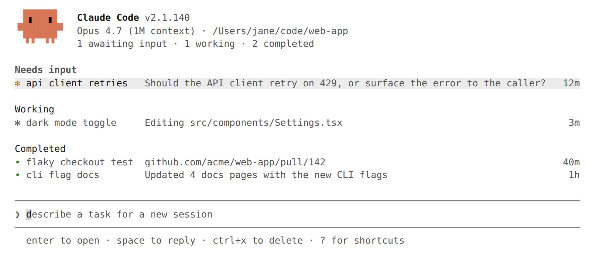

> 文档索引：完整文档列表见 https://code.claude.com/docs/llms.txt

# 使用智能体视图管理多个智能体

> 从同一屏幕派发和管理多个 Claude Code 会话。智能体视图显示每个会话的运行状态，以及哪些会话需要你介入。

智能体视图通过 `claude agents` 打开，是管理所有后台会话的统一界面：显示正在运行的会话、需要你输入的会话，以及已完成的会话。你可以派发新会话，一目了然地查看各会话状态，而无需逐一翻看对话记录，仅在需要时才介入。每个后台会话都是一个完整的 Claude Code 对话，无需连接终端即可持续运行，你可以随时打开、回复，然后离开。




当你有多个相互独立的任务、无需全程监视每一步时，使用智能体视图最为合适。将 bug 修复、Pull Request 审查和不稳定测试排查分别作为三行任务派发，在另一个窗口继续工作，待某行显示需要你介入或已有结果时再回来查看。

当你想更直接地参与某个智能体的会话时，连接到该行即可进入完整对话。

如需对比智能体视图与子智能体、智能体团队和工作树的区别，请参阅 [并行运行智能体](https://code.claude.com/docs/en/agents)。

> **注意：** 智能体视图目前处于研究预览阶段，需要 Claude Code v2.1.139 或更高版本。使用 `claude --version` 检查你的版本。随着功能迭代，界面和快捷键可能发生变化。

本页内容：

* [快速开始](#quick-start)：让 Claude 在后台处理任务、查看进度并在需要时介入
* [通过智能体视图监控会话](#monitor-sessions-with-agent-view)，包括状态图标、快速预览与回复、连接、整理及键盘快捷键
* [派发新智能体](#dispatch-new-agents)，可从智能体视图、会话内部或 shell 中操作
* [从 shell 管理会话](#manage-sessions-from-the-shell)
* [后台会话的托管方式](#how-background-sessions-are-hosted)（由主进程负责）

## 快速开始

本演练涵盖智能体视图的核心工作流：派发任务、观察 Claude 工作时行条目的更新、快速预览并回复，以及连接查看完整对话。你派发的会话在关闭智能体视图后仍会继续运行，你可以随时离开再回来。

**步骤 1：打开智能体视图**

在 shell 中运行：

```bash theme={null}
claude agents
```

智能体视图打开后，底部有一个输入框，表格会随会话启动逐步填充。随时按 `Esc` 返回 shell。离开期间你的会话仍在运行，下次打开智能体视图时会重新显示。

**步骤 2：派发会话**

输入描述任务的提示词并按 `Enter`。一个新的后台会话将开始处理该任务，并以一行显示其状态：正在工作、等待你的输入，或已完成。新会话使用智能体视图标题栏中显示的模型，以及在该目录下运行 `claude` 时对应的[权限模式](#permission-mode-model-and-effort)。

此处每次输入的提示词都会启动一个全新的独立会话。再次输入提示词并按 `Enter` 会启动第二个会话与第一个并行运行，而不是向第一个会话发送后续消息。你可以通过这种方式同时运行多个会话。

每个会话独立消耗你的订阅配额，大量并发派发前请先查看[限制](#limitations)。

**步骤 3：快速预览与回复**

用方向键选中某行，按 `Space` 打开快速预览面板。它显示该会话的最新输出，或其正在等待的问题，而非完整的对话记录。输入回复并按 `Enter` 即可发送，无需离开智能体视图。

**步骤 4：连接与断开**

当你想查看完整对话时，在某行上按 `Enter` 或 `→` 进行连接。该会话将作为完整的交互式 Claude Code 会话接管终端。在空提示词处按 `←` 可断开并返回表格。

**步骤 5：将现有会话纳入管理**

要将已打开的会话移入智能体视图，在其中运行 `/bg`，或在空提示词处按 `←`，即可将其转入后台并同步打开智能体视图。该会话继续运行，并作为一行显示在你已派发的会话旁边。

你可以将 `claude agents` 作为主要入口点，替代 `claude`：从智能体视图派发所有任务，需要完整对话时再连接，按 `←` 返回表格。

## 通过智能体视图监控会话

运行 `claude agents` 打开智能体视图。它将占满整个终端，按状态分组列出所有会话，已固定的会话和需要你介入的会话置于顶部。每行显示会话名称、当前活动以及上次变更的时间。

默认情况下，列表显示你启动的所有后台会话，涵盖所有项目。一个在某个仓库中工作的会话和另一个在不同工作树中运行的会话都会显示在此，无论你从哪个目录打开智能体视图。若要将列表限定为某个项目，传入 `--cwd` 参数（需要 Claude Code v2.1.141 或更高版本）：

```bash theme={null}
claude agents --cwd ~/projects/my-app
```

这将只显示在该目录下启动的会话。已[迁入工作树](#how-file-edits-are-isolated)（路径为 `~/projects/my-app/.claude/worktrees/`）的会话仍归属于 `~/projects/my-app`。

你在其他终端中打开的交互式会话不会显示，除非你[将其转入后台](#from-inside-a-session)。会话派生的[子智能体](https://code.claude.com/docs/en/sub-agents)和[队友](https://code.claude.com/docs/en/agent-teams)不会作为独立行列出。

```text theme={null}
Pinned
  ✽ clawd walk cycle          Write assets/sprites/clawd-walk.png           3m

Ready for review
  ∙ jump physics              Opened PR with collision fix              PR #2048  2h

Needs input
  ✻ power-up design           needs input: double jump or wall climb?       1m

Working
  ✽ collision detection       Edit src/physics/CollisionSystem.ts           2m
  ✢ playtest level 3          run 12 · all checkpoints cleared           in 4m

Completed
  ✻ title screen              result: menu, options, and credits done       9m
  ∙ sound effects             result: 14 SFX exported to assets/audio       4h
  … 6 more
```

### 读取会话状态

每行开头的图标，其颜色和动画反映会话的当前状态：

| 状态 | 图标显示 | 含义 |
| :--- | :--- | :--- |
| 运行中 | 动画效果 | Claude 正在主动执行工具或生成响应 |
| 等待输入 | 黄色 | Claude 正在等待你回答特定问题或做出权限决策 |
| 空闲 | 变暗 | 会话无任务待处理，等待你的下一条提示词 |
| 已完成 | 绿色 | 任务成功结束 |
| 失败 | 红色 | 任务以错误结束 |
| 已停止 | 灰色 | 会话通过 `Ctrl+X` 或 `claude stop` 被终止 |

此外，图标形状表示底层进程是否仍在运行：

| 形状 | 含义 |
| :--- | :--- |
| `✻` 或动画 `✽` | 会话进程存活，可立即响应 |
| `∙` | 进程已退出。你仍可进行快速预览、回复或连接，Claude 会从上次中断处继续 |
| `✢` | [`/loop`](https://code.claude.com/docs/en/scheduled-tasks) 会话在两次迭代之间处于休眠状态，行中显示运行次数和倒计时 |

行右侧可能出现的 `PR #N` 标签是[该会话打开的拉取请求](#pull-request-status)，与状态图标无关。当一个会话打开了多个拉取请求时，标签将显示数量，例如 `3 PRs`。

终端标签页标题会在智能体视图打开时显示等待输入的数量：当会话需要输入时显示 `2 awaiting input · claude agents`，否则显示 `claude agents`。

后台会话无需打开任何终端即可持续运行。独立的[主进程](#the-supervisor-process)负责管理它们，因此你可以关闭智能体视图、关闭终端，或启动新的交互式会话，而已派发的任务仍在继续。

会话状态会持久化到磁盘，在自动更新和主进程重启后依然保留。机器休眠时会话同样被保留，进程在唤醒后恢复，主进程会重新连接它们而非将休眠时间视为空闲。关机仍会停止正在运行的会话；如需恢复，请参阅[关机后会话显示为失败](#sessions-show-as-failed-after-shutdown)。

### 行摘要

每行的单行摘要由 [Haiku 级模型](https://code.claude.com/docs/en/model-config)生成，无需打开完整对话记录，即可告知你会话正在做什么、需要什么，或产出了什么。会话活跃运行期间，摘要最多每 15 秒刷新一次，并在每轮结束时额外刷新一次。

从 v2.1.161 起，当会话正在运行两个或多个并行工作项（如子智能体、后台 shell 命令或监视器）时，摘要文字前会显示 `done/total` 格式的计数，例如 `2/5`。

每次刷新都是通过你的正常提供商发出的一次简短 Haiku 级请求，按与会话本身相同的[数据使用条款](https://code.claude.com/docs/en/data-usage)计费和处理。在 Bedrock、Vertex AI、Microsoft Foundry 及自定义网关等第三方提供商上，当未配置 Haiku 模型时，请求将回退为会话的主模型。可设置 [`ANTHROPIC_DEFAULT_HAIKU_MODEL`](https://code.claude.com/docs/en/model-config#environment-variables) 来为这些提供商上的摘要指定模型。

### 拉取请求状态

当会话打开拉取请求时，行右侧会出现 `PR #1234` 标签，在支持超链接的终端中可直接链接到该拉取请求。向会话发送后续消息后标签仍会保留，因此即使行恢复为实时进度显示，拉取请求依然可见。

当会话打开了多个拉取请求时，标签显示数量而非编号，例如 `3 PRs`，颜色由最需要关注的开放拉取请求决定。打开[快速预览面板](#peek-and-reply)可查看所有拉取请求。

拉取请求编号的颜色表示其状态：

| 颜色 | 拉取请求状态 |
| :--- | :--- |
| 黄色 | 等待检查或审查，或检查失败 |
| 绿色 | 检查通过且无阻塞审查 |
| 紫色 | 已合并 |
| 灰色 | 草稿或已关闭 |

对大多数任务而言，这一列是你获取结果的地方：当编号变为绿色时，审查并合并拉取请求即可。

### 快速预览与回复

在选中的行上按 `Space` 打开快速预览面板。面板显示会话需要你提供的内容、最近的输出，以及它打开的所有拉取请求。大多数情况下这已足够，无需打开完整对话记录。

从 v2.1.161 起，当会话正在运行并行工作项时，面板还会显示运行时间最长的工作项及其已运行时长，让你无需连接会话即可了解它在等待什么。

在快速预览面板中输入回复并按 `Enter` 发送给该会话。当会话提出多选问题时，面板会显示选项，你可以按数字键选择。对于其他阻塞状态的会话，按 `Tab` 可用建议回复填充输入框，发送前可自行编辑。在回复前加 `!` 前缀可发送 Bash 命令。

从 v2.1.145 起，启用[语音听写](https://code.claude.com/docs/en/voice-dictation)后，在回复输入框获得焦点时，按住或轻触推送通话键即可听写回复，无需手动输入。智能体视图底部的派发输入框同样支持此功能。

使用 `↑` 和 `↓` 在不关闭面板的情况下快速预览相邻会话，或按 `→` 连接。

### 连接到会话

在选中的行上按 `Enter` 或 `→` 进行连接。智能体视图将被完整的交互式会话替换。连接后，Claude 会发布一份简短的离开期间事件摘要。

连接后，会话与其他 Claude Code 会话行为完全一致：所有[命令](https://code.claude.com/docs/en/commands)、键盘快捷键和功能均可正常使用。

连接的会话始终以[全屏模式](https://code.claude.com/docs/en/fullscreen)渲染，不受 `tui` 设置影响，因为后台会话没有终端滚动缓冲区可以追加内容。使用 `PgUp`、`PgDn` 或鼠标滚轮滚动，按 `Ctrl+O` 进入对话记录模式。终端原生滚动和 tmux 复制模式仅显示当前视口，与运行任何全屏应用时相同。

在空提示词处按 `←` 可断开连接并返回智能体视图。如果某个对话框获得了焦点且 `←` 无响应，按 `Ctrl+Z` 可立即断开连接。

`Ctrl+C` 在连接状态下保持标准中断行为：取消正在运行的响应或 `!` shell 命令，而非断开连接。在空提示词处连按两次 `Ctrl+C` 可断开连接，与任意会话中的行为相同。

断开连接不会停止后台会话：`←`、`Ctrl+Z`、`/exit`，以及双击 `Ctrl+C` 或双击 `Ctrl+D` 都会让会话继续运行。若要从内部结束会话，请运行 `/stop`。

在空提示词处按 `←` 适用于任何 Claude Code 会话，而不仅限于从智能体视图连接的会话。它会将当前会话转入后台并打开智能体视图，同时选中对应行，让你无需离开终端即可切换会话。即使是没有对话历史的全新会话也会创建对应行，因此 `→` 可返回该会话。当该行是唯一一行时，智能体视图会在其下方显示引导提示。你可以在 `/config` 中关闭此快捷键（`leftArrowOpensAgents` 设置）。

### 整理列表

智能体视图对会话进行分组，将需要输入的会话置顶，`Ready for review`（待审查）和 `Needs input`（需要输入）排在 `Working`（运行中）和 `Completed`（已完成）之前。这些分组名称与上文[状态](#read-session-state)并非一一对应：会话在打开拉取请求后移至 `Ready for review`，而 `Completed` 将已完成、失败和已停止的会话统一归入其中。按 `Ctrl+S` 可改为按目录分组，你的选择在运行间持久保留。

在分组内：

* 按 `Ctrl+T` 将会话置顶，并在空闲时[保持其进程运行](#the-supervisor-process)
* 按 `Shift+↑` 或 `Shift+↓` 对会话重新排序
* 按 `Ctrl+R` 重命名会话
* 在分组标题上按 `Enter` 折叠该分组

要从列表中移除会话，按 `Ctrl+X` 停止它，然后在两秒内再次按 `Ctrl+X` 删除它。在分组标题上按 `Ctrl+X` 会在确认后删除该分组中的每个会话。

删除操作会将会话从智能体视图中移除。如果 Claude [为会话创建了工作树](#how-file-edits-are-isolated)，删除操作也会移除该工作树，包括其中所有未提交的更改，因此请先推送或提交您希望保留的工作。您自己创建并在其中启动会话的工作树不受影响。对话记录保留在您的本地机器上，仍可通过 `claude --resume` 访问。

较旧的已完成会话会折叠进 `… N more` 行以保持列表简洁。失败的会话和包含未关闭 pull request 的会话始终保持可见。

### 筛选会话

在派发输入框中输入内容可以筛选会话，而非直接派发：

| 筛选条件                  | 显示内容    |
| :--- | :--- |
| `a:<name>`              | 运行指定名称智能体的会话   |
| `s:<state>`             | 处于指定状态的会话，例如 `s:working`。也接受 `s:blocked` 来显示所有等待您响应的会话 |
| `#<number>` 或 PR URL | 正在处理该 pull request 的会话                                                                                 |
| 任意其他 URL           | 首条提示词中包含该 URL 的会话                                                                        |

### 键盘快捷键

在智能体视图中按 `?` 可查看当前上下文中的所有快捷键。下表对其进行汇总。

| 快捷键              | 操作                                                                              |
| :--- | :--- |
| `↑` / `↓`             | 在行之间移动                                                                   |
| `Enter`               | 连接到选中的会话；若输入框有文字则执行派发            |
| `Space`               | 打开或关闭选中会话的快速预览面板                               |
| `Shift+Enter`         | 派发并立即连接                                                     |
| `→`                   | 连接到选中的会话                                                                 |
| `Alt+1`..`Alt+9`      | 连接到当前聚焦目录中的第 1–9 个会话                            |
| `Tab`                 | 输入框为空时，浏览所有子智能体；否则应用高亮的建议 |
| `Ctrl+S`              | 在按状态和按目录分组之间切换                                         |
| `Ctrl+T`              | 固定或取消固定选中的会话                                                   |
| `Ctrl+R`              | 重命名选中的会话                                                             |
| `Ctrl+G`              | 在您的 `$VISUAL` 或 `$EDITOR` 中打开派发提示词输入框                             |
| `Ctrl+X`              | 停止会话；两秒内再次按下可删除它                       |
| `Shift+↑` / `Shift+↓` | 对选中会话重新排序                                                        |
| `Esc`                 | 关闭快速预览面板、清空输入框或退出                                |
| `Ctrl+C`              | 清空输入框；按两次退出                                                |
| `?`                   | 显示所有快捷键                                                                  |

## 派发新智能体

您可以从智能体视图派发新的后台会话、将现有的交互式会话发送到后台，或直接从 shell 启动一个会话。

### 从智能体视图

在智能体视图底部的输入框中输入提示词，然后按 `Enter` 启动新的后台会话。会话名称根据提示词自动生成，稍后可通过 `Ctrl+R` 重命名。

将图片粘贴到提示词中，可以在任务中附带截图或示意图。

在提示词中添加前缀或提及特定部分，可控制会话的启动方式：

| 输入                             | 效果                                                                                                                                                         |
| :--- | :--- |
| `<agent-name> <prompt>`           | 若第一个词与自定义[子智能体](https://code.claude.com/docs/en/sub-agents)名称匹配，该子智能体将以其 frontmatter 中的配置作为会话的主智能体运行 |
| `@<agent-name>`                   | 在提示词任意位置提及自定义子智能体，以将其作为主智能体运行                                                                                                   |
| `@<repo>`                         | 提及您打开智能体视图所在目录下的某个代码仓库，以在该仓库中运行会话                                                                                   |
| `/<command>`                      | 建议将 [skills](https://code.claude.com/docs/en/skills) 和 [commands](https://code.claude.com/docs/en/commands) 作为提示词派发                                                                            |
| `! <command>`                     | 将 shell 命令作为后台任务运行，而非启动 Claude 会话。该任务以行的形式显示，您可以连接、查看并断开连接               |
| `#<number>` 或 pull request URL | 若已有会话正在处理该 PR，则选中该会话而非新建派发                                                                                                   |
| `Shift+Enter`                     | 派发并立即连接到新会话                                                                                                                             |

少数命令会在智能体视图本身执行，而非进行派发：`/exit` 和 `/quit` 关闭智能体视图，`/logout` 登出账户。其他所有命令和 skill 均作为首条提示词发送至新的后台会话。

将反复执行的任务封装为 [skill](https://code.claude.com/docs/en/skills)，可让您无需重新输入提示词，即可在智能体视图中反复启动相同的工作流。

当同一个 `@name` 同时匹配子智能体和同级代码仓库时，子智能体优先。纯首词匹配规则同样适用，因此以子智能体名称开头的提示词会派发该子智能体，而非将该词作为普通文本处理。如需明确指定，请使用 `@` 形式；若要避免匹配，可将提示词改为以其他词开头。

#### 派发到指定目录

新会话默认在您打开智能体视图的目录中运行。若要指向其他目录：

* 在目标目录中打开 `claude agents`。
* 在包含多个代码仓库的父目录中打开 `claude agents`，并在提示词中用 `@<repo>` 提及某个仓库，以在该仓库中运行会话。
* 在 shell 中 `cd` 进入目标目录，然后运行 `claude --bg "<prompt>"`。

当智能体视图按目录分组时，高亮行所在的目录将成为派发目标，因此您可以滚动到某个分组后直接向其派发，无需重新输入路径。

### 从会话内部

运行 `/background` 或其别名 `/bg`，可将当前对话移至后台会话。传入提示词（如 `/bg run the test suite and fix any failures`）可在后台化前先发出一条指令。如果 Claude 正在响应时您运行了 `/bg`，响应会在后台会话中继续。

从交互式会话后台化会启动一个新进程，该进程从已保存的对话恢复，因此正在运行的子智能体、[monitors](https://code.claude.com/docs/en/tools-reference#monitor-tool) 和后台命令不会转移过去。如果有正在运行的上述内容，Claude 会在后台化前请您确认。进入后台后，会话可以启动新的子智能体、monitors 和后台命令，这些会在之后的断开连接和重新连接过程中持续运行。

原始启动时的配置标志会延续到后台化的会话中，因此其 MCP servers、设置和回退模型仍然有效：

* `--mcp-config` 和 `--strict-mcp-config`
* `--settings`
* `--add-dir`
* `--plugin-dir`
* `--fallback-model`
* `--allow-dangerously-skip-permissions`

你在会话期间通过 [`/add-dir`](https://code.claude.com/docs/en/permissions#additional-directories-grant-file-access-not-configuration) 添加的目录也会一并保留。

传入 `--allow-dangerously-skip-permissions` 可在后台会话中保持 `bypassPermissions` 可用，但不会额外授予新的权限。该权限模式仍需在任何会话使用前完成[权限模式、模型与执行强度](#permission-mode-model-and-effort)中所描述的一次性交互式确认。

### 从 shell 启动

传入 `--bg` 可直接启动一个后台会话：

```bash theme={null}
claude --bg "investigate the flaky SettingsChangeDetector test"
```

若要将特定子智能体作为会话的主智能体运行，可将 `--bg` 与 `--agent` 组合使用：

```bash theme={null}
claude --agent code-reviewer --bg "address review comments on PR 1234"
```

传入 `--name` 可在智能体视图中为会话设置显示名称，而非使用自动生成的名称：

```bash theme={null}
claude --bg --name "flaky-test-fix" "investigate the flaky SettingsChangeDetector test"
```

进入后台后，Claude 会打印会话的短 ID 以及用于管理它的命令。当你传入 `--name` 时，名称会显示在短 ID 之后：

```text theme={null}
backgrounded · 7c5dcf5d · flaky-test-fix
  claude agents             list sessions
  claude attach 7c5dcf5d    open in this terminal
  claude logs 7c5dcf5d      show recent output
  claude stop 7c5dcf5d      stop this session
```

#### 运行 shell 命令

若要在智能体视图中以后台任务的形式运行 shell 命令（而非启动 Claude 会话），可在派发输入框中输入 `!` 作为首字符。`!` 会显示为前缀，其后输入的内容即为命令。以下示例从智能体视图输入框派发 `pytest -x`：

```text theme={null}
! pytest -x
```

按 `Enter` 启动任务。同一任务也可直接在 shell 中通过 `--exec` 启动：

```bash theme={null}
claude --bg --exec 'pytest -x'
```

该命令以 PTY 支持的任务形式运行，并在智能体视图中显示为一行，最新一行输出作为其状态。shell 任务直接运行命令，不调用模型，输出也不会发送至任何会话。

查看输出时，可连接到该行、按 `Space` 进行快速预览而不连接，或在 shell 中运行 `claude logs <id>`。捕获的输出保留在内存中，不会写入磁盘。命令退出约五分钟后，该行及其输出会自动清除，因此如需结果，请在此之前读取。

### 文件编辑的隔离方式

每个后台会话——无论是从智能体视图、`/bg` 还是 `claude --bg` 启动——都从你的工作目录开始。在编辑文件之前，Claude 会将会话迁移至 `.claude/worktrees/` 下的独立[工作树](https://code.claude.com/docs/en/worktrees)，使并行会话可以读取同一份代码库，但各自写入独立的工作树。

以下情况下 Claude 会跳过工作树：

* 该会话已在某个关联的 git 工作树内——无论是 Claude 在 `.claude/worktrees/` 下创建的，还是你通过 `git worktree add` 在其他位置创建的
* 工作目录不是 git 仓库，且未配置 [`WorktreeCreate` hook](https://code.claude.com/docs/en/hooks#worktreecreate)
* 写入路径在工作目录之外

若要为 git 工作树不适用的仓库关闭工作树隔离，可将 [`worktree.bgIsolation`](https://code.claude.com/docs/en/settings#worktree-settings) 设置为 `"none"`。后台会话将直接编辑你的工作副本，不再迁移至工作树。在项目的 `.claude/settings.json` 中添加如下配置：

```json theme={null}
{
  "worktree": {
    "bgIsolation": "none"
  }
}
```

> **注意：** `worktree.bgIsolation` 设置需要 Claude Code v2.1.143 或更高版本。

在 git 仓库之外，各会话直接写入工作目录，彼此之间不隔离，因此请避免派发多个编辑同一文件的并行会话。如果你使用其他版本控制系统，可配置 [`WorktreeCreate` hook](https://code.claude.com/docs/en/worktrees#non-git-version-control)，Claude 将以与 git 相同的方式隔离编辑。

在智能体视图中删除会话（连按两次 `Ctrl+X`）会移除 Claude 为其创建的工作树，包括所有未提交的更改，因此请先合并或推送你想保留的更改。通过 shell 命令 [`claude rm`](#manage-sessions-from-the-shell) 删除时，若工作树存在未提交的更改，则会保留该工作树并打印路径供你自行清理。你自己创建并在其中启动会话的工作树，无论哪种删除方式都不会被移除。

要查找会话的工作树路径，可快速预览该会话或连接后检查其工作目录。

后台会话派发的[子智能体](https://code.claude.com/docs/en/sub-agents)会继承会话的工作目录，因此其文件编辑会落在会话的工作树中，而非你的工作副本。若要为子智能体分配独立的工作树，可在其 frontmatter 中设置 [`isolation: worktree`](https://code.claude.com/docs/en/sub-agents#supported-frontmatter-fields)，或在派发时传入 `isolation: "worktree"`。

### 设置模型

智能体视图标题中显示的模型名称是派发时的默认模型。从输入框启动的新会话将使用此模型，该模型来自用户设置中的 [`model` 设置项](https://code.claude.com/docs/en/settings#available-settings)。可通过 [`/model` 选择器](https://code.claude.com/docs/en/model-config) 选择模型来设置，也可直接编辑该设置项。若要为整个智能体视图会话覆盖默认模型，可在打开智能体视图时传入 `--model`。详见[权限模式、模型与执行强度](#permission-mode-model-and-effort)。

每个后台会话可以运行在不同的模型上。若要为单个会话覆盖模型：

* 在 shell 中，通过 `claude --bg` 传入 `--model`。
* 连接到正在运行的会话，打开 `/model`，然后按 `s` 选择某个模型，仅对该会话生效。若该会话被重新启动，所做更改将持续保留。
* 派发一个在 frontmatter 中设置了 `model` 字段的[子智能体](https://code.claude.com/docs/en/sub-agents)。

### 权限模式、模型与效能

后台会话从其运行所在目录读取[配置](https://code.claude.com/docs/en/settings)，与在该目录中直接启动 `claude` 的效果相同。

[权限模式](https://code.claude.com/docs/en/permissions)取决于会话的启动方式。通过 `/bg` 或 `←` 将现有会话切换至后台，会保留当前的权限模式——因此，若你已将某会话切换为 `acceptEdits` 或 `auto`，断开连接后该模式依然有效。从智能体视图输入框派发，或在 shell 中运行 `claude --bg`，则会使用该目录配置中的 `defaultMode`，或所派发[子智能体 frontmatter](https://code.claude.com/docs/en/sub-agents#supported-frontmatter-fields) 中的 `permissionMode`。

后台会话启动时所用的权限模式、模型与效能，以及它[从会话内部携带的配置标志](#from-inside-a-session)，在主进程后续[停止并重启](#the-supervisor-process)其进程时均会保留。通过 `claude --bg --dangerously-skip-permissions` 或 `claude --bg --permission-mode bypassPermissions` 启动的会话，在重启后仍保持 `bypassPermissions` 模式，而不会回退至目录的 `defaultMode`；在会话中途通过 `/model` 或 `/effort` 修改的模型或效能设置同样会被保留。

如需为从智能体视图派发的所有会话设置默认值，可在打开时传入以下任意参数：`--permission-mode`、`--model`、`--effort` 或 `--agent`：

```bash theme={null}
claude agents --permission-mode plan --model opus --effort high
```

`--agent` 用于设置当派发提示词中未通过 `@name` 或首个单词指定子智能体时所使用的[子智能体](https://code.claude.com/docs/en/sub-agents)。若未设置，默认使用 [`agent` 配置项](https://code.claude.com/docs/en/settings#available-settings)（如有），否则使用内置的通用 `claude` 智能体。在派发输入框中明确指定子智能体会覆盖上述两者。

`claude agents` 还支持 `--dangerously-skip-permissions` 作为 `--permission-mode bypassPermissions` 的简写，以及 `--allow-dangerously-skip-permissions`，后者可使 `bypassPermissions` 在每个派发会话的 `Shift+Tab` 循环中可用，但不会以该模式启动。两者均与[顶级 CLI 标志](https://code.claude.com/docs/en/cli-reference)保持一致。

这些标志分批次在不同版本中添加，早期版本会以"未知选项"错误拒绝它们。

| 标志或配置项                                                                 | 最低版本要求                          |
| :--- | :--- |
| `--permission-mode`, `--model`, `--effort`, `--dangerously-skip-permissions` | v2.1.142 {/* min-version: 2.1.142 */} |
| `--allow-dangerously-skip-permissions`                                       | v2.1.143 {/* min-version: 2.1.143 */} |
| `--agent`，以及为派发会话遵循 `agent` 配置项                                | v2.1.157 {/* min-version: 2.1.157 */} |

v2.1.157 之前，智能体视图会忽略 `agent` 配置项，并派发内置的 `claude` 智能体。

当前默认值显示在派发输入框下方的页脚区域。

若未传入上述标志，会话将使用该目录配置中的 `defaultMode` 或所派发[子智能体 frontmatter](https://code.claude.com/docs/en/sub-agents#supported-frontmatter-fields) 中的 `permissionMode`，以及智能体视图页头中显示的模型。

在通过 `claude` 以交互方式运行并接受相应模式之前，使用 `bypassPermissions` 或 `auto` 会被拒绝，因为这些模式允许你未在旁监督的会话在无需审批的情况下自行操作。无论是将该模式传给 `claude agents` 还是 `claude --bg --permission-mode`，规则均适用。

### 配置、plugin 与 MCP server

智能体视图接受与 `claude` 相同的配置标志，用于加载配置、plugin、MCP server 及附加目录。这些标志需要 Claude Code v2.1.142 或更高版本。每个标志作用于智能体视图本身，并会透传给从中派发的所有会话，因此通过此方式加载的 plugin 或 MCP server 在这些会话中同样可用。

| 标志                                                                                             | 效果                                                                           |
| :--- | :--- |
| [`--settings <file-or-json>`](https://code.claude.com/docs/en/settings)                                                      | 覆盖智能体视图及派发会话的配置                                                 |
| [`--add-dir <path>`](https://code.claude.com/docs/en/permissions#additional-directories-grant-file-access-not-configuration) | 授予额外目录的文件访问权限                                                     |
| [`--plugin-dir <path>`](https://code.claude.com/docs/en/plugins)                                                             | 从本地目录加载 plugin                                                          |
| [`--mcp-config <file-or-json>`](https://code.claude.com/docs/en/mcp)                                                         | 从配置文件或 JSON 字符串加载 MCP server                                        |
| `--strict-mcp-config`                                                                            | 仅使用 `--mcp-config` 中的 MCP server，忽略其他 MCP 配置                      |

`--add-dir`、`--plugin-dir` 或 `--mcp-config` 每个值需单独重复传入。`claude agents` 不支持空格分隔的形式，例如 `--add-dir a b c`。

以下示例使用配置覆盖和一个额外目录打开智能体视图：

```bash theme={null}
claude agents --settings ./ci-settings.json --add-dir ../shared-lib
```

## 从 shell 管理会话

每个后台会话都有一个短 ID，可在 shell 中使用。启动会话时 `claude --bg` 会打印该 ID，且每个会话的 ID 即其在 `~/.claude/jobs/` 下的目录名。这些命令适用于脚本编写，或不想打开智能体视图时使用。

| 命令                         | 用途                                                                                                                                                                                                                                                                                                                                                                                                                                                                                                                                                                                                                                                                                                                     |
| :--------------------------- | :----------------------------------------------------------------------------------------------------------------------------------------------------------------------------------------------------------------------------------------------------------------------------------------------------------------------------------------------------------------------------------------------------------------------------------------------------------------------------------------------------------------------------------------------------------------------------------------------------------------------------------------------------------------------------------------------------------------------- |
| `claude agents`              | 打开智能体视图                                                                                                                                                                                                                                                                                                                                                                                                                                                                                                                                                                                                                                                                                                           |
| `claude agents --cwd <path>` | 打开仅显示 `<path>` 下启动的会话的智能体视图                                                                                                                                                                                                                                                                                                                                                                                                                                                                                                                                                                                                                                                                            |
| `claude agents --json`       | 以 JSON 数组形式打印活跃会话并退出：包括所有存活会话，以及仍在运行或处于阻塞状态的后台会话（即使其进程已退出）。添加 `--all` 可同时包含已完成的后台会话。每条记录包含 `cwd`、`kind` 和 `startedAt`。后台会话还额外包含 `id`（可与 `claude attach`/`logs`/`stop` 配合使用）及 `state`（取值为 `working`、`blocked`、`done`、`failed` 或 `stopped` 之一）。`pid` 和 `status` 仅在进程存活时出现，当 `status` 为 `waiting` 时还附带 `waitingFor`，说明会话被阻塞的原因，例如 `permission prompt` 或 `input needed`；设置后会出现 `sessionId` 和 `name`。可与 `--cwd <path>` 组合使用以过滤结果 |
| `claude attach <id>`         | 在当前终端连接到指定会话                                                                                                                                                                                                                                                                                                                                                                                                                                                                                                                                                                                                                                                                                                 |
| `claude logs <id>`           | 打印该会话的近期输出                                                                                                                                                                                                                                                                                                                                                                                                                                                                                                                                                                                                                                                                                                     |
| `claude stop <id>`           | 停止指定会话，也可使用 `claude kill`                                                                                                                                                                                                                                                                                                                                                                                                                                                                                                                                                                                                                                                                                     |
| `claude respawn <id>`        | 重启指定会话（无论运行中还是已停止），保留其对话内容，例如用于加载更新后的 Claude Code 二进制文件                                                                                                                                                                                                                                                                                                                                                                                                                                                                                                                                                                                                                       |
| `claude respawn --all`       | 重启所有正在运行的会话，例如一次性将所有会话迁移至更新后的 Claude Code 二进制文件                                                                                                                                                                                                                                                                                                                                                                                                                                                                                                                                                                                                                                       |
| `claude rm <id>`             | 从列表中移除指定会话。若 Claude 为该会话创建的工作树没有未提交的更改，则同时删除该工作树；否则打印工作树路径供你手动清理。你自行创建的工作树不会被删除。对话记录保留在本地，仍可通过 `claude --resume` 访问                                                                                                                                                                                                                                                                                                                                                                                                                                                                                                              |
| `claude daemon status`       | 打印[主进程](#the-supervisor-process)的状态、版本、socket 目录及 worker 数量                                                                                                                                                                                                                                                                                                                                                                                                                                                                                                                                                                                                                                             |
| `claude daemon stop --any`   | 停止主进程及其托管的后台会话。传入 `--keep-workers` 可保留后台会话运行，以便下一个主进程重新连接。下次执行 `claude agents` 或 `claude --bg` 时将启动新的主进程                                                                                                                                                                                                                                                                                                                                                                                                                                                                                                                                                          |

## 后台会话的托管方式

智能体视图中列出的每个会话均视为后台会话，无论你当前是否已连接。相比之下，直接运行 `claude` 启动的会话与该终端绑定，终端关闭时会话随之结束——除非你[将其切换至后台](#from-inside-a-session)。

### 主进程

后台会话由一个独立于终端和智能体视图、针对每位用户运行的主进程托管。首次将会话切换至后台或打开智能体视图时，主进程会自动启动，无需手动管理。

主进程及其会话使用与交互式会话相同的凭据进行身份验证，除模型 API 外不建立任何额外的网络连接。

每个后台会话都是独立的 Claude Code 进程，由主进程管理，而非绑定到你的终端。正在运行、等待输入或已连接终端的会话会保持其进程运行。正在运行的后台 shell 命令、子智能体、动态工作流或监控器均视为活跃工作，因此长期运行的进程（如开发服务器）会使会话保持存活。

会话完成并断开连接约一小时后，主进程会停止其进程以释放资源。通过 `Ctrl+T` [固定](#organize-the-list)的会话不受此限制，空闲时其进程会持续保持运行。无论如何，对话记录和状态均保存在磁盘上；下次连接、快速预览或回复已停止的会话时，主进程会从上次离开的地方重新启动一个新进程。当所有会话均已完成且无终端连接时，主进程自身退出，并在下次需要时重新启动。

按下 `←` 后留下的空行若从未输入提示词，约五分钟后会自动清除，列表会自动整理。通过 `claude --bg` 启动的会话，以及正在等待信任对话框等设置提示词的会话，不会以这种方式被清除。

当宿主机内存不足时，主进程会优先停止空闲的非固定会话，若此操作未释放内存，才会停止空闲的固定会话。

主进程会监视磁盘上已安装的 Claude Code 二进制文件，并在常规[自动更新](https://code.claude.com/docs/en/setup#auto-updates)替换后重启至新版本。这是本地文件监视，而非网络检查。后台会话是独立进程，因此会在重启过程中持续运行，新的主进程会重新连接到它们。空闲的固定会话也会就地重启至新版本，无需重新连接即可获取更新。

### 状态存储位置

会话状态存储在你的 Claude Code 配置目录下。如果设置了 [`CLAUDE_CONFIG_DIR`](https://code.claude.com/docs/en/env-vars)，主进程将使用该目录而非 `~/.claude`，并以独立实例运行，拥有各自的会话。

| 路径 | 内容 |
| :--- | :--- |
| `~/.claude/daemon.log` | 主进程日志 |
| `~/.claude/daemon/roster.json` | 正在运行的后台会话列表，用于重启后重新连接 |
| `~/.claude/jobs/<id>/state.json` | 智能体视图中显示的每个会话的状态 |
| `~/.claude/jobs/<id>/tmp/` | 每个会话的临时目录。向此处写入不会触发权限提示。会话删除后自动清除 |

每个后台会话都设置了 `CLAUDE_JOB_DIR` 环境变量，指向其 `~/.claude/jobs/<id>` 目录，因此会话运行的 shell 命令可以将临时文件写入 `$CLAUDE_JOB_DIR/tmp`，而不会与并行会话发生冲突。

如需在不直接读取文件的情况下检查此状态，可运行 `claude daemon status`。它会报告主进程是否可达、其进程 ID 和版本、socket 目录，以及当前活跃的后台会话数量。`/doctor` 包含同一检查的摘要。

该命令还会在运行中的主进程版本与你调用的 `claude` 版本不一致时发出警告——这种情况发生在主进程尚未重启至更新版本之后。警告会显示两个版本号，并提示你运行 `claude daemon stop --any` 以切换至新版本。当 Claude Code 作为操作系统服务安装时，建议的命令是不带该标志的 `claude daemon stop`。

在 Windows 上，当守护进程的管道密钥文件被锁定或无法读取时，`claude daemon status` 会显示底层文件错误，而不是报告通用连接失败。

### 关闭智能体视图

如需完全关闭后台智能体和智能体视图，请将 `disableAgentView` [设置](https://code.claude.com/docs/en/settings)设为 `true`，或设置 `CLAUDE_CODE_DISABLE_AGENT_VIEW` 环境变量。管理员可通过[托管设置](https://code.claude.com/docs/en/permissions#managed-settings)强制执行此配置。

## 故障排查

### `claude agents` 列出子智能体而非打开智能体视图

如果 `claude agents` 打印一个计数、列出你配置的子智能体后退出，说明智能体视图在你的环境中不可用。早期版本在某些环境下（包括通过 Bedrock、Vertex AI 或 Foundry 连接时）不会打开智能体视图。运行 `claude update` 安装最新版本。

如果更新后智能体视图仍无法打开，请检查是否被某个设置或环境变量[关闭了](#turn-off-agent-view)。

### 智能体视图打开后没有会话

在你派发第一个会话之前，智能体视图会在会话列表位置显示一条简短的引导提示和示例提示词。在底部输入框中输入提示词并按 `Enter` 来派发你的第一个会话。

### 因后台有任务运行而无法打开智能体

如果按 `←` 将当前会话转入后台时显示 `Cannot open agents — N still running in the background`，说明该会话有正在进行的工作，例如子智能体、动态工作流或后台 shell 命令，快捷键不会静默放弃这些任务。运行 `/tasks` 查看正在运行的内容，然后运行 `/bg` 确认放弃。关于转入后台时哪些内容会保留、哪些不会，请参阅[从会话内部操作](#from-inside-a-session)。

### 提示词因太短而被拒绝

派发输入框期望的是任务描述，而非对话式开场白。少于四个字符的提示词会被拒绝，并显示 `Too short` 提示，以防止误触按键启动会话。请描述你希望会话执行的内容，例如 `investigate the flaky checkout test`。

### 关机后会话显示为失败

关机或重启机器会停止正在运行的后台会话，因此下次打开智能体视图时它们会显示为失败。连接、快速预览或回复其中任意一个，会话将从中断处重新启动。

单独睡眠不会导致此问题。会话在睡眠期间会被保留，主进程在唤醒后会重新连接到它们。

### 智能体视图提示后台服务未响应

如果连接、快速预览或 `claude logs` 报告后台服务未响应，说明主进程可能已卡死。停止它并让下一次 `claude agents` 启动一个新的实例。如需在重启过程中保持后台会话运行，请传入 `--keep-workers`：

```bash theme={null}
claude daemon stop --any --keep-workers
```

新的主进程会重新连接到正在运行的会话。不加 `--keep-workers` 时，该命令也会终止后台会话。`--any` 标志表示确认要停止一个按需启动（而非作为已安装服务）的主进程，这是默认情况。

在 Windows 上，如果主进程未响应停止请求，命令会打印其进程 ID。使用 `taskkill /PID <pid>` 终止该进程以完成恢复。如果传入了 `--keep-workers`，后台会话仍会被保留。

### 后台会话无法在 macOS 上读取桌面、文稿或下载目录

在 macOS 上，后台会话宿主作为独立进程运行，需单独申请对受保护文件夹的访问权限，与你的终端分开处理。如果后台会话在读取 `~/Desktop`、`~/Documents`、`~/Downloads` 或其他受保护位置时报告 `Operation not permitted`，请在"系统设置"的"隐私与安全性 > 文件和文件夹"下授予访问权限，或为该条目启用"完全磁盘访问"。

使用原生安装程序时，该条目显示为 Claude Code，且授权在更新后仍然有效。使用其他安装方式（如 Homebrew 或 npm）时，条目显示为二进制文件路径，更新后可能需要重新授权。

### 连接后会话响应缓慢

会话完成并在未连接状态下停留约一小时后，主进程会停止其进程以释放资源。重新连接会从上次离开的地方启动一个新进程，需要片刻时间。正在工作、等待你操作或[已固定](#organize-the-list)的会话不会以这种方式被停止，因此可使用 `Ctrl+T` 固定会话以保持其响应速度。

### `.claude/worktrees/` 目录占用过大

在智能体视图中删除会话时，Claude 为其创建的工作树也会被删除。`claude rm` 会保留存在未提交更改的工作树并打印其路径。在项目目录中运行 `git worktree list` 列出残留条目，然后用 `git worktree remove <path>` 逐一删除。参阅[清理工作树](https://code.claude.com/docs/en/worktrees#clean-up-worktrees)。

## 限制

智能体视图目前处于研究预览阶段，存在以下限制：

* **受速率限制约束**：后台会话与交互式会话消耗相同的订阅用量，因此并行运行十个智能体消耗配额的速度约为运行一个的十倍。
* **会话在本地运行**：后台会话在你的机器上运行。它们在睡眠期间会被保留，但若机器关机则会停止。
* **智能体视图中删除会话时，Claude 创建的工作树也会被删除**：在删除一个于其自身工作树中编辑了文件的会话之前，请先合并或推送更改。`claude rm` 会保留存在未提交更改的工作树；你自己创建的工作树则不受影响，原样保留。

## 相关资源

其他并行运行 Claude 的方式，请参阅：

* [并行运行智能体](https://code.claude.com/docs/en/agents)：比较智能体视图与子智能体、智能体团队和工作树
* [智能体团队](https://code.claude.com/docs/en/agent-teams)：协调多个相互通信的会话
* [网页版 Claude Code](https://code.claude.com/docs/en/claude-code-on-the-web)：在托管云环境中运行会话，而非本地运行

