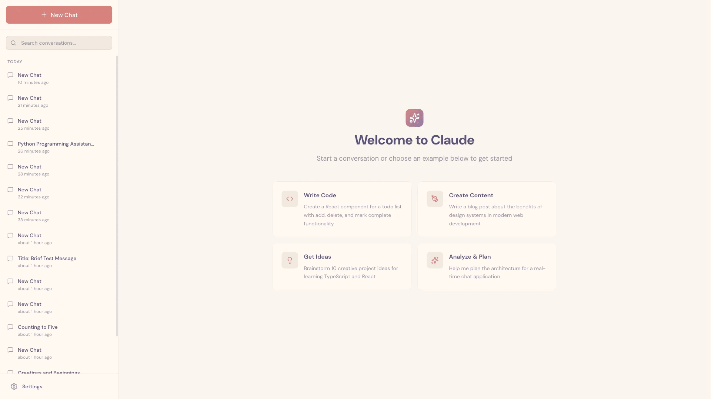

# 面向长时间运行智能体的高效工具链设计

智能体在跨越多个上下文窗口的工作中仍面临挑战。我们从人类工程师身上寻找灵感，为长时间运行的智能体构建了更高效的工具链。

> **来源：** [Anthropic Engineering - Effective harnesses for long-running agents](https://www.anthropic.com/engineering/effective-harnesses-for-long-running-agents)
> **发布日期：** 2025 年 11 月 26 日
> **作者：** Justin Young

---

随着 AI 智能体的能力不断增强，开发者越来越多地要求它们承担需要数小时甚至数天才能完成的复杂任务。然而，如何让智能体在跨越多个上下文窗口的情况下保持稳定的进展，仍是一个尚未解决的问题。

长时间运行智能体的核心挑战在于，它们必须在一个个独立的会话（session）中工作，而每个新会话开始时都不记得之前发生过什么。可以想象一个由轮班工程师负责的软件项目，每一位新上岗的工程师都完全不记得上一班发生了什么。由于上下文窗口是有限的，而大多数复杂项目都无法在单个窗口内完成，智能体需要一种方法来弥合编码会话之间的断层。

为此，我们为 [Claude Agent SDK](https://platform.claude.com/docs/en/agent-sdk/overview) 开发了一套双重方案，使其能够在多个上下文窗口之间有效地协同工作：一个在首次运行时负责搭建环境的**初始化智能体（initializer agent）**，以及一个在每次会话中负责推进增量进展、同时为下一次会话留下清晰产物的**编码智能体（coding agent）**。你可以在配套的[快速入门指南](https://github.com/anthropics/claude-quickstarts/tree/main/autonomous-coding)中找到代码示例。

## 一、长时间运行智能体面临的问题

Claude Agent SDK 是一个强大的通用智能体工具链，擅长编码，也擅长其他需要模型使用工具来收集上下文、制定计划并执行的任务。它具备压缩（compaction）等上下文管理能力，使智能体能够在不耗尽上下文窗口的情况下持续处理任务。理论上，在这样的设定下，智能体应该能够长时间持续产出有用的工作。

然而，仅靠压缩是不够的。即使是像 Opus 4.5 这样的前沿编码模型，在 Claude Agent SDK 上循环运行、跨越多个上下文窗口，如果只给出一个高层次的提示词，比如"构建一个 [claude.ai](http://claude.ai) 的克隆版"，也无法造出一个生产级质量的 Web 应用。

Claude 的失败呈现出两种模式。第一种是，智能体往往试图一次性完成太多事情——本质上是想"一次成型"整个应用。这种做法常常导致模型在实现过程中就耗尽了上下文，使下一次会话要面对一个实现了一半、又缺乏文档说明的功能。此后，智能体必须去猜测之前发生了什么，并花费大量时间试图让应用重新恢复基本可用状态。即便有压缩机制，这种情况依然会发生，因为压缩并不总能把完全清晰的指令传递给下一个智能体。

第二种失败模式往往出现在项目的后期。在部分功能已经构建完成之后，后续的智能体实例会环顾四周，看到已有进展，就宣布任务已经完成。

这将问题拆解为两个部分。首先，我们需要搭建一个初始环境，为给定提示词所要求的*全部*功能奠定基础，从而让智能体能够逐步骤、逐功能地推进工作。其次，我们应该引导每一个智能体在朝着目标推进增量进展的同时，在会话结束时把环境留在一个干净的状态。所谓"干净状态"，指的是那种适合合并到主分支的代码：没有重大 bug，代码整洁且有良好的文档，开发者通常可以直接开始一项新功能的工作，而不必先清理一堆无关的烂摊子。

在内部实验中，我们用一套两部分组成的方案解决了这些问题：

1. 初始化智能体：第一次智能体会话使用一个专门的提示词，要求模型搭建初始环境：一个 `init.sh` 脚本、一个记录智能体工作日志的 `claude-progress.txt` 文件，以及一次展示已添加文件的初始 git 提交。
2. 编码智能体：此后的每一次会话都要求模型推进增量进展，然后留下结构化的更新记录。[^1]

这里的关键洞察在于，找到一种方法，让智能体在以全新的上下文窗口开始时能够迅速理解工作现状，而这正是通过 `claude-progress.txt` 文件与 git 历史共同实现的。这些做法的灵感，来自于我们观察优秀软件工程师日常工作方式所获得的启发。

## 二、环境管理

在更新后的[《Claude 4 提示词指南》](https://docs.claude.com/en/docs/build-with-claude/prompt-engineering/claude-4-best-practices#multi-context-window-workflows)中，我们分享了一些关于多上下文窗口工作流的最佳实践，其中包括一种工具链结构，即"为第一个上下文窗口使用不同的提示词"。这个"不同的提示词"要求初始化智能体搭建好环境，为后续编码智能体提供有效工作所需的全部必要上下文。这里，我们对这类环境的一些关键组成部分做更深入的介绍。

### 功能清单

为了解决智能体"一次成型"整个应用或过早认定项目已完成的问题，我们引导初始化智能体撰写一份详尽的功能需求文件，对用户最初的提示词进行展开说明。在 [claude.ai](http://claude.ai) 克隆示例中，这意味着要列出 200 多项功能，例如"用户可以打开一个新对话，输入查询，按下回车，并看到 AI 的响应"。这些功能最初都被标记为"未通过"，以便后续的编码智能体能够清楚地了解完整功能应该是什么样子。

```
{
    "category": "functional",
    "description": "New chat button creates a fresh conversation",
    "steps": [
      "Navigate to main interface",
      "Click the 'New Chat' button",
      "Verify a new conversation is created",
      "Check that chat area shows welcome state",
      "Verify conversation appears in sidebar"
    ],
    "passes": false
  }
```

我们引导编码智能体只能通过修改 `passes` 字段的状态来编辑这份文件，并配合措辞强硬的指令，例如"删除或编辑测试是不可接受的行为，因为这可能导致功能缺失或出现 bug"。经过一番实验后，我们最终选择用 JSON 格式来实现这份文件，因为相比 Markdown 文件，模型更不容易不当地修改或覆盖 JSON 文件。

### 增量进展

在这套初始环境脚手架的基础上，我们要求下一轮迭代的编码智能体每次只专注于一项功能。这种增量式的方法，事实证明是解决智能体"想一次做太多事情"这一倾向的关键所在。

在实现增量式工作之后，还有一点至关重要：模型在完成一次代码改动后，必须把环境留在干净的状态。在我们的实验中，我们发现引导出这种行为最好的方式，是要求模型把进展提交到 git，并附上具有描述性的提交信息，同时在一份进展文件中撰写工作总结。这使得模型可以借助 git 来撤销糟糕的代码改动，恢复代码库中可正常工作的状态。

这些方法同时也提高了效率，因为它们消除了智能体去猜测此前发生了什么、并花时间让应用重新恢复基本可用状态的必要。

### 测试

我们观察到的最后一种主要失败模式，是 Claude 倾向于在没有经过充分测试的情况下就把某项功能标记为已完成。在缺乏明确提示的情况下，Claude 通常会进行代码改动，甚至用单元测试或针对开发服务器的 `curl` 命令进行测试，但却未能识别出该功能在端到端层面并未真正跑通。

在构建 Web 应用的场景中，一旦明确引导 Claude 使用浏览器自动化工具，并像真人用户一样进行全部测试，Claude 在端到端验证功能方面的表现就相当出色。



*Claude 通过 Puppeteer MCP server 在测试 claude.ai 克隆应用过程中截取的画面。*

为 Claude 提供这类测试工具显著提升了它的表现，因为智能体能够识别并修复那些仅凭代码本身并不明显的 bug。

不过仍存在一些遗留问题，比如 Claude 的视觉能力以及浏览器自动化工具本身的局限性，使其难以识别所有类型的 bug。举例来说，Claude 无法通过 Puppeteer MCP 看到浏览器原生的 alert 弹窗，因此依赖这类弹窗的功能往往更容易出现 bug。

## 三、快速进入工作状态

在上述所有机制就位后，每一个编码智能体都会被引导先执行一系列步骤来了解现状，其中一些步骤看起来相当基础，但依然很有帮助：

1. *运行 `pwd` 查看你正在工作的目录。你只能编辑这个目录中的文件。*
2. *阅读 git 日志和进展文件，了解最近的工作内容。*
3. *阅读功能清单文件，选择优先级最高、尚未完成的功能开始处理。*

这种方式在每次会话中都能为 Claude 省下一些 token，因为它不必再去思考如何测试代码。引导初始化智能体编写一个可以运行开发服务器的 `init.sh` 脚本，并在实现新功能之前先跑一次基础的端到端测试，同样很有帮助。

在 claude.ai 克隆的案例中，这意味着智能体总会先启动本地开发服务器，并使用 Puppeteer MCP 开始一个新对话、发送一条消息、接收一次响应。这确保了 Claude 能够迅速识别应用是否处于损坏状态，并立即修复现有的 bug。如果智能体转而直接开始实现新功能，很可能会让问题变得更糟。

基于以上这一切，一次典型的会话通常以如下的助手消息序列开始：

```
[Assistant] I'll start by getting my bearings and understanding the current state of the project.
[Tool Use] <bash - pwd>
[Tool Use] <read - claude-progress.txt>
[Tool Use] <read - feature_list.json>
[Assistant] Let me check the git log to see recent work.
[Tool Use] <bash - git log --oneline -20>
[Assistant] Now let me check if there's an init.sh script to restart the servers.
<Starts the development server>
[Assistant] Excellent! Now let me navigate to the application and verify that some fundamental features are still working.
<Tests basic functionality>
[Assistant] Based on my verification testing, I can see that the fundamental functionality is working well. The core chat features, theme switching, conversation loading, and error handling are all functioning correctly. Now let me review the tests.json file more comprehensively to understand what needs to be implemented next.
<Starts work on a new feature>
```

**智能体的失败模式与对应方案**

| **问题** | **初始化智能体的行为** | **编码智能体的行为** |
| :--- | :--- | :--- |
| Claude 过早地宣布整个项目已经完成。 | 搭建一份功能清单文件：根据输入的需求说明，建立一份结构化的 JSON 文件，列出端到端的功能描述。 | 在会话开始时阅读功能清单文件。选择一项功能开始处理。 |
| Claude 让环境处于带有 bug 或未记录进展的状态。 | 写入一个初始 git 仓库和一份进展记录文件。 | 在会话开始时先阅读进展记录文件和 git 提交日志，并在开发服务器上运行一次基础测试，以捕获任何未被记录的 bug。在会话结束时写入一次 git 提交并更新进展记录。 |
| Claude 过早地把功能标记为已完成。 | 搭建一份功能清单文件。 | 对所有功能进行自我验证。只有经过仔细测试后，才能将功能标记为"通过"。 |
| Claude 需要花时间弄清楚如何运行应用。 | 编写一个可以运行开发服务器的 `init.sh` 脚本。 | 在会话开始时先阅读 `init.sh`。 |

*总结了长时间运行 AI 智能体中四种常见的失败模式及对应方案。*

## 四、未来的工作方向

这项研究展示了长时间运行智能体工具链中一套可能的解决方案，使模型能够在跨越多个上下文窗口的情况下持续推进增量进展。然而，仍有一些开放性问题存在。

其中最值得关注的是，目前还不清楚是单一的通用编码智能体在跨上下文场景下表现最佳，还是通过多智能体架构可以实现更好的表现。合理推测是，像测试智能体、质量保证智能体或代码清理智能体这样的专职智能体，或许能在软件开发生命周期中的各个子任务上做得更好。

此外，本次演示是针对全栈 Web 应用开发进行优化的。未来的一个方向是将这些发现推广到其他领域。这些经验中的部分或全部，很可能也能应用于其他需要长时程智能体式处理的任务类型，比如科学研究或金融建模。

---

## 致谢

本文由 Justin Young 撰写。特别感谢 David Hershey、Prithvi Rajasakeran、Jeremy Hadfield、Naia Bouscal、Michael Tingley、Jesse Mu、Jake Eaton、Marius Buleandara、Maggie Vo、Pedram Navid、Nadine Yasser 以及 Alex Notov 的贡献。

这项工作凝聚了 Anthropic 内部多个团队的共同努力，正是他们让 Claude 能够安全地完成长时程的自主软件工程工作，尤其要感谢 code RL 团队和 Claude Code 团队。有意参与贡献的候选人，欢迎前往 [anthropic.com/careers](http://anthropic.com/careers) 申请。

[^1]: 我们在此处将它们称为不同的智能体，仅仅是因为它们拥有不同的初始用户提示词。系统提示词、工具集以及整体的智能体工具链在其他方面完全相同。
