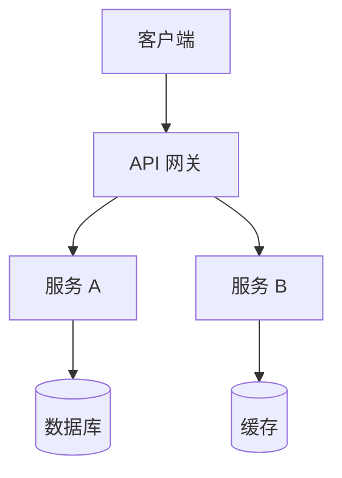
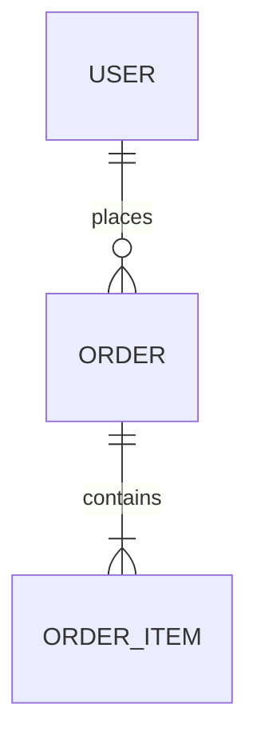

# 后端架构设计文档模板

> 使用说明：根据实际项目填写各章节内容。标注 `[必填]` 的为必须包含的章节，`[按需]` 的根据项目复杂度决定是否需要。

---

## 1. 项目概述 [必填]

### 1.1 项目背景

<!-- 简要描述项目的业务背景和立项原因 -->

### 1.2 项目目标

<!-- 列出核心目标，使用可量化的描述 -->

- 目标 1：...
- 目标 2：...

### 1.3 技术栈

| 类别 | 技术选型 | 版本 | 选型理由 |
|---|---|---|---|
| 语言 | | | |
| 框架 | | | |
| 数据库 | | | |
| 缓存 | | | |
| 消息队列 | | | |
| 搜索引擎 | | | |
| 容器化 | | | |

### 1.4 术语表

| 术语 | 说明 |
|---|---|
| | |

---

## 2. 系统架构 [必填]

### 2.1 架构模式

<!-- 描述采用的架构模式（单体/微服务/模块化单体等）及选择理由 -->

### 2.2 系统架构图

<!-- 使用 Mermaid 或文字描述系统整体架构，包含各服务/模块及其交互关系 -->



### 2.3 部署拓扑

<!-- 描述生产环境的部署结构，包括负载均衡、服务实例、数据库集群等 -->

---

## 3. 模块设计 [必填]

### 3.1 模块划分

<!-- 列出系统的主要模块及其职责 -->

| 模块名称 | 职责描述 | 对外依赖 |
|---|---|---|
| | | |

### 3.2 模块依赖关系

<!-- 描述模块间的调用关系和数据流向 -->


### 3.3 核心模块详设

<!-- 对关键模块进行详细设计说明，包括核心类、核心流程等 -->

---

## 4. 数据库设计 [必填]

### 4.1 ER 关系图

<!-- 使用 Mermaid 或文字描述核心实体及其关系 -->



### 4.2 核心表结构

<!-- 列出核心数据表的字段设计 -->

#### 表名：`table_name`

| 字段名 | 类型 | 约束 | 说明 |
|---|---|---|---|
| id | BIGINT | PK, AUTO_INCREMENT | 主键 |
| created_at | DATETIME | NOT NULL | 创建时间 |
| updated_at | DATETIME | NOT NULL | 更新时间 |

### 4.3 索引策略

<!-- 列出核心索引设计及查询场景 -->

| 表名 | 索引名 | 字段 | 类型 | 使用场景 |
|---|---|---|---|---|
| | | | | |

### 4.4 数据迁移策略

<!-- 描述数据库版本管理和迁移方案（Flyway/Liquibase 等） -->

---

## 5. API 设计概览 [必填]

### 5.1 RESTful 规范

<!-- 描述项目遵循的 API 设计规范 -->

- URL 命名：小写、连字符分隔（如 `/api/v1/user-profiles`）
- HTTP 方法语义：GET 查询、POST 创建、PUT 更新、DELETE 删除
- 状态码使用：200 成功、201 创建成功、400 参数错误、401 未认证、403 无权限、404 不存在、500 服务器错误

### 5.2 统一响应格式

```json
{
  "code": 0,
  "message": "success",
  "data": {}
}
```

### 5.3 分页规范

```json
{
  "code": 0,
  "message": "success",
  "data": {
    "list": [],
    "total": 100,
    "page": 1,
    "pageSize": 20
  }
}
```

### 5.4 错误码设计

| 错误码 | 说明 | HTTP 状态码 |
|---|---|---|
| 0 | 成功 | 200 |
| 10001 | 参数校验失败 | 400 |
| 10002 | 未登录 | 401 |
| 10003 | 无权限 | 403 |

> 详细接口文档见 `后端API接口文档`

---

## 6. 认证与授权 [必填]

### 6.1 认证机制

<!-- 描述用户认证方案（JWT/Session/OAuth2 等） -->

### 6.2 权限模型

<!-- 描述权限控制方案（RBAC/ABAC 等） -->

### 6.3 接口鉴权流程

<!-- 描述请求从发起到鉴权通过的完整流程 -->

---

## 7. 第三方集成 [按需]

### 7.1 公司内部服务

<!-- 通过 unipus:backend:api-connect 对接的公司已有服务 -->

| 服务名称 | 用途 | 对接方式 | 文档链接 |
|---|---|---|---|
| | | | |

### 7.2 外部第三方服务

<!-- 需要对接的外部服务 -->

| 服务名称 | 用途 | SDK/API | 备注 |
|---|---|---|---|
| | | | |

---

## 8. 性能设计 [按需]

### 8.1 缓存策略

<!-- 描述缓存方案：缓存对象、过期策略、更新策略 -->

| 缓存对象 | 缓存类型 | 过期时间 | 更新策略 |
|---|---|---|---|
| | | | |

### 8.2 异步处理

<!-- 需要异步处理的业务场景及实现方式（消息队列/线程池等） -->

### 8.3 分页与限流

<!-- 大数据量查询的分页策略、接口限流策略 -->

---

## 9. 错误处理与日志 [必填]

### 9.1 全局异常处理

<!-- 描述全局异常处理机制和异常分类 -->

### 9.2 日志规范

| 日志级别 | 使用场景 | 示例 |
|---|---|---|
| ERROR | 系统异常、需要报警 | 数据库连接失败 |
| WARN | 业务异常、可降级 | 缓存未命中 |
| INFO | 关键业务流程 | 用户登录成功 |
| DEBUG | 开发调试信息 | 请求参数详情 |

### 9.3 监控与告警

<!-- 核心监控指标和告警规则 -->

---

## 10. 部署与运维 [按需]

### 10.1 环境配置

| 环境 | 用途 | 配置差异 |
|---|---|---|
| dev | 本地开发 | |
| test | 测试环境 | |
| staging | 预发布 | |
| prod | 生产环境 | |

### 10.2 CI/CD 流程

<!-- 描述持续集成和持续部署的流程 -->

### 10.3 健康检查

<!-- 服务健康检查端点和检查项 -->
