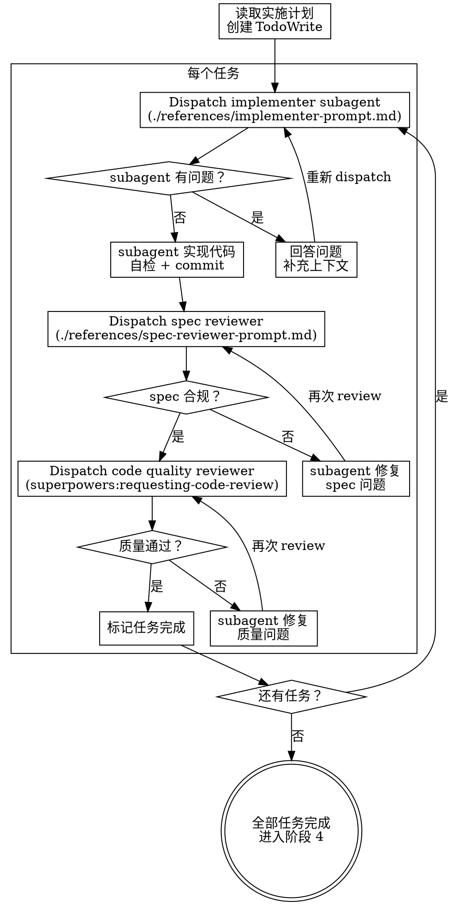

# 阶段 3：Subagent 驱动代码生成

按实施计划逐任务 dispatch subagent 生成代码，每个任务完成后进行双阶段 review。

**宣告：** "我正在使用 subagent 驱动方式生成代码。"

**集成：** 本阶段采用 `superpowers:subagent-driven-development` 模式。

## 流程

## 任务执行顺序

按以下顺序生成代码（后续任务依赖前置任务的产出）：

1. **类型定义** — 生成 TypeScript 类型（所有后续任务的基础）
2. **API 函数** — 生成 API 层代码（依赖类型定义）
3. **页面代码** — 生成页面组件（依赖类型和 API），按页面逐个 dispatch

## Dispatch 规则

### Implementer Subagent

使用 `./references/implementer-prompt.md` 模板 dispatch，传入：
- 完整的任务描述（从实施计划中提取，不让 subagent 自己读文件）
- 项目技术栈档案
- 上下文（当前任务在整体中的位置、依赖关系）

### Spec Compliance Review

使用 `./references/spec-reviewer-prompt.md` 模板 dispatch，验证：
- 代码是否完整实现了任务要求
- 是否有遗漏的需求
- 是否有多余的功能

**只有 spec 合规通过后才进入 code quality review。**

### Code Quality Review

使用 `superpowers:requesting-code-review` 进行代码质量审查。

## Implementer 状态处理

| 状态 | 处理 |
|------|------|
| **DONE** | 进入 spec 合规 review |
| **DONE_WITH_CONCERNS** | 先评估 concerns，再进入 review |
| **NEEDS_CONTEXT** | 补充上下文后重新 dispatch |
| **BLOCKED** | 评估原因：上下文不足 → 补充；任务过大 → 拆分；plan 有误 → 上报用户 |

## 设计稿 100% 还原（硬性约束）

<HARD-GATE>
所有页面代码必须 **100% 还原设计稿**，零容差。以下任何一项不达标即视为未完成：

- **布局**：页面整体布局方式（Flex / Grid）、区块排列、嵌套层级必须与设计稿完全一致
- **间距**：margin / padding / gap 值精确到 px，与设计稿标注完全匹配
- **颜色**：所有颜色值（背景、文字、边框、阴影）必须与设计稿色值完全一致，不可近似替代
- **字体**：字号、字重、行高、字间距必须与设计稿标注一致
- **圆角与阴影**：border-radius、box-shadow 参数必须精确匹配
- **组件尺寸**：按钮、输入框、图标等组件的宽高必须与设计稿一致
- **组件状态**：hover、active、disabled、focus 等状态的视觉表现必须与设计稿一致
- **图标**：使用设计稿中标注的图标，大小和颜色与设计稿一致
- **响应式**（如设计稿有多端标注）：各断点下的布局必须与对应设计稿一致

**不可接受的做法：**
- "差不多就行" — 每个像素都有意义
- "组件库默认样式已经很接近了" — 必须覆盖到与设计稿完全一致
- "这个间距看不出差别" — 以设计稿标注值为准，不以肉眼判断
- "设计稿没标注，用默认值" — 从设计稿中测量实际值，或向设计师确认
</HARD-GATE>

## 代码生成规范

### 类型定义生成

- 放在项目已有的类型目录下
- 优先输出数据模型（实体类型），再输出请求/响应类型
- 字段注释来源于文档描述
- 枚举值跟随项目风格（`enum` 或字面量联合类型）
- 使用工具类型（`Pick`、`Omit`、`Partial`）派生变体
- 已有通用类型（分页、响应包装）不重复定义

### API 函数生成

- 放在项目已有的 API 目录下
- 导入项目已有的请求封装实例
- 参数和返回值严格类型化
- 遵循项目已有的函数命名和导出风格

### 页面代码生成

**模板层：**
- 使用项目 UI 组件库的组件
- 设计稿组件（Symbol / Component）映射到项目组件库
- 组件 props（类型、尺寸、状态）与设计稿一致

**逻辑层：**
- 遵循项目框架规范（Composition API / React Hooks 等）
- 列表查询（含分页、搜索、筛选、重置）
- 表单提交（新增/编辑复用，含验证）
- 删除逻辑（含二次确认）
- 批量操作、状态管理

**样式层（100% 还原）：**
- 使用项目的 CSS 方案
- 组件库默认样式不符合设计稿时，必须通过自定义样式覆盖到与设计稿完全一致
- 颜色、字号、字重、行高、间距、圆角、阴影必须与设计稿标注值精确匹配，不可近似
- 布局方式（Flex / Grid）、对齐方式、间距分布必须与设计稿一致
- 组件尺寸（宽度、高度、最小/最大尺寸）必须与设计稿一致

**交互细节：**
- 表单验证：根据 PRD 校验规则生成
- 权限控制：使用项目已有的权限方案
- 状态流转：枚举值 → Tag 颜色映射
- 条件显隐：根据业务规则实现
- 防重复提交：提交按钮 loading 状态

## Red Flags

| 想法 | 现实 |
|------|------|
| "跳过 spec review，代码看着没问题" | 双阶段 review 不可跳过 |
| "并行 dispatch 多个 implementer" | 不行，任务间有依赖，顺序执行 |
| "让 subagent 自己读 plan 文件" | 不行，controller 提供完整任务文本 |
| "quality review 之前做 spec review" | 顺序不能反，先 spec 后 quality |
| "subagent 报 BLOCKED 就跳过这个任务" | 不行，必须解决 blocker 后继续 |
