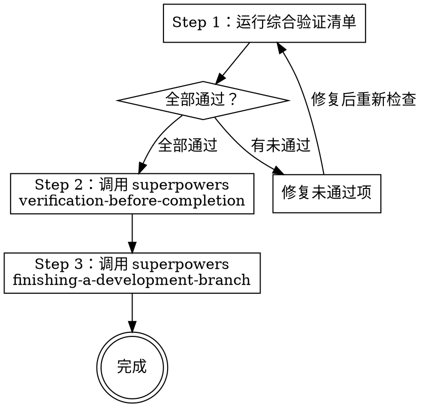

# 阶段 5：验证与完成

运行综合验证清单，确保所有产出物质量达标，然后完成开发流程。

**宣告：** "我正在进行最终验证。"

**集成：**
- `superpowers:verification-before-completion` — 完成前验证
- `superpowers:finishing-a-development-branch` — 开发分支完成流程

## 流程



## Step 1：综合验证清单

### 代码质量

- [ ] 所有文件放在项目已有目录结构下
- [ ] 代码风格与项目已有页面一致
- [ ] 无 any 类型（TypeScript 项目）
- [ ] 导入路径正确
- [ ] 无未使用的导入和变量

### PRD 覆盖

- [ ] PRD 中的所有功能点都已实现
- [ ] 页面路由与 PRD 描述一致
- [ ] 列表字段与 PRD 字段清单完全对应
- [ ] 表单字段、类型、必填项与 PRD 一致
- [ ] 表单验证规则与 PRD 描述一致
- [ ] 枚举/状态值与 PRD 定义一致
- [ ] 搜索筛选条件与 PRD 要求一致
- [ ] 操作按钮齐全（新增、编辑、删除、批量等）
- [ ] 权限控制已按 PRD 标注实现
- [ ] 二次确认弹窗、提示文案与 PRD 一致

### 设计稿 100% 还原（零容差）

- [ ] 布局方式（Flex/Grid）、区块排列、嵌套层级与设计稿完全一致
- [ ] 设计稿组件已正确映射到项目组件库
- [ ] 组件 props 与设计稿一致
- [ ] 颜色值（背景、文字、边框、阴影）与设计稿色值完全一致，无近似替代
- [ ] 字号、字重、行高与设计稿标注完全一致
- [ ] 间距（margin/padding/gap）与设计稿标注值精确匹配（px 级）
- [ ] 圆角、阴影参数与设计稿精确匹配
- [ ] 组件尺寸（宽高）与设计稿一致
- [ ] 组件库默认样式偏离设计稿时，已通过自定义样式覆盖至完全一致
- [ ] 设计 Token 已映射到项目 Token 体系
- [ ] 图标使用设计稿标注的图标，大小和颜色一致
- [ ] 组件各状态（hover/active/disabled/focus）视觉表现与设计稿一致
- [ ] （Figma）参考代码已适配到项目实际技术栈

### API 对接

- [ ] 所有接口都已覆盖
- [ ] 请求方法（GET/POST/PUT/DELETE）正确
- [ ] 路径参数、Query 参数、Body 参数区分正确
- [ ] 响应类型与文档一致
- [ ] 必填/可选参数标注正确
- [ ] 每个接口的请求和响应都有类型定义
- [ ] 相同实体在不同接口间复用同一模型
- [ ] 嵌套对象和数组元素都有独立类型定义
- [ ] 枚举/状态值已定义
- [ ] 通用结构（分页、响应包装）已复用

### 交互完整性

- [ ] 联动逻辑和条件显隐已实现
- [ ] 加载状态、空状态、错误状态已处理
- [ ] 防重复提交已实现

### 交付物完整性

- [ ] 页面功能说明书已输出
- [ ] 接口清单与映射表已输出
- [ ] 页面状态清单已输出
- [ ] Mock 数据已生成
- [ ] 前端架构设计文档已输出

## Step 2：调用 superpowers:verification-before-completion

使用 superpowers 的完成前验证流程进行最终检查。

## Step 3：调用 superpowers:finishing-a-development-branch

使用 superpowers 的开发分支完成流程：

1. 验证测试通过
2. 呈现 4 个选项：本地合并 / 创建 PR / 保留分支 / 丢弃
3. 执行用户选择
4. 清理 worktree（如需要）

## 完成报告

最终输出一份简洁的完成报告：

```
=== 开发完成 ===

📄 生成文件：
- [文件清单]

📋 交付物：
- [交付物清单及位置]

✅ 验证结果：
- PRD 覆盖：全部通过
- 设计稿还原：全部通过
- API 对接：全部通过
- 交付物完整性：全部通过
```
