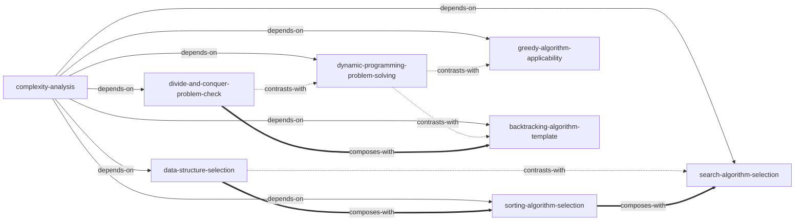

# Hello 算法（Hello Algo） — Skill Index

> 本书由 cangjie-skill 蒸馏, 共产出 **8** 个 skills。
> 处理时间: 2026-08-30

## 关于这本书

- **作者**: krahets
- **版本**: 1.3.0
- **一句话主旨**: 用一套统一的度量语言（复杂度分析）串联"数据如何组织"（数据结构）与"如何求解问题"（算法策略），并反复强调每种方案都是时间/空间/稳定性/通用性之间的权衡，没有全能选项。
- **整书理解**: 见 [BOOK_OVERVIEW.md](./BOOK_OVERVIEW.md)
- **术语词典**: [GLOSSARY.md](./GLOSSARY.md)

---

## Skill 列表 (按主题分组)

### 方法论地基

- [`complexity-analysis`](../skills/complexity-analysis/SKILL.md) — 该用最佳/最差/平均哪种复杂度视角评估方案，是全部其余 7 个 skill 的方法论前提

### 数据组织决策

- [`data-structure-selection`](../skills/data-structure-selection/SKILL.md) — 该用数组/链表/栈队列/哈希表/树/堆/图中的哪一种存储和访问数据

### 数据排布与查找决策

- [`sorting-algorithm-selection`](../skills/sorting-algorithm-selection/SKILL.md) — 该用哪种排序算法（五维评价体系：效率/原地/稳定/自适应/比较）
- [`search-algorithm-selection`](../skills/search-algorithm-selection/SKILL.md) — 在已确定的存储结构上该用二分查找/哈希查找/树查找中的哪一种

### 高级求解策略（子问题分解的四种变体）

- [`divide-and-conquer-problem-check`](../skills/divide-and-conquer-problem-check/SKILL.md) — 判断问题能否用分治解（可分解/子问题独立/可合并三条件自检）
- [`dynamic-programming-problem-solving`](../skills/dynamic-programming-problem-solving/SKILL.md) — 判断问题能否用动态规划解，并按三步法设计状态转移方程
- [`greedy-algorithm-applicability`](../skills/greedy-algorithm-applicability/SKILL.md) — 判断贪心策略能否保证全局最优解（证伪优先于证实）
- [`backtracking-algorithm-template`](../skills/backtracking-algorithm-template/SKILL.md) — 设计"状态/选择/剪枝/解判定"四要素框架求解搜索/约束满足问题

---

## 引用图

图例:
- `-->`  depends-on
- `-.->` contrasts-with
- `===>` composes-with

---

## 推荐学习顺序

(从依赖图的叶子节点开始, 向上)

1. **complexity-analysis** — 全书唯一的通用度量语言，没有它无法为任何选型决策给出可辩护的依据
2. **data-structure-selection** — 工程中最高频的"该用什么容器"决策，直接建立在复杂度分析之上
3. **sorting-algorithm-selection** — 数据静态排布决策，与数据结构选型共享稳定性/有序性判断逻辑
4. **search-algorithm-selection** — 在已确定的存储结构/排布之上，判断该用什么算法查找
5. **divide-and-conquer-problem-check** — 高级求解策略的起点：判断子问题是否真正独立
6. **dynamic-programming-problem-solving** — 分治的"重叠子问题"版本，三步法落地状态转移方程
7. **greedy-algorithm-applicability** — 动态规划在更强前提（贪心选择性质）下的高效捷径
8. **backtracking-algorithm-template** — 求所有解/存在性判断的通用框架，工程实践中相对少见，优先级最低

---

## 审计轨迹

- 候选单元池: [candidates/](./candidates/)
- 被淘汰的候选: 无（117 条候选全部通过归属校验，`rejected/` 目录为空，详见 [verified.md](./verified.md) 汇总结论）
- 三重验证结果: [verified.md](./verified.md)
- BOOK_OVERVIEW: [BOOK_OVERVIEW.md](./BOOK_OVERVIEW.md)
