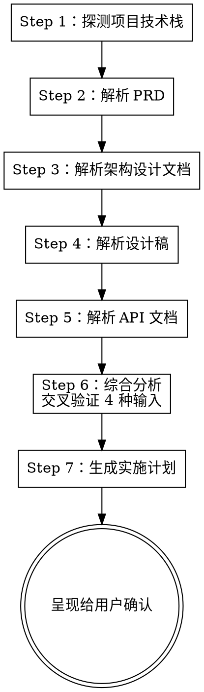

# 阶段 2：分析与规划

解析 4 种输入文档，探测项目技术栈，综合分析后生成实施计划。

**宣告：** "我正在分析输入文档并生成实施计划。"

## 流程



## Step 1：探测项目技术栈

在生成任何代码之前，必须先探测当前项目的技术栈，后续所有代码生成严格遵循。

### 探测项

| 探测项 | 方法 |
|--------|------|
| **框架** | `package.json` 中的 `dependencies`：`vue` / `react` / `next` / `nuxt` / `@angular/core` |
| **语言** | 是否存在 `tsconfig.json` → TypeScript；否则 JavaScript |
| **CSS 方案** | `package.json` 中查找 `less` / `sass` / `tailwindcss`；或 Glob 查看 `src/**/*.{less,scss,css,module.css}` |
| **UI 组件库** | `package.json` 中查找 `element-plus` / `ant-design-vue` / `antd` / `@arco-design` / `naive-ui` / `vuetify` 等 |
| **请求库** | `package.json` 中查找 `axios` / `ky` / `ofetch`；或项目中是否直接用 `fetch` |
| **请求封装** | Grep 搜索 `axios.create` 或类似封装，找到已有的 request 实例导入路径 |
| **目录结构** | Glob 查看 `src/` 下的目录布局，确认 api / types / views / pages / components 等位置 |
| **代码风格** | 读取 1-2 个已有的页面文件和 API 文件，学习命名、导入风格、注释习惯等 |
| **路由方案** | 检查 `vue-router` / `react-router` / 文件路由等 |
| **业务组件库（Storybook）** | 见下方 Storybook 探测流程 |

### Storybook 业务组件库探测

无论用户是否提供了 Storybook URL，都在此步骤自动探测项目中的业务组件库：

**Step 1a：检查 Storybook 基础设施**

```
1. package.json 中是否有 storybook / @storybook/* 依赖
2. 项目根目录是否存在 .storybook/ 目录
3. package.json scripts 中是否有 storybook 命令
```

**Step 1b：扫描 Story 文件**

```
Glob: **/*.stories.{ts,tsx,js,jsx}
```

对找到的每个 story 文件，提取：

```
- 组件名（from title / component export）
- 组件源文件路径（from component import）
- 变体列表（export 的 story 名称）
- argTypes（props 定义，含类型、默认值、描述）
```

**Step 1c：构建业务组件目录**

将扫描结果整理为结构化的「业务组件目录」：

```markdown
## 业务组件目录

### 表单类
| 组件 | 路径 | Props | 变体 |
|------|------|-------|------|
| SearchForm | src/components/SearchForm | fields, onSearch, onReset | Default, WithDateRange |
| EditDialog | src/components/EditDialog | visible, data, onSubmit | Create, Edit |

### 数据展示类
| 组件 | 路径 | Props | 变体 |
|------|------|-------|------|
| StatusTag | src/components/StatusTag | status, statusMap | Active, Disabled, Pending |
| DataTable | src/components/DataTable | columns, data, pagination | Default, Selectable |

### 布局类
...
```

**如果阶段 1 已通过 Storybook URL 获取了在线文档，与本地扫描结果合并，在线文档优先（信息更完整）。**

**Step 1d：输出组件目录**

将业务组件目录纳入技术栈档案，例如：

```
框架: Vue 3 (Composition API, <script setup>)
...
业务组件库: 有 Storybook，共 [N] 个业务组件
  - 表单类: SearchForm, EditDialog, FilterPanel
  - 展示类: StatusTag, DataTable, InfoCard
  - 布局类: PageLayout, SidePanel
```

### 输出：技术栈档案

在内部形成一份技术栈档案（不输出给用户），后续所有代码生成严格遵循。例如：

```
框架: Vue 3 (Composition API, <script setup>)
语言: TypeScript
CSS: Less + BEM
组件库: Element Plus
请求: axios, 封装在 src/utils/request.ts
API 目录: src/api/
类型目录: src/types/
页面目录: src/views/
```

## Step 2：解析 PRD 文档

从 PRD 中提取以下关键信息：

**页面信息：**
- 页面名称和路由路径
- 页面层级关系（一级页面 / 子页面 / 弹窗）
- 页面之间的跳转关系

**功能模块：**
- 功能清单（CRUD、搜索、筛选、导出等）
- 每个功能的交互流程和触发条件
- 按钮和操作项（新增、编辑、删除、批量操作等）

**数据结构：**
- 列表字段（表头、字段名、字段类型、排序/筛选）
- 表单字段（字段名、类型、是否必填、校验规则、默认值）
- 状态枚举（如 `状态: 启用/禁用`、`审批: 待审核/已通过/已拒绝`）

**交互规则：**
- 表单验证规则和提示文案
- 操作确认（二次确认弹窗、提示信息）
- 权限控制（按钮级别的权限标识）
- 特殊交互（联动、条件显隐、动态表单等）

**业务规则：**
- 字段间的联动关系
- 条件判断逻辑
- 数据流转规则

## Step 3：解析架构设计文档

从架构设计文档中提取：

- **目录结构**：本次新增/修改的目录及各目录职责
- **组件拆分方案**：页面级组件与业务组件的拆分依据
- **数据流设计**：状态管理方案、跨组件通信方式
- **接口对接方案**：API 模块划分、请求/响应拦截器
- **类型体系**：核心类型定义文件位置、类型复用关系
- **权限方案**：路由级权限、按钮级权限
- **关键设计决策**：技术选型或方案取舍及其理由

**与技术栈档案交叉验证：** 确认架构设计文档中的技术选型与项目实际探测结果一致。如有冲突，以项目实际为准并提醒用户。

## Step 4：解析设计稿

结合设计截图和结构化数据，分析以下内容：

**布局分析：**
- 页面整体布局（Flex / Grid）
- 区块划分（搜索区、操作区、列表区、弹窗等）

**设计 Token 提取：**
- 颜色、字号、字重、行高、间距、圆角、阴影

**组件识别与映射：**

组件映射的优先级（从高到低）：

1. **业务组件库** — 如果设计稿中的组件与业务组件目录中的组件匹配（名称、功能、结构相似），优先使用业务组件
2. **UI 组件库** — 基础 UI 组件映射到项目已安装的组件库（Element Plus / Ant Design / Arco 等）
3. **手写实现** — 以上都不匹配时，标记为需要手写

| 优先级 | 来源 | 示例映射 |
|--------|------|---------|
| 1 - 业务组件 | Storybook 扫描 / URL 获取 | 设计稿"搜索栏" → `<SearchForm :fields="..." />` |
| 2 - UI 组件库 | `package.json` 依赖 | 设计稿"按钮" → `<el-button>` / `<a-button>` / `<Button>` |
| 3 - 手写实现 | 标记 | 设计稿"自定义图表卡片" → 需要新建组件 |

**业务组件匹配规则：**
- 对照业务组件目录的 Props 定义，确认设计稿中的组件属性可以通过 props 传入
- 如果业务组件 90% 匹配但缺少某个 props 或变体，记录在实施计划中（可能需要扩展组件）
- 不要为了复用业务组件而扭曲设计稿的交互意图

**Figma 特殊处理：**
- `get_design_context` 返回的代码是 React + Tailwind 格式的**参考代码**，必须适配到项目的实际技术栈
- 如果返回了 Code Connect 映射，优先使用映射的代码组件
- 如果返回了设计标注，遵循设计师标注的约束

**Sketch 组件映射：**
- 通过 Symbol 实例的 overrides 提取组件属性
- 将属性转换为项目组件库的 props

**如果组件库中没有对应组件，标记为需要手写实现。**

**Figma Code Connect 与业务组件库：**
- 如果 Figma `get_design_context` 返回了 Code Connect 映射，检查映射目标是否是业务组件库中的组件
- Code Connect 映射 > Storybook 扫描结果（Code Connect 是设计师主动关联的，更准确）

## Step 5：解析 API 文档

### 5.1 解析接口

**Swagger / OpenAPI：**
- 直接解析 paths、parameters、requestBody、responses
- 提取 definitions / components/schemas 中的数据模型

**Markdown 接口文档：**
- 从表格提取：参数名、类型、是否必填、描述
- 区分参数位置：Path / Query / Body / Header
- 识别嵌套结构（缩进、`.` 分隔、`└` 符号等）
- 从响应示例（JSON 代码块）或响应表格提取字段结构

### 5.2 构建数据模型

**核心原则：每个接口的请求参数和响应数据都必须有完整的类型定义。**

- **请求参数模型**：Body 参数超过 2 个字段时必须定义独立类型
- **响应数据模型**：识别通用包装结构（如 `{ code, message, data }`），提取内层类型
- **模型复用**：同一实体在不同接口间通过 `Pick`、`Omit`、`Partial` 派生
- **枚举值**：如字段有可选值（`status: 1-启用 2-禁用`），定义为枚举或联合类型
- **分页泛型**：如项目有通用分页类型则复用，否则定义 `PageResult<T>`

## Step 6：综合分析与交叉验证

将 4 种输入的解析结果交叉验证：

- PRD 功能清单 ↔ API 接口是否全部覆盖
- PRD 数据字段 ↔ API 响应字段是否一致
- 设计稿页面 ↔ PRD 页面是否对应
- 架构文档组件拆分 ↔ 设计稿布局是否匹配
- 发现不一致时标记并告知用户

## Step 7：生成实施计划

输出一份结构化的实施计划供用户确认：

```markdown
# 实施计划

## 文件清单

### 类型定义
- 新建: src/types/xxx.ts — [描述]

### API 函数
- 新建: src/api/xxx.ts — [接口数]个接口

### 页面组件
- 新建: src/views/xxx/index.vue — 主页面
- 新建: src/views/xxx/components/XxxForm.vue — 表单弹窗
- ...

## 任务拆分

### Task 1: 生成类型定义
- 文件: src/types/xxx.ts
- 内容: [类型列表]

### Task 2: 生成 API 函数
- 文件: src/api/xxx.ts
- 内容: [接口列表]

### Task 3: 生成主页面
- 文件: src/views/xxx/index.vue
- 内容: [功能描述]

### Task N: ...

## 不一致项（如有）
- [列出交叉验证发现的问题]
```

**等待用户确认后再进入阶段 3。**
