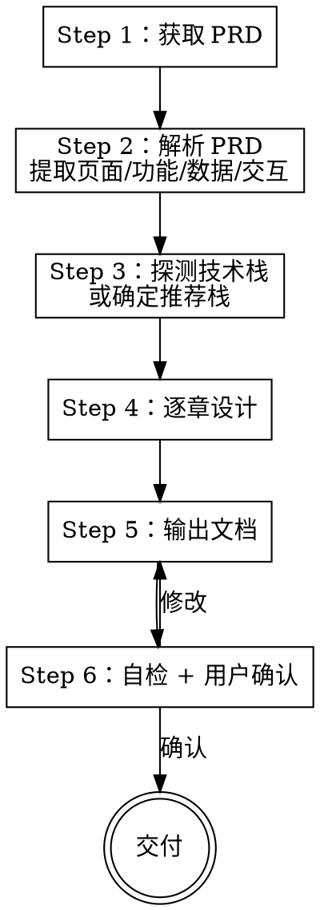

# 编写前端架构设计文档

根据 PRD 需求文档和项目现状，输出一份完整的前端架构设计文档，供团队评审、后续开发和测试参考。

**宣告：** "我正在使用 fe-dev:architecture-doc 编写前端架构设计文档。"

**定位：** 本 skill 的产出物是主流程 `fe-dev` 的 4 种必填输入之一。先用本 skill 生成架构文档 → 再用主流程生成代码。

## 输入

| # | 输入 | 必填 | 获取方式 |
|---|------|------|---------|
| 1 | PRD 需求文档 | **是** | URL → `WebFetch`；本地文件 → `Read`；文本 → 直接解析 |
| 2 | 现有项目代码 | 可选 | 如有项目则自动探测技术栈；空项目则由用户指定或采用推荐栈 |

<HARD-GATE>
没有 PRD 不得编写架构文档。PRD 是架构设计的唯一需求来源。
</HARD-GATE>

## 流程



## Step 1：获取 PRD

- URL → `WebFetch` 获取
- 本地文件 → `Read` 读取
- 文本 → 直接解析

## Step 2：解析 PRD

从 PRD 中提取架构设计所需的关键信息：

**页面维度：**
- 页面清单（名称、路由、层级关系）
- 页面间跳转关系
- 共享区域（布局壳、导航栏、面包屑）

**功能维度：**
- 功能模块清单（CRUD、搜索、筛选、导出、审批流等）
- 复杂交互（联动、动态表单、拖拽、实时通知等）
- 权限要求（路由级、按钮级）

**数据维度：**
- 业务实体清单（用户、订单、商品等）
- 实体间关系（一对多、多对多）
- 状态枚举和流转规则
- 数据量级预估（是否需要虚拟滚动、分页策略）

**非功能维度：**
- 性能要求（首屏加载、列表渲染）
- 国际化需求
- 主题/暗黑模式
- 浏览器兼容性

## Step 3：探测技术栈

**现有项目：** 按 `fe-dev:analyze-and-plan` 中的探测规则，读取 `package.json`、`tsconfig.json` 等，形成技术栈档案。

**新项目：** 如用户未指定，采用推荐技术栈（详见 [`../coding-standards/references/tech-stack.md`](../coding-standards/references/tech-stack.md)）。

## Step 4：逐章设计

按以下章节顺序设计，每章完成后内部校验与 PRD 需求的对应关系。

---

### 第一章：项目概述

```markdown
## 1. 项目概述

### 1.1 项目背景
[从 PRD 提取，1-2 句话]

### 1.2 技术栈
[按 ../coding-standards/references/tech-stack.md 中的表格模板填写]
```

---

### 第二章：目录结构

根据 PRD 功能范围设计目录结构，标注本次新增的目录：

```markdown
## 2. 目录结构

src/
├── main.tsx
├── App.tsx
├── styles/
│   └── globals.css
├── lib/
│   └── cn.ts
├── pages/                     # 页面（按路由 1:1）
│   ├── [module-a]/            # ← 新增
│   │   ├── index.tsx
│   │   └── components/
│   └── [module-b]/            # ← 新增
├── components/                # 全局共享组件
│   └── [SharedComponent]/     # ← 如需新增
├── api/
│   ├── request.ts
│   └── [module-a].ts          # ← 新增
├── hooks/
│   └── use[ModuleA].ts        # ← 新增
├── stores/
│   └── use[GlobalStore].ts
├── types/
│   ├── common.ts
│   └── [module-a].ts          # ← 新增
└── utils/
```

**设计原则：**
- 页面私有组件放 `pages/xxx/components/`，共享组件放 `components/`
- 一个业务模块对应一个 API 文件、一个类型文件、一个 Hook 文件
- 跟随 `fe-dev:coding-standards` 的 8 层分层规范

---

### 第三章：页面 & 路由设计

```markdown
## 3. 页面 & 路由设计

### 3.1 路由表

| 路由路径 | 页面组件 | 说明 | 权限 |
|---------|---------|------|------|
| /module-a | ModuleAPage | 列表页 | role:admin |
| /module-a/:id | ModuleADetailPage | 详情页 | role:admin |
| /module-b | ModuleBPage | ... | ... |

### 3.2 路由结构

[如有嵌套路由、Layout 壳，画出层级关系]

### 3.3 路由守卫

- 未登录 → 跳转 /login
- 无权限 → 跳转 403 页面
- 路由懒加载：所有页面使用 React.lazy + Suspense
```

**设计规则：**
- 每个 PRD 页面必须有对应路由
- 列表 → 详情 用路由参数 `:id`
- 弹窗表单不需要独立路由

---

### 第四章：组件拆分

```markdown
## 4. 组件拆分

### 4.1 页面组件树

ModuleAPage
├── SearchForm              # 搜索区域（页面私有）
├── ActionBar               # 操作按钮区（页面私有）
├── DataTable               # 数据表格（页面私有）
└── FormDialog              # 新增/编辑弹窗（页面私有）

### 4.2 共享组件（如需新增）

| 组件 | 说明 | 使用页面 |
|------|------|---------|
| PageHeader | 页面标题 + 操作区 | 多个页面 |
| StatusTag | 状态标签（枚举 → 颜色） | 多个列表页 |

### 4.3 拆分原则

- 一个组件只做一件事
- 超过 150 行考虑拆分
- 被 2+ 页面使用 → 提取到 components/
- 弹窗/抽屉表单必须独立组件
```

---

### 第五章：数据流设计

```markdown
## 5. 数据流设计

### 5.1 状态分类

| 状态类型 | 管理方式 | 示例 |
|---------|---------|------|
| 服务端数据 | TanStack Query | 列表、详情、CRUD |
| 全局客户端状态 | Zustand | 用户信息、权限、主题 |
| 页面局部 UI 状态 | useState | 弹窗开关、loading、当前编辑项 |

### 5.2 TanStack Query Key 规划

| Query Key | 数据 | 失效时机 |
|-----------|------|---------|
| ['moduleA', params] | 列表 | 增/删/改后 |
| ['moduleA', id] | 详情 | 编辑后 |

### 5.3 跨组件通信

- 父子 → props + 回调
- 兄弟 → 提升状态到共同父组件
- 全局 → Zustand store
- 服务端数据联动 → invalidateQueries
```

---

### 第六章：接口对接方案

```markdown
## 6. 接口对接方案

### 6.1 API 模块划分

| 模块 | 文件 | 接口数 |
|------|------|--------|
| 模块 A | api/module-a.ts | N 个 |
| 模块 B | api/module-b.ts | N 个 |

### 6.2 接口清单（概要）

| 功能 | 方法 | 路径 | 说明 |
|------|------|------|------|
| 列表查询 | GET | /api/module-a | 分页 + 筛选 |
| 新增 | POST | /api/module-a | - |
| 编辑 | PUT | /api/module-a/:id | - |
| 删除 | DELETE | /api/module-a/:id | - |
| 详情 | GET | /api/module-a/:id | - |

### 6.3 统一错误处理

- 401 → 跳转登录
- 403 → 提示无权限
- 422 → 表单字段级错误回显
- 500 → 全局错误提示
- 超时 → 提示网络异常
```

---

### 第七章：类型体系

```markdown
## 7. 类型体系

### 7.1 通用类型（已有/复用）

- ApiResponse<T> — 后端统一响应包装
- PageResult<T> — 分页响应
- PageParams — 分页请求参数

### 7.2 业务类型（本次新增）

| 类型 | 文件 | 说明 |
|------|------|------|
| ModuleAItem | types/module-a.ts | 列表项 |
| ModuleAFormData | types/module-a.ts | 表单数据 |
| ModuleAQueryParams | types/module-a.ts | 查询参数 |
| ModuleAStatus (enum) | types/module-a.ts | 状态枚举 |

### 7.3 类型复用关系

ModuleAItem（基础实体）
├── ModuleAFormData = Pick<ModuleAItem, 'name' | 'email' | ...>
├── ModuleADetail = ModuleAItem & { extra fields }
└── ModuleAQueryParams = PageParams & { name?: string; status?: ... }
```

---

### 第八章：权限方案

```markdown
## 8. 权限方案

### 8.1 路由级权限

| 路由 | 所需角色/权限 |
|------|-------------|
| /module-a | admin, editor |

### 8.2 按钮级权限

| 操作 | 权限标识 | 无权限表现 |
|------|---------|-----------|
| 新增 | module-a:create | 按钮隐藏 |
| 编辑 | module-a:update | 按钮隐藏 |
| 删除 | module-a:delete | 按钮隐藏 |

### 8.3 实现方式

- 路由守卫：在 router loader 中检查
- 按钮级：封装 <AuthButton permission="xxx"> 组件或 usePermission() hook
```

---

### 第九章：性能考量

```markdown
## 9. 性能考量

| 策略 | 适用场景 | 实现方式 |
|------|---------|---------|
| 路由懒加载 | 所有页面 | React.lazy + Suspense |
| 列表虚拟滚动 | 数据量 > 1000 条 | @tanstack/react-virtual |
| 图片懒加载 | 列表中有图片列 | loading="lazy" |
| 防抖搜索 | 搜索输入框 | useDeferredValue 或 lodash.debounce |
| 缓存策略 | TanStack Query | staleTime: 5min |
```

---

### 第十章：埋点方案（神策SDK）

> 章节模板详见 [`references/sensors-chapter-template.md`](./references/sensors-chapter-template.md)。
> SDK 配置和代码模式详见 [`../coding-standards/references/sensors-config.md`](../coding-standards/references/sensors-config.md)。

按模板输出第十章，包括：埋点策略表、SDK 初始化、PV 埋点、点击埋点、曝光埋点、登录绑定、错误埋点、埋点清单管理、测试调试。

---

### 第十一章：关键设计决策

```markdown
## 11. 关键设计决策

| 决策 | 方案 | 理由 | 备选 |
|------|------|------|------|
| 状态管理 | Zustand + TanStack Query | 服务端/客户端分离，零模板代码 | Redux Toolkit |
| 样式方案 | Tailwind + CVA | AI 生成准确率高，变体管理清晰 | CSS Modules |
| 埋点方案 | 神策 SDK | 产品级数据分析能力，支持热力图/漏斗/留存 | 自研埋点/友盟/Google Analytics |
| 埋点初始化 | main.tsx 前置初始化 | 确保所有页面浏览事件被捕获 | 路由 loader 中初始化 |
| PV 埋点 | 路由 loader 统一埋点 | 集中管理，不遗漏任何页面 | 组件内手动埋点 |
| 点击埋点 | TrackButton 组件 | 声明式，代码可读性高 | 每个 onClick 手动调用 |
| 曝光埋点 | useTrackExposure Hook | 复用 IntersectionObserver，性能好 | scroll 事件监听 |
| ... | ... | ... | ... |
```

---

## Step 5：输出文档

将以上 10 章整合为一份 Markdown 文档，保存到项目中：

**保存路径：** `docs/architecture/YYYY-MM-DD-[feature-name]-architecture.md`

- 如果项目没有 `docs/` 目录，创建之
- 文件名包含日期和功能名称

## Step 6：自检 + 用户确认

### 自检清单

- [ ] PRD 中的每个页面都有对应的路由设计
- [ ] PRD 中的每个功能模块都有对应的组件拆分
- [ ] PRD 中的每个数据实体都有对应的类型设计
- [ ] PRD 中的每个接口都在接口清单中
- [ ] 权限要求已全部覆盖
- [ ] 目录结构与组件拆分一致
- [ ] 类型复用关系合理（无重复定义）
- [ ] Query Key 规划与接口清单对应
- [ ] 性能策略与数据量级匹配
- [ ] 埋点方案覆盖 PV、关键点击、曝光、错误等场景
- [ ] 埋点清单文档化，事件名和属性统一规范
- [ ] 11 章内容内部无矛盾

### 用户确认

输出后提示：

> "前端架构设计文档已保存到 `docs/architecture/xxx.md`，请审阅。确认后可作为 `fe-dev` 主流程的输入之一。"

## Red Flags

| 想法 | 现实 |
|------|------|
| "PRD 太简单，不需要架构文档" | 再简单的功能也需要明确组件拆分和数据流 |
| "先写代码再补文档" | 架构文档是主流程的前置输入，不是事后补的 |
| "直接照搬上个项目的架构" | 每个功能的页面/数据/权限不同，必须针对性设计 |
| "技术选型不用写理由" | 第十一章「关键设计决策」必须写清方案和理由 |
| "性能之后再考虑" | 虚拟滚动、懒加载等在架构阶段就要规划 |

## 与主流程的关系

```
PRD ──→ fe-dev:architecture-doc ──→ 前端架构设计文档
                                            │
                                            ▼
                                    fe-dev 主流程的
                                    4 种必填输入之一
```
