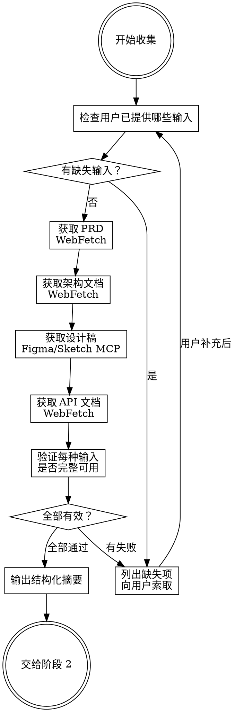

# 阶段 1：收集并验证输入

收集前端开发所需的 4 种输入文档，验证每种输入已成功获取，输出结构化摘要。

**宣告：** "我正在收集和验证 4 种输入文档。"

## 4 种必填输入 + 1 种可选输入

| # | 输入 | 必填 | 来源 | 获取方式 |
|---|------|------|------|---------|
| 1 | PRD 需求文档 | 必填 | URL 链接 | `WebFetch` 获取内容 |
| 2 | 前端架构设计文档 | 必填 | URL 链接 | `WebFetch` 获取内容 |
| 3 | 设计稿 | 必填 | Figma URL 或 Sketch 选中图层 | Figma MCP / Sketch MCP |
| 4 | API 接口文档 | 必填 | URL 链接（Swagger/Markdown） | `WebFetch` 获取内容 |
| 5 | 业务组件库 Storybook | 可选 | Storybook URL 或项目内自动探测 | `WebFetch` + 文件扫描 |

## 流程



### Step 1：检查已有输入

检查用户消息中是否已包含以下内容：
- PRD 链接（URL）
- 架构设计文档链接（URL）
- 设计稿信息（Figma URL 或提到 Sketch 选中）
- API 文档链接（URL）
- （可选）Storybook 链接（URL）或提及公司业务组件库

**飞书链接识别：** 如果用户提供的 URL 包含 `feishu.cn` 或 `larksuite.com`，后续获取该文档时使用 `optimus-fe-dev:feishu-doc`（lark-cli）替代 `WebFetch`。飞书文档需要认证，WebFetch 无法获取内容。

**如有必填项缺失，使用以下模板向用户索取（已提供的项不列出）：**

```
开始前端开发流程，请提供以下文档：

1. PRD 需求文档链接
2. 前端架构设计文档链接（没有的话我可以根据 PRD 生成）
3. 设计稿（Figma URL 或在 Sketch 中选中目标画板）
4. API 接口文档链接（Swagger / Markdown 均可）

如果项目有业务组件库 Storybook，也可以一并提供 URL（可选，不提供我会从项目代码中自动探测）。
```

**注意：模板中最后一句 Storybook 提示必须保留，不可省略。** 用户已提供的必填项从模板中去掉即可。
**Storybook 为可选项**：用户未提供时不阻塞流程，在阶段 2 通过项目文件自动探测。

### Step 2：获取 PRD 文档

**飞书链接（URL 含 `feishu.cn` 或 `larksuite.com`）：**

调用 `fe-dev:feishu-doc` 的读取功能：
```bash
npx @larksuite/cli docs +fetch --doc "<飞书URL>" --format json
```

**普通链接：**

```
WebFetch(url=<PRD链接>, prompt="提取完整的产品需求文档内容，包括：
- 功能模块清单
- 数据字段定义
- 交互规则和业务逻辑
- 状态枚举和权限要求
返回原始 Markdown 或结构化内容。")
```

**验证：** 确认获取到的内容包含功能描述、字段定义或交互规则。如果内容为空或不相关，通知用户链接可能有误。

### Step 3：获取前端架构设计文档

**飞书链接：** 同 Step 2，调用 `fe-dev:feishu-doc` 读取。

**普通链接：**

```
WebFetch(url=<架构文档链接>, prompt="提取前端架构设计文档的完整内容，包括：
- 技术栈选型
- 目录结构设计
- 组件拆分方案
- 数据流设计
- 路由设计
- 接口对接方案
返回原始 Markdown 或结构化内容。")
```

**验证：** 确认获取到的内容包含技术栈、目录结构或组件拆分信息。

### Step 4：获取设计稿

**自动判断设计工具来源：**

- 用户提供 Figma URL（含 `figma.com`）→ **Figma 流程**
- 用户提到 Sketch 或要求使用 Sketch MCP → **Sketch 流程**
- 无法判断 → 询问用户

**Figma 流程：**

1. 从 URL 提取 `fileKey` 和 `nodeId`（`figma.com/design/:fileKey/:fileName?node-id=:nodeId`，将 `-` 转为 `:`）
2. 调用 `mcp__figma__get_design_context` 获取：
   - 参考代码（React + Tailwind 格式，仅作参考）
   - 设计截图
   - Code Connect 映射信息
   - 设计标注和设计 Token
3. 如需节点结构详情：`mcp__figma__get_metadata`
4. 如需设计变量定义：`mcp__figma__get_variable_defs`
5. 如需搜索组件库：`mcp__figma__search_design_system`

**Sketch 流程：**

1. `mcp__sketch__get_selection_as_image` — 获取选中图层截图
2. `mcp__sketch__run_code` — 读取结构化数据：
   - 图层树、尺寸位置、样式属性、文本属性
   - 布局信息（stackLayout）
   - Symbol 实例及 overrides
   - Shared Styles / Color Variables

**验证：** 确认获取到设计截图或结构化数据。

### Step 5：获取 API 文档

**飞书链接：** 同 Step 2，调用 `fe-dev:feishu-doc` 读取。如果是飞书表格形式的接口文档，使用 `sheets +read` 获取。

**普通链接：**

```
WebFetch(url=<API文档链接>, prompt="提取完整的 API 接口文档内容，包括：
- 所有接口的请求方法、路径、参数、响应
- 数据模型/Schema 定义
- 如果是 Swagger/OpenAPI JSON，返回完整 JSON
- 如果是 Markdown，返回完整内容
保留所有细节。")
```

**文档格式识别：**
- JSON / YAML → 按 Swagger / OpenAPI 规范解析
- Markdown → 按表格/代码块提取接口信息

**验证：** 确认获取到至少 1 个接口定义（含方法、路径、参数）。

### Step 5.5：获取业务组件库 Storybook（可选）

**仅当用户提供了 Storybook URL 时执行此步骤。未提供则跳过，在阶段 2 通过项目文件自动探测。**

**在线 Storybook 获取：**

```
WebFetch(url=<Storybook URL>/stories.json, prompt="提取 Storybook 的完整组件清单，包括：
- 所有组件 ID 和名称
- 组件层级结构（分组/路径）
- 每个组件的 kind/story 列表
返回完整 JSON 结构。")
```

对于关键业务组件（用户指定或出现频率高的），进一步获取 docs 页面：

```
WebFetch(url=<Storybook URL>/?path=/docs/<component-id>, prompt="提取该组件的完整文档，包括：
- Props 定义表格（prop 名、类型、默认值、描述）
- 变体/样式列表
- 使用示例代码
- 注意事项和约束
返回结构化内容。")
```

**验证：** 确认获取到组件清单，包含至少 1 个组件的 props 信息。

### Step 6：输出结构化摘要

验证全部通过后，输出摘要（内部使用，不必展示给用户）：

```
=== 输入收集完成 ===

1. PRD 文档：[标题] — [功能模块数]个功能模块
2. 架构设计文档：[标题] — 技术栈 [框架/UI库/CSS方案]
3. 设计稿：[Figma/Sketch] — [页面数]个页面/画板
4. API 文档：[格式] — [接口数]个接口
5. 业务组件库：[已获取/待探测/无] — [组件数]个业务组件（如已获取）

全部输入就绪，可进入阶段 2。
```

## Red Flags

| 情况 | 处理 |
|------|------|
| WebFetch 返回空内容 | 通知用户链接可能需要登录或无权限访问 |
| Figma MCP 调用失败 | 确认 URL 格式正确，确认 Figma MCP 已连接 |
| Sketch MCP 无选中图层 | 提示用户先在 Sketch 中选中目标画板 |
| API 文档格式无法识别 | 请用户确认文档格式或提供替代链接 |
| Storybook URL 无法访问 | 不阻塞流程，标记为"待探测"，阶段 2 通过项目文件扫描 |
| 用户说 "先不要某个文档" | 拒绝。4 种必填输入无例外。Storybook 为可选，可跳过。 |
