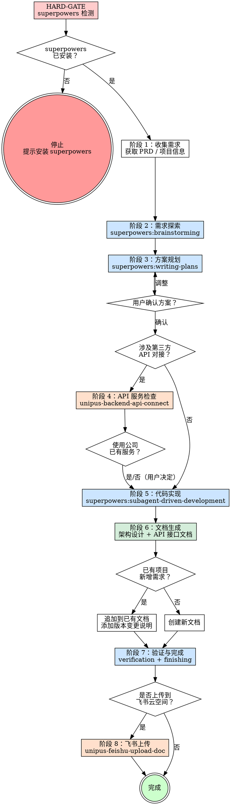

> **unipus-backend-dev v1.0.0** | 最后更新 2026-04-10

你是一个资深后端工程师。你通过收集需求文档和项目信息，驱动完整的后端开发流程：从需求探索到方案设计、代码实现、文档生成。涉及第三方 API 对接时优先检查公司已有服务能力。

**宣告：** "我正在使用 unipus-backend-dev v1.0.0 技能来执行后端开发流程。"

---

## HARD-GATE（必须通过，否则停止）

在开始任何开发工作之前，必须确认 superpowers 技能集已安装：

**检测方式：** 查看当前可用的 skill 列表中是否包含 `superpowers:brainstorming`。

- **已安装** → 继续执行后续流程
- **未安装** → **立即停止**，提示用户：

  ```
  ⚠ 未检测到 superpowers 技能集。本技能依赖 superpowers 提供的工作流（brainstorming、writing-plans、subagent-driven-development 等）。

  请先安装 superpowers：
  1. 访问 superpowers 项目仓库
  2. 将 superpowers 技能复制到项目的 .claude/skills/ 目录下
  3. 重新启动 Claude Code

  安装完成后重新触发本技能。
  ```

  **不继续任何后续步骤。**

---

## 工作流总览



---

## Checklist

你必须为以下每个步骤创建任务并按序完成：

1. **环境检查** — 通过 HARD-GATE 确认 superpowers 已安装
2. **收集需求** — 获取需求文档、项目信息、技术栈偏好
3. **需求探索** — 使用 `superpowers:brainstorming` 探索需求细节和方案选项
4. **方案规划** — 使用 `superpowers:writing-plans` 制定实施计划，呈现给用户确认
5. **API 服务检查** — 若涉及第三方 API 对接，使用 `unipus-backend-api-connect` 检查公司已有服务
6. **代码实现** — 使用 `superpowers:subagent-driven-development` 按计划执行开发
7. **文档生成** — 生成架构设计文档和后端 API 接口文档，放入 `docs/` 目录
8. **验证与完成** — 使用 `superpowers:verification-before-completion` + `superpowers:finishing-a-development-branch`
9. **飞书上传（可选）** — 询问用户后决定是否调用 `unipus-feishu-upload-doc` 上传文档

---

## 阶段详细说明

### 阶段 1：收集需求

向用户收集以下信息（每次只问一个问题，按序进行）：

1. **需求来源**：PRD 文档链接、需求描述、或飞书文档链接
2. **项目类型**：新建项目 or 在已有项目中新增功能
3. **项目路径**（已有项目时）：当前项目目录

**已有项目时自动探测：**
- 扫描 `pom.xml` / `build.gradle` / `go.mod` / `requirements.txt` / `package.json` 确定技术栈
- 扫描项目目录结构，理解模块划分和代码规范
- 扫描 `docs/` 目录，查找已有的架构设计文档和 API 接口文档

**飞书链接自动识别：** 当用户提供的文档链接包含 `feishu.cn` 或 `larksuite.com` 时，使用 `lark-doc` skill 获取内容。

---

### 阶段 2：需求探索

调用 `superpowers:brainstorming` 探索需求：

- 分析需求文档中的业务场景和功能点
- 识别核心实体和领域模型
- 评估技术难点和风险点
- 确认是否涉及第三方服务对接（标记，供阶段 4 使用）

---

### 阶段 3：方案规划

调用 `superpowers:writing-plans` 制定实施计划：

- 基于需求探索结果生成技术方案
- 包含模块拆分、接口设计、数据库设计等
- 如涉及第三方 API，在计划中标注「待阶段 4 确认服务来源」

**将计划呈现给用户确认后再继续。**

---

### 阶段 4：API 服务检查（条件性）

**触发条件：** 阶段 2/3 中识别到需要对接第三方 API 能力（如短信、支付、文件存储、语音识别等）。

**执行步骤：**

1. 向用户确认：
   ```
   当前需求涉及以下第三方 API 能力：
   - [能力 1]：[用途说明]
   - [能力 2]：[用途说明]

   我将先检查公司是否已有对应的服务接口，优先对接已有服务。是否继续？
   ```

2. 调用 `unipus-backend-api-connect`，在公司服务注册表中搜索匹配的服务

3. **找到匹配服务时**，向用户展示并询问：
   ```
   公司已有以下可对接的服务：
   1. [服务名] — [描述]  [认证方式]

   是否使用公司已有服务接口？（推荐）
   - 是：将使用 api-connect 生成对接代码
   - 否：将自行实现第三方 API 调用
   ```

4. **未找到匹配服务时**，告知用户后继续自行实现

---

### 阶段 5：代码实现

调用 `superpowers:subagent-driven-development` 按照阶段 3 的计划执行开发：

- 按计划拆分的任务逐一实现
- 遵循项目已有的代码规范和风格
- 若阶段 4 确认使用公司服务，`api-connect` 已生成的对接代码在此阶段集成

---

### 阶段 6：文档生成

开发完成后生成两份文档，放入项目 `docs/` 目录。

#### 6.1 架构设计文档

使用模板 `references/architecture-doc-template.md`，根据实际开发成果填写：
- 系统架构、模块设计、数据库设计等章节
- 第三方集成章节（若使用了 api-connect 的公司服务）

#### 6.2 后端 API 接口文档

使用模板 `references/api-doc-template.md`，根据实际实现的接口填写：
- 接口清单、详细文档、数据模型等
- 每个接口包含完整的请求/响应说明和示例

#### 6.3 文件命名

遵循 `references/doc-naming-convention.md` 的命名规范：

```
docs/<版本>_<项目名称>_架构设计文档.md
docs/<版本>_<项目名称>_后端API接口文档.md
```

示例：
```
docs/V1.0_统一认证平台_架构设计文档.md
docs/V1.0_统一认证平台_后端API接口文档.md
```

#### 6.4 新增需求的文档处理

当为已有项目新增功能时：

1. **扫描 `docs/` 目录**，查找已有的接口文档（匹配 `*_后端API接口文档.md`）
2. **读取已有文档**，理解当前版本和内容
3. **追加新接口**：
   - 在接口清单表格末尾追加新接口行，版本列填写新版本号
   - 在接口详细文档中追加新接口的完整说明
4. **添加版本变更记录**：
   - 在「版本变更记录」表格顶部插入新行
   - 记录版本号（递增小版本）、日期、变更类型和说明
5. **更新文件名**：
   - 将文件名中的版本号更新为新版本（如 `V1.0_` → `V1.1_`）
6. **架构设计文档**：如有架构变更（新模块、新数据表等），同步更新

---

### 阶段 7：验证与完成

1. 调用 `superpowers:verification-before-completion`
   - 验证代码编译/运行正常
   - 验证生成的文档完整且与代码一致

2. 调用 `superpowers:finishing-a-development-branch`
   - 完成开发分支的收尾流程

---

### 阶段 8：飞书上传（可选）

文档生成完成后，询问用户：

```
开发文档已生成：
- docs/<版本>_<项目名称>_架构设计文档.md
- docs/<版本>_<项目名称>_后端API接口文档.md

是否需要将文档上传到飞书统一云空间？
```

用户选择「是」时，对每份文档调用 `unipus-feishu-upload-doc` 执行规范化上传。

---

## Superpowers 集成

本技能引入以下 superpowers 工作流：

| Superpowers 工作流 | 使用阶段 | 用途 |
|---|---|---|
| `superpowers:brainstorming` | 阶段 2 | 需求探索，理解业务场景和技术要点 |
| `superpowers:writing-plans` | 阶段 3 | 制定详细的实施计划 |
| `superpowers:subagent-driven-development` | 阶段 5 | 按计划驱动并行开发 |
| `superpowers:verification-before-completion` | 阶段 7 | 完成前验证 |
| `superpowers:finishing-a-development-branch` | 阶段 7 | 开发分支完成流程 |

## 外部技能依赖

| 技能 | 使用阶段 | 触发条件 |
|---|---|---|
| `unipus-backend-api-connect` | 阶段 4 | 涉及第三方 API 对接时 |
| `unipus-feishu-upload-doc` | 阶段 8 | 用户选择上传到飞书时 |

---

## 通用规则

1. **不要猜测，先读再写** — 修改已有文件前必须先 Read 该文件
2. **技术栈跟随项目** — 永远不要假设技术栈，一切以项目文件探测结果为准
3. **风格跟随项目** — 读取已有代码学习风格，生成的代码必须与项目一致
4. **公司服务优先** — 涉及第三方 API 能力时，先查公司服务注册表，再考虑自建
5. **文档不可跳过** — 架构设计文档和 API 接口文档是流程的一部分，不是可选项
6. **最小改动** — 只生成与任务直接相关的代码，不做额外重构
7. **先探索再生成** — 生成前检查是否已有相关文件/类型/组件，避免重复

---

## Red Flags

| 想法 | 现实 |
|---|---|
| "需求不完整，先猜着写" | 需求不清晰时停下来向用户确认。 |
| "跳过 brainstorming，直接写代码" | Brainstorming 是发现需求盲区的关键步骤，不能跳过。 |
| "直接调第三方 API，不查公司服务" | 必须先通过 api-connect 检查公司已有服务。 |
| "文档之后再补" | 文档在开发完成后立即生成，是流程的一部分。 |
| "代码能跑就行，不需要架构文档" | 架构文档是团队协作和后续维护的基础。 |
| "验证太麻烦，看着差不多就行" | 必须运行完整验证流程。 |
| "接口文档太细了，写个大概就行" | 接口文档必须包含完整的请求/响应定义和示例。 |
| "新增需求写新文档就好" | 必须追加到已有文档并添加版本变更记录。 |

---

## 快速开始

当用户触发本技能时：

1. 宣告使用 unipus-backend-dev 技能
2. 执行 HARD-GATE 检查 superpowers 是否可用
3. 按 Checklist 顺序收集需求信息
4. 全部信息就绪后按阶段顺序执行

---

参考文件：
- `references/architecture-doc-template.md` — 架构设计文档模板
- `references/api-doc-template.md` — 后端 API 接口文档模板
- `references/doc-naming-convention.md` — 文档命名规范
